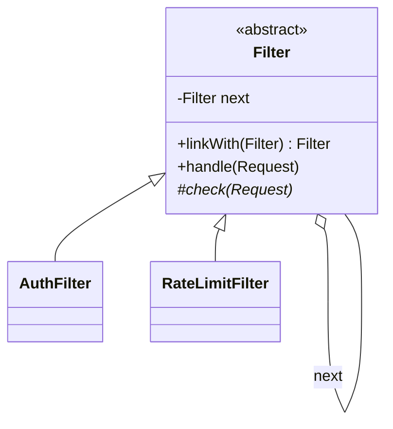

# Chain of Responsibility

> **Solves:** Pass a request along a line of handlers, each doing one check or one piece of handling — links are added, removed, and reordered without touching each other.

## When to use / when NOT

- **Use when:** a request crosses several independent checks/stages (auth → rate-limit → validation), approval escalates by level, or log records flow through level-filtered handlers.
- **Don't use when:** the steps are fixed and never reconfigured — straight-line calls in one method are honest. Red flag: a "chain" of exactly one handler, or handlers that all need to run in a fixed order anyway.
- **Say aloud:** "Each filter has one job and the chain is assembled at startup — adding an IP-block filter is a new class linked in, nothing else changes."

## Structure



## Key code — the 20% that matters

```java
abstract class Filter {
    private Filter next;
    Filter linkWith(Filter next) { this.next = next; return next; }   // chains read left-to-right

    void handle(Request request) {
        check(request);                    // throws to reject → short-circuits the rest
        if (next != null) next.handle(request);
    }
    protected abstract void check(Request request);
}

Filter chain = new AuthFilter();
chain.linkWith(new RateLimitFilter(100)); // assembly is configuration, in one place
chain.handle(request);
```

Run [`Demo.java`](Demo.java) — two passes, a rate-limit rejection, and a missing token rejected at the first link (the rate limiter never sees it).

## Two chain styles — know both

- **First-match / gate style** (this example, approvals): each link either settles the request or forwards it; a rejection stops everything.
- **Broadcast style** (logger levels): every interested handler processes and *always* forwards — a log record can hit console AND file sinks. Same shape, different `handle`.

Modern alternative: a `List<Filter>` iterated in order — easier to reorder and inject than linked nodes. Offer it; servlet filters and HTTP middleware work this way.

## Where it appears in the 12 problems

- **Logging Service (p7)** — level-filtered handlers (broadcast style)
- Approval workflows — manager → director → VP by amount (note: levels differing only by limit is one class with different config, not three subclasses — say it)
- Request middleware — auth, rate-limit, validation ahead of any service

## Expected interview questions

1. **Q: Chain of Responsibility vs Decorator — both wrap and delegate?**
   **A:** Decorator always delegates and *adds* behaviour around the call — every layer runs. CoR links are peers where one may *settle* the request and stop the chain. Decorator composes behaviour; CoR routes responsibility.
2. **Q: What if no handler handles the request?**
   **A:** Make the end of the chain explicit: a terminal handler that rejects (as here, via exception), a default handler, or a documented no-op. Falling off the end silently is the classic CoR bug.
3. **Q: How would you reorder or configure the chain per environment?**
   **A:** Build it from config at startup — an ordered list of filters. That's the strongest argument for the list-based form over hard-linked nodes.
4. **Q: Is your chain thread-safe?**
   **A:** The chain structure is immutable after assembly, so traversal is safe. Shared state lives inside individual handlers — the rate limiter uses `ConcurrentHashMap` + `AtomicInteger` (`incrementAndGet`), not check-then-act.
5. **Q: Where does this exist in real systems?**
   **A:** Servlet filters, Spring interceptors, Netty pipeline, express/axios middleware, logging frameworks' handler chains. Naming two shows you've seen it outside textbooks.

## Write-from-memory checklist (target: 3 minutes)

- [ ] Abstract handler: `next`, `linkWith`, `handle` = own check + forward
- [ ] 2 concrete filters, each one responsibility
- [ ] Reject = specific exception (short-circuit), never a silent drop
- [ ] Demo: pass, reject mid-chain, reject at first link (early termination visible)
