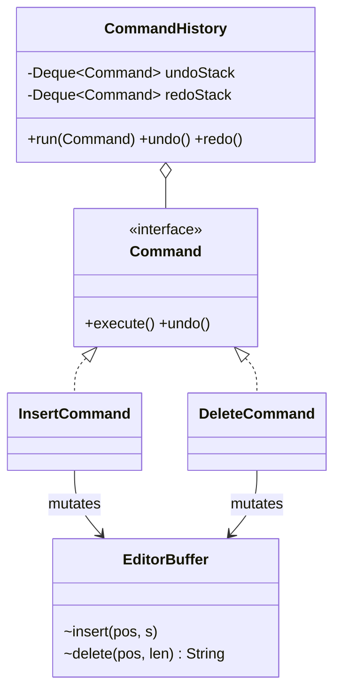

# Command

> **Solves:** An action becomes an object — so it can be stored, queued, logged, and above all **undone**. The backbone of undo/redo, task queues, and ledgers.

## When to use / when NOT

- **Use when:** actions need a history (undo/redo), deferred/queued execution, or an audit trail (stock movements as an append-only ledger).
- **Don't use when:** actions fire immediately and are never replayed or reversed — a method call is honest. Red flag: `Command` objects with `execute()` as their only reason to exist.
- **Say aloud:** "Edits must be undoable, so each edit is a Command with `execute`/`undo`; the invoker owns two stacks and never knows what commands do."

## Structure



## Key code — the 20% that matters

```java
interface Command { void execute(); void undo(); }

class DeleteCommand implements Command {
    private String removed;                              // captured state undo depends on
    public void execute() { removed = buffer.delete(position, length); }
    public void undo()    { buffer.insert(position, removed); }
}

class CommandHistory {
    private final Deque<Command> undoStack = new ArrayDeque<>();
    private final Deque<Command> redoStack = new ArrayDeque<>();

    void run(Command c) { c.execute(); undoStack.push(c); redoStack.clear(); } // new edit kills redo
    void undo() { Command c = undoStack.pop(); c.undo();    redoStack.push(c); }
    void redo() { Command c = redoStack.pop(); c.execute(); undoStack.push(c); }
}
```

Run [`Demo.java`](Demo.java) — insert/delete/undo/redo, then a new edit clears the redo branch (rejected explicitly).

## Where it appears in the 12 problems

- **Text Editor (p12)** — insert/delete/replace with two stacks; macros as a composite command
- **Inventory (p9)** — stock movements as an append-only ledger of commands/events
- Task queues, remote controls, transactional scripts

## Expected interview questions

1. **Q: Why is the redo stack cleared on a new edit?**
   **A:** After undoing and typing something new, history has branched — the old redo chain would replay operations against a document state they were never built for (positions no longer valid). Linear undo keeps one truth; branching history is a version tree (name it, don't build it).
2. **Q: Command vs Memento for undo?**
   **A:** Command stores *inverse operations* — cheap per step, but every action needs a correct undo. Memento stores *snapshots* — trivially correct, memory-heavy. Real editors mix them: commands for keystrokes, snapshots at checkpoints.
3. **Q: How do macros fit?**
   **A:** A composite command: holds a list, `execute()` runs them in order, `undo()` runs undos in *reverse* order. Same interface, so history treats a macro as one entry — one Ctrl+Z undoes the whole macro.
4. **Q: Where does state needed by undo live?**
   **A:** Captured *inside the command at execute time* (`DeleteCommand` keeps the removed text). The receiver stays clean; the command is the record of what happened.
5. **Q: Commands in a queue — what about retries?**
   **A:** Executed-elsewhere commands must be idempotent or carry an idempotency key; a retried `execute()` must not apply twice. This is where Command meets the ledger/event-sourcing idea from Inventory.

## Write-from-memory checklist (target: 3 minutes)

- [ ] `Command` with `execute()` + `undo()`
- [ ] Receiver with primitive operations; commands capture undo state at execute time
- [ ] Invoker: two `ArrayDeque`s; `run` pushes undo + clears redo
- [ ] Empty undo/redo → specific exception
- [ ] Demo: edit → undo → redo → new edit → redo rejected
