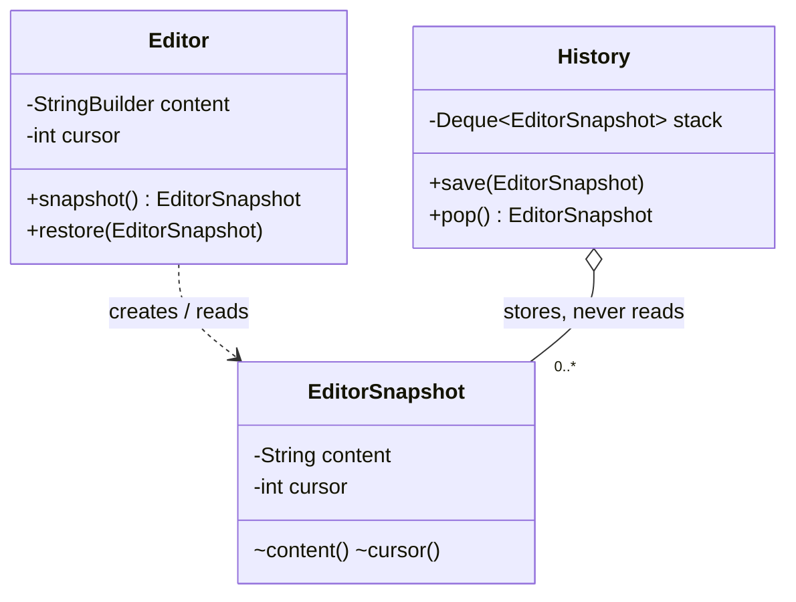

# Memento

> **Solves:** Snapshot an object's state and restore it later — without exposing internals to whoever stores the snapshot. Undo by state, not by inverse operations.

## When to use / when NOT

- **Use when:** you need checkpoints/rollback and computing inverse operations is hard or error-prone (complex state, multi-field invariants, game saves, transaction savepoints).
- **Don't use when:** state is large and edits are frequent — full snapshots per keystroke blow memory; use Command (inverse ops) or store diffs. Red flag: snapshotting a 100MB document on every character.
- **Say aloud:** "Restore must be trivially correct, so I snapshot state; the history stores mementos it cannot read — encapsulation survives."

## Structure



## Key code — the 20% that matters

```java
public final class EditorSnapshot {          // immutable; accessors package-private:
    private final String content;            // the caretaker can hold it, never read it
    private final int cursor;
    EditorSnapshot(String content, int cursor) { ... }
    String content() { return content; }
}

class Editor {                               // originator: sole creator/reader
    public EditorSnapshot snapshot() { return new EditorSnapshot(content.toString(), cursor); }
    public void restore(EditorSnapshot s) { content = new StringBuilder(s.content()); cursor = s.cursor(); }
}

class History {                              // caretaker: a stack of opaque tokens
    private final Deque<EditorSnapshot> stack = new ArrayDeque<>();
    void save(EditorSnapshot s) { stack.push(s); }
}
```

Run [`Demo.java`](Demo.java) — checkpoint before each edit, two restores (content AND cursor come back), empty history rejected.

## Where it appears in the 12 problems

- **Text Editor (p12)** — snapshots at checkpoints, combined with Command for per-keystroke undo
- Transaction savepoints, game saves, wizard/form "go back", config rollback

## Expected interview questions

1. **Q: Memento vs Command for undo?**
   **A:** Memento stores *states* — trivially correct restore, memory-heavy. Command stores *inverse operations* — cheap per step, but every action needs a correct undo. Real editors mix: commands for keystrokes, snapshots as periodic checkpoints (bounded replay).
2. **Q: Why are the snapshot's accessors package-private?**
   **A:** That's the pattern's actual point: the caretaker holds mementos without being able to read or forge internal state — encapsulation isn't traded away for undo. In Java, package-private access (or a nested class) enforces it.
3. **Q: Cursor position too — why?**
   **A:** Restore must return the *whole* observable state, or undo feels broken (text back, cursor lost). Deciding what belongs in the snapshot IS the design question — say it.
4. **Q: Memory blows up — options?**
   **A:** Bound the history (drop oldest), store diffs/deltas between snapshots, copy-on-write share unchanged parts (persistent data structures), or checkpoint every N operations with Command replay in between. Name piece table for editors.
5. **Q: Is the snapshot safe to share across threads?**
   **A:** Yes — it's immutable (final fields, defensive copy of mutable content at creation), so it's safely published with no synchronization. Immutability doing concurrency work for free — say it.

## Write-from-memory checklist (target: 3 minutes)

- [ ] Immutable memento, package-private accessors (opaque outside the originator)
- [ ] Originator: `snapshot()` copies state out, `restore()` copies it back
- [ ] Caretaker: stack of mementos, zero knowledge of contents
- [ ] Demo: checkpoint → edits → two restores → empty history rejected
