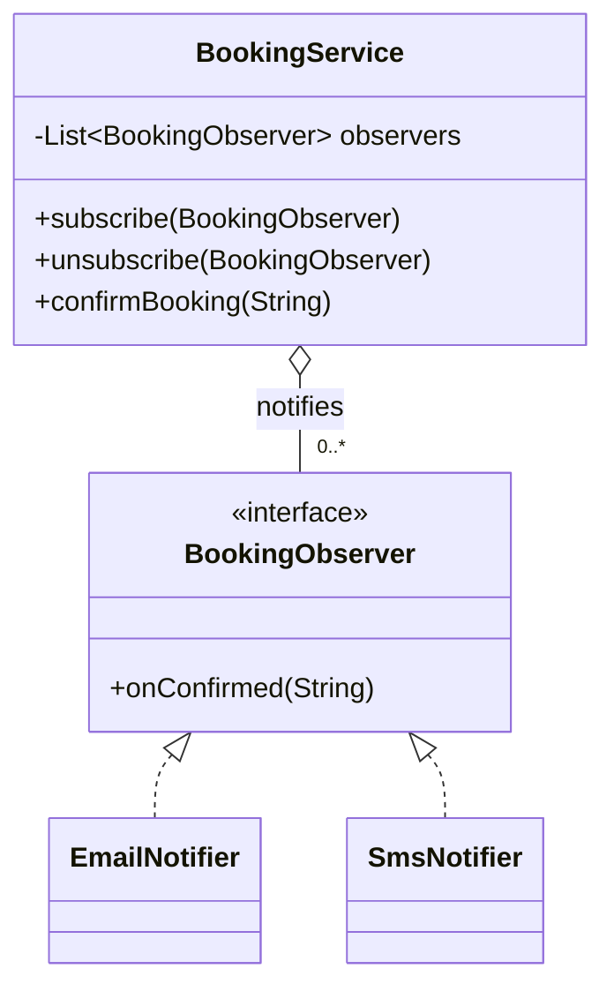

# Observer

> **Solves:** Notify many interested parties when something changes, without the subject knowing who they are — new listeners are added with zero edits to the subject.

## When to use / when NOT

- **Use when:** one event fans out to several reactions that will grow or vary (email + SMS + analytics on confirm; panels on elevator move; low-stock alerts).
- **Don't use when:** there's exactly one listener and no growth in sight — a direct call is honest.
- **Say aloud:** "Confirmation triggers several side-effects that will grow, so the service publishes to `BookingObserver`s; the booking flow never changes when a channel is added."

## Structure



## Key code — the 20% that matters

```java
@FunctionalInterface
interface BookingObserver { void onConfirmed(String bookingId); }

class BookingService {
    private final List<BookingObserver> observers = new CopyOnWriteArrayList<>();
    // safe to iterate while others (un)subscribe — read-heavy, rare writes

    void confirmBooking(String id) {
        // 1) mutate own state FIRST, 2) notify after — observers see committed truth
        for (BookingObserver o : observers) {
            try { o.onConfirmed(id); }
            catch (RuntimeException e) { /* one failing observer must not break the rest */ }
        }
    }
}
```

Run [`Demo.java`](Demo.java) — three observers including a failing one (isolated), then an unsubscribe.

## Where it appears in the 12 problems

- **Elevator** — display panels on floor/direction change
- **Movie Ticket Booking** — email/SMS on confirm
- **Logging Service** — sinks as observers of log events
- **Inventory** — low-stock alerts
- **Food Delivery** — customer, restaurant, rider each notified differently

## Expected interview questions

1. **Q: Synchronous or asynchronous notification?**
   **A:** Sync (as here) is simple but a slow observer blocks the subject and runs on its thread. For real fan-out: hand events to a bounded queue / executor, or `CompletableFuture` per channel in parallel with timeouts. Costs you ordering guarantees and needs an error policy — say the trade-off.
2. **Q: What if an observer throws?**
   **A:** Catch per-observer and continue — a notification failure must never break the state change or starve later observers. Log/park the failure (dead-letter) for retry.
3. **Q: Why `CopyOnWriteArrayList`?**
   **A:** Notification iterates far more often than subscribe/unsubscribe mutates. Copy-on-write gives lock-free, `ConcurrentModificationException`-free iteration — MVCC in miniature. Under write-heavy load it'd be the wrong tool.
4. **Q: Push vs pull?**
   **A:** Push a small immutable event (id, status) — observers shouldn't call back into the subject mid-notification. Pull (observer queries subject) risks seeing state that moved again; if used, version the event.
5. **Q: Observer vs pub-sub?**
   **A:** Observer is in-process and the subject holds the list. Pub-sub inserts a broker with topics, durable delivery, and decoupled lifecycles — say "same intent, different delivery guarantees", and name at-least-once + idempotent consumers if pushed on reliability.

## Write-from-memory checklist (target: 3 minutes)

- [ ] `@FunctionalInterface` observer with one event method (small immutable payload)
- [ ] Subject: `CopyOnWriteArrayList`, subscribe/unsubscribe, notify loop
- [ ] Mutate state before notifying; try/catch around each observer
- [ ] Demo: multiple observers, one failing (isolated), one unsubscribe
