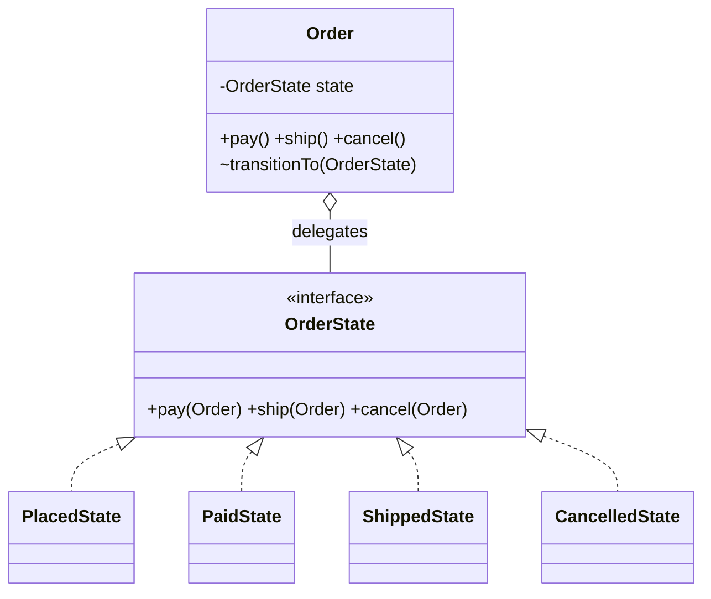
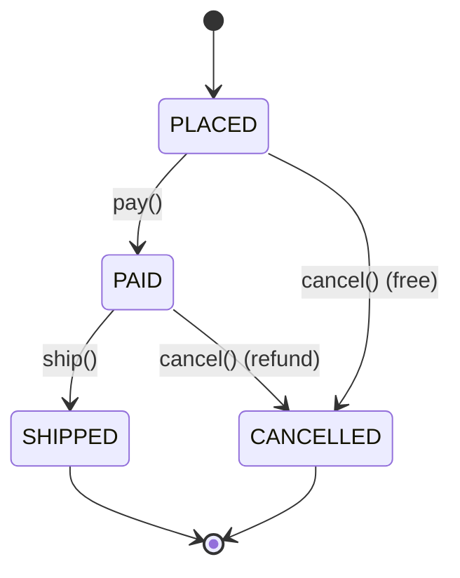

# State

> **Solves:** An entity whose allowed actions differ by lifecycle stage — each stage becomes a class, killing the giant switch and making illegal transitions throw in one place.

## When to use / when NOT

- **Use when:** an entity has a lifecycle where each stage allows different actions (order, booking, seat, elevator, vending machine, ATM) and behaviour per stage is non-trivial.
- **Don't use when:** you only need to *validate* transitions, not vary behaviour — an enum + transition table is honest and smaller (see below). Red flag: state classes that are all empty except a name.
- **Say aloud:** "The order's allowed actions depend on its stage, so each stage is a class that overrides only what it allows; a new stage is a new class, and every illegal transition throws the same specific exception."

## Structure





## Key code — the 20% that matters

```java
interface OrderState {                       // illegal by default…
    String name();
    default void pay(Order o)  { throw new IllegalStateTransitionException(name(), "pay"); }
    default void ship(Order o) { throw new IllegalStateTransitionException(name(), "ship"); }
}

class PlacedState implements OrderState {    // …each state overrides ONLY what it allows
    public void pay(Order o) { o.transitionTo(new PaidState()); }
}

class Order {                                // context: delegates, never switches
    private OrderState state = new PlacedState();
    public synchronized void pay() { state.pay(this); }   // transition is atomic
    void transitionTo(OrderState next) { state = next; }  // package-private: only states move the machine
}
```

Run [`Demo.java`](Demo.java) — happy path PLACED→PAID→SHIPPED, plus two rejected illegal transitions (ship unpaid, cancel shipped).

## The lightweight alternative: enum + transition table

When you only need *legality*, not per-state behaviour (Food Delivery's "allowed transitions in one place"):

```java
enum Status {
    PLACED, PAID, SHIPPED, CANCELLED;
    private static final Map<Status, Set<Status>> ALLOWED = Map.of(
        PLACED, Set.of(PAID, CANCELLED),
        PAID, Set.of(SHIPPED, CANCELLED),
        SHIPPED, Set.of(), CANCELLED, Set.of());
    boolean canTransitionTo(Status next) { return ALLOWED.get(this).contains(next); }
}
```

Offer both in an interview and pick by whether behaviour (not just legality) varies per stage.

## Where it appears in the 12 problems

- **Elevator** — Idle, MovingUp, MovingDown, DoorsOpen, Maintenance; emergency stop from any state
- **Movie Ticket Booking** — seat: Available → Held → Booked; booking: Created → Paid → Confirmed/Cancelled
- **Food Delivery** — Placed → Accepted → Preparing → PickedUp → Delivered/Cancelled, with per-state cancellation rules

## Expected interview questions

1. **Q: State vs Strategy — the diagram looks identical.**
   **A:** Intent. Strategy = interchangeable rules the *client* picks, unaware of each other. State = stages the *machine itself* moves through — states trigger their own transitions (`PlacedState` moves the order to `PaidState`). Caller chooses vs machine evolves.
2. **Q: Why not a switch on a status enum?**
   **A:** A switch per action scatters one stage's behaviour across N methods and every new stage edits all of them. With State, one stage's behaviour lives in one class and a new stage is a new class (OCP). But say the honest part: for a small closed machine with legality-only checks, the enum transition table is simpler.
3. **Q: Who decides the next state — the state or the context?**
   **A:** Here the states do (classic GoF): the transition rule lives next to the behaviour it belongs to. Keeping `transitionTo` package-private stops callers from forcing a state. The alternative — context consults a transition table — centralizes the map at the cost of splitting behaviour from transition.
4. **Q: Two threads act on the same order at once — what breaks?**
   **A:** Check-then-act race: both read PLACED, both pass. Fix: transitions must be atomic — `synchronized` action methods (fine: critical section is tiny), or CAS on an `AtomicReference<OrderState>`. Food Delivery's "two riders accept one order" is exactly this, solved with CAS on assignment. With a DB, an optimistic version check on update.
5. **Q: Add a DELIVERED stage after SHIPPED — what changes?**
   **A:** One new `DeliveredState` class, plus one `deliver` override in `ShippedState` (and a default-throwing `deliver` on the interface). No existing transition logic is touched.

## Write-from-memory checklist (target: 3 minutes)

- [ ] State interface whose default methods all throw a specific `IllegalStateTransitionException`
- [ ] One class per stage, overriding only the actions it allows; states call `transitionTo`
- [ ] Context holds current state, delegates every action, `synchronized` (atomic transitions)
- [ ] `transitionTo` package-private — callers can't force a state
- [ ] Demo: happy path + two rejected illegal transitions
