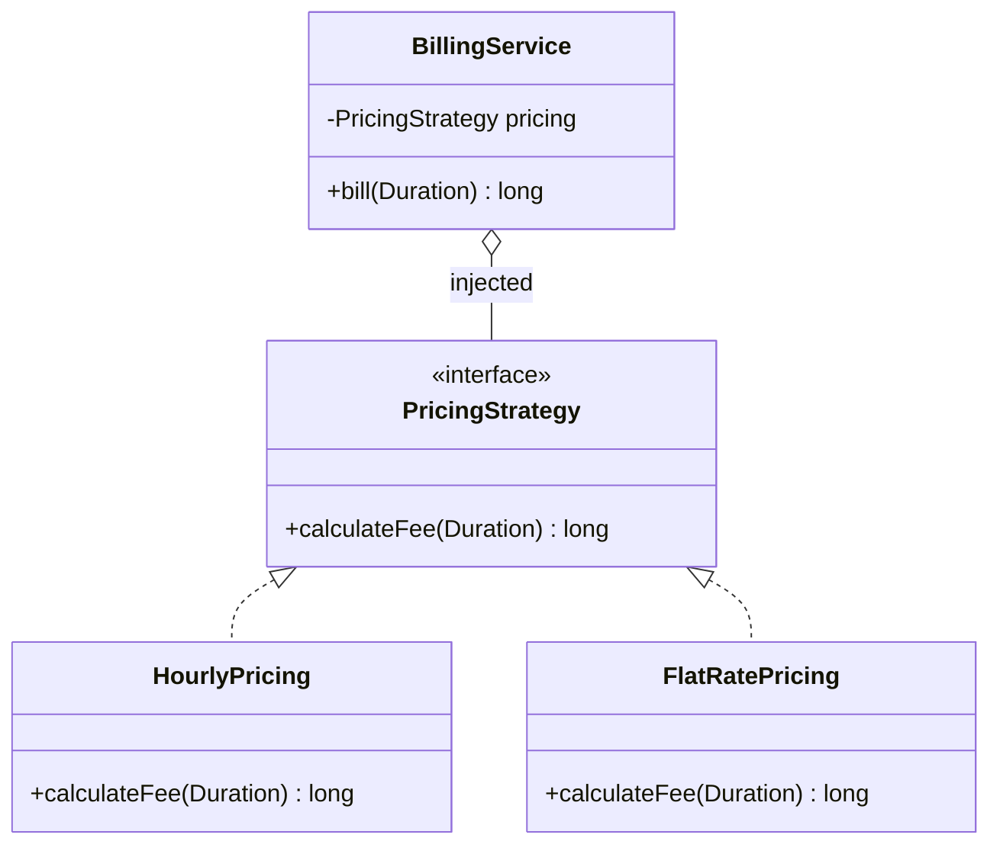

# Strategy

> **Solves:** A rule/algorithm that varies, kept behind an interface so the code using it never changes. **The single most-used pattern in LLD interviews** — pricing, allocation, matching, payment, splitting.

## When to use / when NOT

- **Use when:** a rule has 2+ variants now, or the interviewer hints it will change ("pricing depends on…", "later we might add…"). Each variant becomes a small, independently testable class.
- **Don't use when:** the rule will never vary — a plain method is honest. Red flag: an interface with exactly one implementation and no variation in sight.
- **Say aloud:** "Pricing will vary, so I'm putting it behind a `PricingStrategy` interface; if it wouldn't, a method on `BillingService` is simpler."

## Structure



## Key code — the 20% that matters

```java
@FunctionalInterface
interface PricingStrategy {
    long calculateFee(Duration parked);          // paise — money is never a double
}

class HourlyPricing implements PricingStrategy { // one class per rule, stateless
    public long calculateFee(Duration parked) {
        long hours = Math.max(1, (parked.toMinutes() + 59) / 60);
        return firstHourPaise + (hours - 1) * perExtraHourPaise;
    }
}

class BillingService {                           // context: knows the interface, never the rule
    private final PricingStrategy pricing;       // constructor injection (DIP)
    BillingService(PricingStrategy pricing) { this.pricing = pricing; }
    long bill(Duration parked) { return pricing.calculateFee(parked); }
}

new BillingService(new FlatRatePricing(10_000)); // swap the rule, zero edits (OCP)
new BillingService(parked -> 0L);                // a lambda IS a strategy
```

Run [`Demo.java`](Demo.java) — swaps three pricing rules through one context, plus a rejected invalid input.

## Where it appears in the 12 problems

- **Amazon Locker** — locker selection (smallest-fit, nearest)
- **Parking Lot** — spot allocation and pricing
- **Elevator** — dispatch (nearest-car, SCAN/LOOK)
- **Rate Limiter** — the limiting algorithm itself (token bucket, sliding window, …)
- **Splitwise** — split types (equal / exact / percentage / share)
- **Food Delivery** — rider matching, delivery fee

## Expected interview questions

1. **Q: Strategy vs State — same diagram, what's the difference?**
   **A:** Intent. Strategy = interchangeable rules picked by the *client/config*, usually stateless and unaware of each other. State = behaviour tied to a *lifecycle stage*, where states drive their own transitions ("Held → Booked"). In Strategy the caller chooses; in State the machine evolves.
2. **Q: Why not just an if-else / switch?**
   **A:** For 2–3 fixed variants a switch (or enum with behaviour) is honest — say so. Strategy earns its keep when variants will grow, need isolated testing, come from config/DI, or carry their own dependencies. Adding a variant then touches zero existing code (OCP).
3. **Q: How is the strategy chosen at runtime?**
   **A:** A Factory or a registry `Map<PricingType, PricingStrategy>` keyed by enum/config. This is the classic Strategy + Factory pairing (Rate Limiter does exactly this).
4. **Q: Are your strategies thread-safe?**
   **A:** Yes — stateless and immutable, so one instance is freely shared across threads. If a rule needs data, pass it as method parameters rather than mutable fields.
5. **Q: Isn't a functional interface + lambda enough?**
   **A:** Often, yes — for simple one-method rules a lambda is the modern form. Write a class when the strategy has constructor config or dependencies (rates, clients), or when it needs a name for testing and logging.

## Write-from-memory checklist (target: 3 minutes)

- [ ] `@FunctionalInterface` with one method: domain input → result (money in minor units)
- [ ] Two stateless, constructor-configured implementations
- [ ] Context receives the strategy via constructor — no `instanceof`, no `if (type == …)`
- [ ] Demo swaps rules through one context + shows a lambda as the third variant
