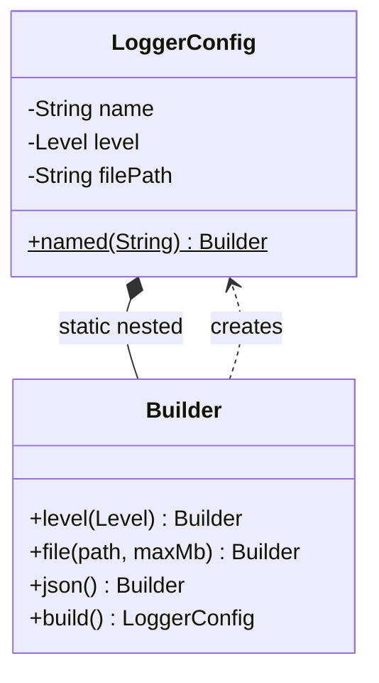

# Builder

> **Solves:** Constructing an object with many optional fields without telescoping constructors or mutable setters — the product comes out immutable and validated.

## When to use / when NOT

- **Use when:** 4+ constructor parameters, several optional, or cross-field validation rules (pizza, query, user profile, log config).
- **Don't use when:** 2–3 fields — a constructor or a Java `record` is honest. Red flag: a builder that just mirrors two required fields.
- **Say aloud:** "Config has one required field and five optional ones with cross-field rules, so a builder: fluent to write, and `build()` is the single place invalid state gets rejected."

## Structure



## Key code — the 20% that matters

```java
public final class LoggerConfig {                 // immutable: final fields, no setters
    private final String name;                    // required
    private final Level level;                    // optional …

    private LoggerConfig(Builder b) { this.name = b.name; this.level = b.level; }

    public static Builder named(String name) { return new Builder(name); }

    public static final class Builder {
        private final String name;                // required → builder constructor
        private Level level = Level.INFO;         // optional → defaulted field
        private Builder(String name) { this.name = name; }

        public Builder level(Level l) { this.level = l; return this; }   // fluent

        public LoggerConfig build() {             // ALL validation in one place
            if (name == null || name.isBlank()) throw new IllegalArgumentException("name required");
            return new LoggerConfig(this);
        }
    }
}
```

Run [`Demo.java`](Demo.java) — minimal build with defaults, full fluent chain, and two cross-field validation rejections.

## Where it appears in the 12 problems

- **Logging Service** — logger/sink configuration (this example)
- **Pizza / Coffee ordering** (extras) — Builder + Decorator combo
- Anywhere a query, request, or profile object grows optional knobs

## Expected interview questions

1. **Q: Why not a constructor with all parameters, or setters?**
   **A:** Telescoping constructors are unreadable and positional (`new Config("app", true, false, null, 0, true)`); setters make the object mutable and allow half-initialized use. Builder gives named, order-free assembly and an immutable, fully validated product.
2. **Q: Where does validation live?**
   **A:** In `build()` — one choke point, including cross-field rules a single setter can't check (file sink needs a size; at least one sink required). Invalid state becomes unrepresentable.
3. **Q: Is the builder thread-safe?**
   **A:** No, and it doesn't need to be — a builder is confined to one thread during assembly. The *product* is immutable, so it's freely shared once built. Say that split explicitly.
4. **Q: Builder vs Factory?**
   **A:** Factory chooses *among types* from a key; Builder assembles *one type* with many knobs. They compose: a factory can return a pre-configured builder.
5. **Q: When is Builder overkill in modern Java?**
   **A:** Records + named static factories cover small immutable types; Lombok `@Builder` generates this exact code. Hand-write it in interviews, and mention required-vs-optional handling: required fields go in the builder's constructor, not a `set` method.

## Write-from-memory checklist (target: 3 minutes)

- [ ] Product: `final` class, all fields `final`, private constructor taking the builder
- [ ] Static nested `Builder`: required fields in its constructor, optional ones defaulted
- [ ] Fluent methods `return this`; `build()` validates everything (incl. cross-field)
- [ ] Demo: defaults-only build, full chain, one rejected invalid build
