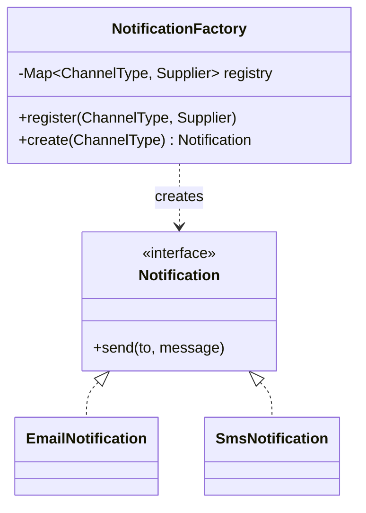

# Factory (+ Abstract Factory)

> **Solves:** Create the right concrete type from a key/config without scattering `new` and `if-else` chains through the codebase — construction knowledge lives in exactly one place.

## When to use / when NOT

- **Use when:** callers pick a variant by type/config (vehicle by type, limiter by algorithm, split by kind, channel by preference), or construction needs wiring the caller shouldn't know.
- **Don't use when:** there's one concrete class, or two that will never grow — call the constructor. Red flag: a factory whose `create` has one line and one caller.
- **Say aloud:** "Channel selection is data-driven, so a factory maps `ChannelType` to a supplier; adding a channel is a `register` call, not an edit."

## Structure



## Key code — the 20% that matters

```java
class NotificationFactory {
    private final Map<ChannelType, Supplier<Notification>> registry = new ConcurrentHashMap<>();

    void register(ChannelType type, Supplier<Notification> supplier) { registry.put(type, supplier); }

    Notification create(ChannelType type) {
        Supplier<Notification> s = registry.get(type);
        if (s == null) throw new UnsupportedChannelException(type); // specific, never null
        return s.get();
    }
}

factory.register(ChannelType.EMAIL, EmailNotification::new);       // wiring in one place
```

The **simple/static factory** (a `switch` inside `create`) is also fine — say why: *"the if-else exists, but in exactly one place; the registry removes even that edit."* Run [`Demo.java`](Demo.java) — create by type, rejected unknown type, then a new channel registered with zero factory edits.

## Abstract Factory — one level up

A factory for **families** of related objects that must be consistent with each other:

```java
interface ChannelKit {                       // one family per channel
    Notification notification();
    MessageFormatter formatter();            // email→HTML, sms→160-char plain
}
class EmailKit implements ChannelKit { ... }
class SmsKit implements ChannelKit { ... }
```

Name it when the interviewer asks for *matching sets* (UI themes, per-region payment stacks). One family = one class; consistency is guaranteed by construction.

## Where it appears in the 12 problems

- **Parking Lot** — vehicle by type
- **Rate Limiter** — limiter algorithm picked by config (Strategy + Factory pairing)
- **Splitwise** — split type (equal/exact/percentage/share)
- **Food Delivery** — notification channels

## Expected interview questions

1. **Q: Isn't the switch inside a simple factory an OCP violation?**
   **A:** Technically yes, pragmatically it's the accepted trade-off: variant knowledge must live *somewhere*, and one switch in one class beats `new` scattered everywhere. The registry form removes even that edit; go there when variants are plugin-like or config-driven.
2. **Q: Simple factory vs Factory Method vs Abstract Factory?**
   **A:** Simple factory = one class, one `create(type)`. Factory Method = subclasses override a creation hook (`createVehicle()` in each gate type) — inheritance-based, rarer in interviews. Abstract Factory = create consistent *families*. Default to simple/registry; name the others.
3. **Q: Why return the interface and throw on unknown types?**
   **A:** Callers must depend on `Notification` only (DIP), and an unknown key is a bug to surface — a specific exception beats returning null and failing later.
4. **Q: Static factory method (`Money.of(…)`) vs factory class?**
   **A:** Static factory methods are for controlling construction of *one* type (validation, caching, naming). A factory class is for choosing *among* types. Different tools.
5. **Q: How does this pair with Strategy?**
   **A:** Factory picks the strategy: `Map<PricingType, PricingStrategy>` built once, looked up per request — exactly how the Rate Limiter selects its algorithm.

## Write-from-memory checklist (target: 3 minutes)

- [ ] Product interface + 2 concretes
- [ ] Enum key (never raw strings)
- [ ] Registry `Map<Key, Supplier<Product>>` with `register` + `create`
- [ ] Unknown key → specific exception, never null
- [ ] Demo: create by type, rejected unknown, register new variant with zero edits
