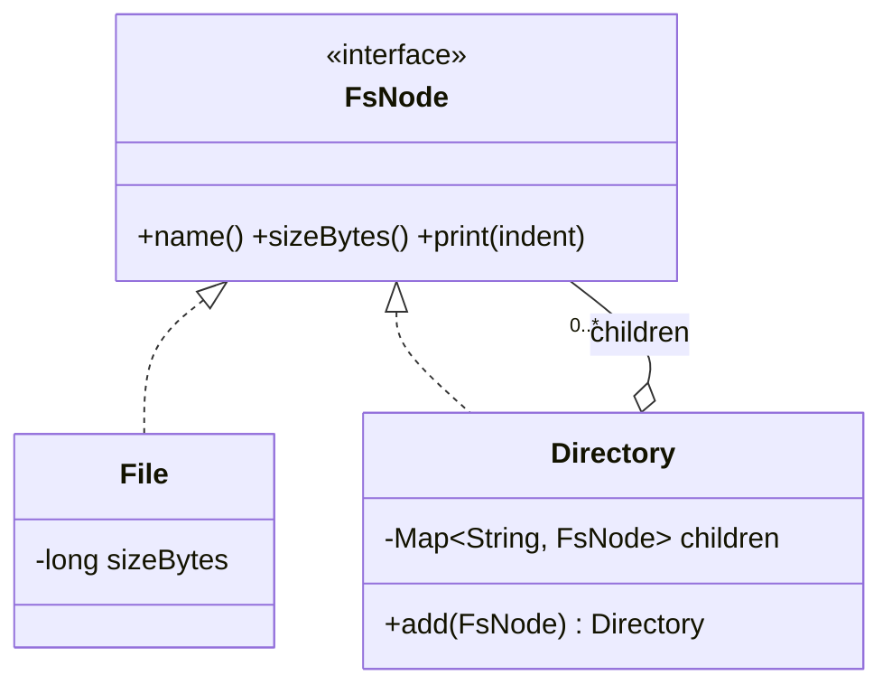

# Composite

> **Solves:** A tree where leaves and containers share one interface — callers run `sizeBytes()` on a file or a million-node directory identically, with zero `instanceof`.

## When to use / when NOT

- **Use when:** part-whole hierarchies where operations recurse naturally: file systems, org charts, UI trees, menu structures, composite commands (macros).
- **Don't use when:** the structure is flat or exactly two levels that never nest — a plain list inside a class is honest.
- **Say aloud:** "Files and directories share `FsNode`, so traversal, size, and search are one code path; a directory answers by recursing into children it never inspects."

## Structure



## Key code — the 20% that matters

```java
interface FsNode { String name(); long sizeBytes(); }

class File implements FsNode {                       // leaf: owns its size
    public long sizeBytes() { return sizeBytes; }
}

class Directory implements FsNode {                  // composite: recurses
    private final Map<String, FsNode> children = new LinkedHashMap<>();  // Map, never List

    Directory add(FsNode child) {
        if (children.putIfAbsent(child.name(), child) != null)
            throw new IllegalArgumentException("duplicate name: " + child.name());
        return this;
    }
    public long sizeBytes() {
        return children.values().stream().mapToLong(FsNode::sizeBytes).sum();
    }
}
```

Run [`Demo.java`](Demo.java) — a three-level tree printed and sized uniformly, plus a duplicate name rejected.

## Where it appears in the 12 problems

- **File System (p5)** — the core structure; plus path resolution, move/rename, cycle prevention
- **Text Editor (p12)** — composite (macro) commands: one interface, execute children in order, undo in reverse
- Org hierarchies, UI component trees, nested menus

## Expected interview questions

1. **Q: Where does `add()` live — on the interface or on Directory?**
   **A:** This is the GoF *safety vs transparency* trade-off. On the interface (transparent): uniform, but `file.add(...)` must fail at runtime. On `Directory` only (safe, chosen here): illegal operations don't compile. Prefer safe; name the trade-off.
2. **Q: Why `Map<String, FsNode>` children and not a `List`?**
   **A:** Duplicate names become unrepresentable (`putIfAbsent`), and child lookup during path resolution is O(1). A list allows two `b.txt` and forces linear scans — the classic hygiene miss.
3. **Q: A new operation (search, checksum, du-style report) — edit every node class?**
   **A:** For core operations, methods on the interface are fine. For an open-ended family of operations, name **Visitor**: nodes accept a visitor, operations become visitor classes, node classes stop growing.
4. **Q: What breaks with cycles (move a directory into its own child)?**
   **A:** Infinite recursion in size/print. Prevent on move: walk up the target's parents; if the moving node appears, reject. This is a File System (p5) must-cover — know it here.
5. **Q: Concurrent reads and writes to the tree?**
   **A:** Listing while another thread creates → lock per directory, and ReadWriteLock since reads dominate; multi-directory operations (move) acquire locks in a global order (parent → child) to avoid deadlock.

## Write-from-memory checklist (target: 3 minutes)

- [ ] Node interface with the recursive operation(s)
- [ ] Leaf: owns its data; Composite: `Map` children + recursion
- [ ] `add` on the composite only (safe variant), duplicate → exception
- [ ] Demo: build tree, run one operation uniformly on leaf and subtree
