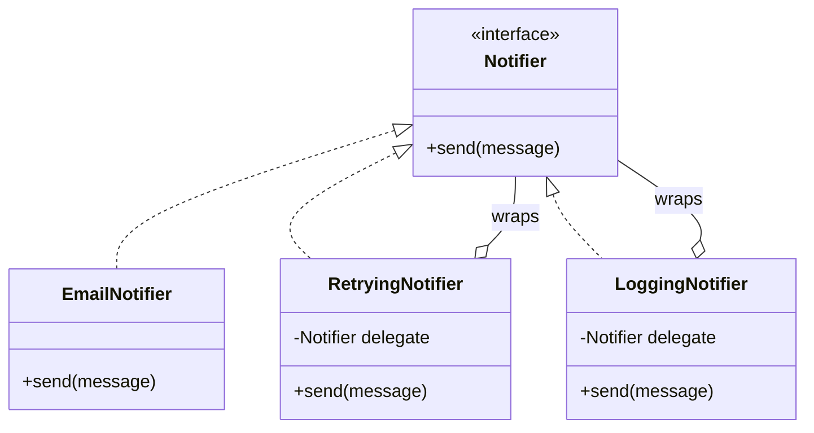

# Decorator

> **Solves:** Add behaviour to an object by wrapping it — no subclass explosion, composed at runtime, invisible to callers. Toppings are the toy version; **retry/logging/caching around a component is the interview version.**

## When to use / when NOT

- **Use when:** cross-cutting add-ons combine freely (retry × logging × caching; toppings on toppings) — inheritance would need a subclass per combination.
- **Don't use when:** there's one fixed add-on — put it in the class or one wrapper isn't a "pattern" decision worth defending. Red flag: a decorator that doesn't delegate to what it wraps.
- **Say aloud:** "Retry and logging are cross-cutting and combine freely, so they're decorators over `Notifier` — the core class stays single-purpose and combinations are runtime choices."

## Structure



The double relationship is the pattern: a decorator **is a** `Notifier` and **has a** `Notifier`.

## Key code — the 20% that matters

```java
interface Notifier { void send(String message); }

class RetryingNotifier implements Notifier {      // is-a AND has-a
    private final Notifier delegate;
    private final int maxAttempts;

    public void send(String message) {
        for (int attempt = 1; ; attempt++) {
            try { delegate.send(message); return; }
            catch (RuntimeException e) {
                if (attempt == maxAttempts) throw e;
            }
        }
    }
}

// composition at runtime — order is a real decision:
new LoggingNotifier(new RetryingNotifier(email, 3));  // logs once around all attempts
new RetryingNotifier(new LoggingNotifier(email), 3);  // logs every attempt
```

Run [`Demo.java`](Demo.java) — a flaky notifier healed by retry, decorators invisible to callers, and a retries-exhausted failure propagating.

## Where it appears in the 12 problems

- **Logging Service (p7)** — timestamp/thread-id decorators around formatters
- **Pizza/Coffee (extras)** — toppings, each adding to `cost()` (Builder + Decorator combo)
- Any gateway: retry, caching, rate-limiting, metrics wrappers

## Expected interview questions

1. **Q: Why not subclasses (`RetryingLoggingEmailNotifier`)?**
   **A:** N add-ons → 2^N subclasses, chosen at compile time. Decorators are N classes composed at runtime in any order. This is composition-over-inheritance in its purest form.
2. **Q: Does stacking order matter?**
   **A:** Yes, and saying so scores: log-outside-retry logs once around all attempts; retry-outside-log logs each attempt. Same classes, different semantics — the order is part of the design.
3. **Q: Decorator vs Proxy vs Adapter — all wrappers?**
   **A:** Same shape, different intent. Decorator *adds behaviour*, same interface. Proxy *controls access* (lazy-load, permissions), same interface. Adapter *changes the interface* to fit what the client expects.
4. **Q: What breaks with deep decorator stacks?**
   **A:** Identity — `decorated != original`, so `equals`/`instanceof` checks and "unwrap to the concrete type" hacks fail. Also stack traces get deep. Keep chains short and construct them in one place (a factory/builder).
5. **Q: When is the missing abstract base class worth adding?**
   **A:** With 3+ decorators, a `NotifierDecorator` base holding the delegate and default-forwarding removes duplication. With two, it's ceremony — say the threshold aloud.

## Write-from-memory checklist (target: 3 minutes)

- [ ] Component interface + one concrete component
- [ ] Decorator: implements the interface, holds a `final` delegate, adds behaviour around delegation
- [ ] Show two decorators stacked; mention order semantics
- [ ] Demo: flaky component + retry succeeds; exhausted retries propagate
