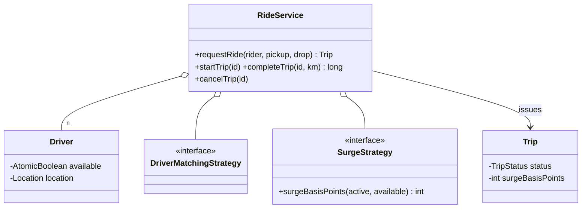

# Cab Booking (Uber-lite)

> **One-liner:** Matching Strategy + trip state table + **surge as a pure function of demand/supply, locked in at request time** — Food Delivery's twin, with pricing dynamics as the new muscle.

## Scope & clarifying questions

**In scope:** nearest-driver matching with CAS claims (two requests can't share a driver); trip lifecycle REQUESTED→ONGOING→COMPLETED with cancel-before-start only; surge in basis points quoted at request, fare computed at completion from actual distance; driver relocates to the drop and frees up. **Out:** ETA/routing, driver acceptance flow (see Food Delivery's double-CAS), payments, pooling, geo-indexing (name it below).

Ask: when is surge locked — quote time or completion? Cancel rules per state (fee after driver en route)? Can drivers reject? How is "nearest" computed at city scale?

## Approach vs alternatives

Chosen — **driver availability as a CAS flag + strategy-ordered claim walk** (the Food Delivery consensus shape) and **surge = `SurgeStrategy(activeTrips, availableDrivers)` in basis points**, captured on the Trip at request so the rider's quote can't drift. Alternatives: **surge at completion** — riders get re-priced mid-trip, product-wise wrong (say it); **auction/dispatch queues** — throughput at scale, added latency; **O(n) nearest scan** (built) vs **geo-hash / quad-tree index** — the named upgrade once drivers number in the thousands: bucket drivers by geohash cell, search the pickup's cell + neighbors.



## Key code

```java
// surge locked at request; basis points, never doubles
int surgeBp = surge.surgeBasisPoints(activeTrips.get(), availableCount);
for (Driver d : matching.candidates(drivers.values(), pickup))
    if (d.tryClaim())                       // CAS — the only gate that matters
        return new Trip(..., d.id(), pickup, drop, surgeBp);
throw new NoDriverAvailableException();

// fare at completion: actual distance × locked surge
long amount = fare.farePaise(actualKm, trip.surgeBasisPoints());
```

## Must-cover edge cases

- [x] Nearest driver wins; the free-filter is a snapshot, `tryClaim` is the gate
- [x] Surge escalates as supply tightens (demo: same 16km costs ₹242 → ₹484)
- [x] Cancel allowed only before start; ONGOING→CANCELLED and REQUESTED→COMPLETED rejected by the table
- [x] Driver relocates to the drop and becomes matchable again
- [x] Two requests race one driver → exactly one trip

## Interview follow-ups

1. **Q: Why lock surge at request time?** **A:** The rider accepted a quote; recomputing at completion re-prices them mid-ride. Lock the multiplier on the Trip, compute fare from *actual* distance at the end — quote integrity + usage-based billing, both.
2. **Q: How does surge stay honest without floats?** **A:** Basis points (10000 = 1.0x) — integer math end to end, same discipline as money. `(base + perKm·km) · bp / 10000` in paise.
3. **Q: 50k drivers — nearest scan too slow?** **A:** Geospatial index: geohash buckets or a quad-tree; query pickup's cell + 8 neighbors, then rank. The matching Strategy seam is where it plugs in — nothing else changes.
4. **Q: Driver goes offline mid-REQUESTED?** **A:** Same as Food Delivery's rider-cancel: release + rematch down the candidate list, excluding the leaver; timeouts sweep trips nobody claims (the p11 pattern — reference, don't rebuild).

Run [`Demo.java`](Demo.java) — nearest matching, surge escalation with a fare comparison, transition-table rejections, and a two-request race for the last driver.
