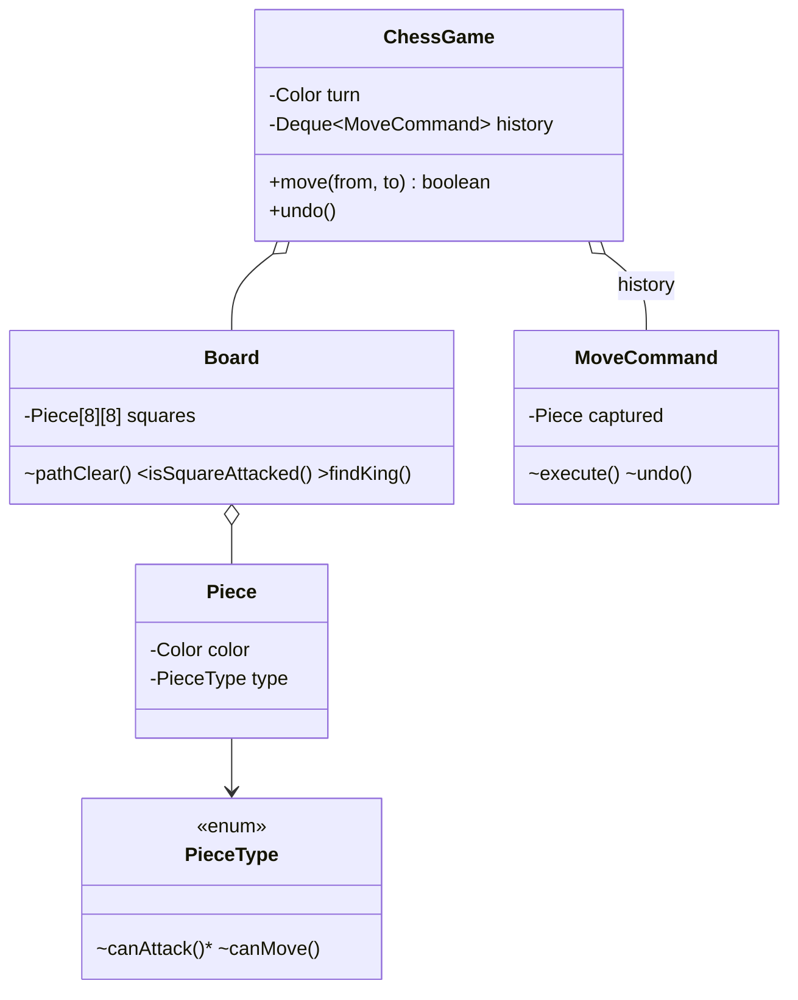

# Chess

> **One-liner:** The composition-over-inheritance test: movement rules live on a `PieceType` enum (no King-extends-Piece tree), legality = geometry + clear path + **king safety via try-and-rollback** — which is exactly what Command's undo is for.

## Scope & clarifying questions

**In scope:** full board setup; per-type movement incl. pawn pushes vs captures; path blocking for sliders; turn enforcement; can't capture your own piece; a move may not leave your own king attacked (check evasion falls out of this); check announcement; move undo. **Out (say it):** castling, en passant, promotion (each is a special-cased `MoveCommand` subtype — name that), checkmate/stalemate *search* (mate = in check AND no legal move exists: iterate all moves through the same legality test — described, not built), clocks, draw rules.

Ask: which special moves are in scope? Detect check only, or full mate? Undo needed? Two human players or engine?

## Approach vs alternatives

Chosen — **`Piece = (color, type)` with behaviour on the enum**: each constant implements `canAttack` (geometry + `pathClear`), pawns alone override `canMove` (pushes ≠ captures). King safety is **apply → test → rollback** using the MoveCommand — one legality path for pins, checks, and evasions with zero special cases. Alternatives: **subclass per piece** — the classic deep-hierarchy trap; behaviour-per-enum gives the same polymorphism without the tree; **precomputed legal-move sets / bitboards** — the engine answer (fast generation), overkill for legality checking; **simulating king safety by hand-analysis of pins** — vastly more code than try-undo, and try-undo is *why* moves are Commands.



## Key code

```java
// king safety = try, test, roll back — the Command earns its keep
command.execute();
int[] king = board.findKing(turn);
if (board.isSquareAttacked(king[0], king[1], turn.opponent())) {
    command.undo();
    throw new IllegalMoveException("leaves your king in check");
}

// pawn: pushes need empty squares; captures are its attack diagonals + an enemy present
if (fc == tc && b.at(tr, tc) == null) { /* 1 or 2 forward */ }
return canAttack(...) && b.at(tr, tc) != null && b.at(tr, tc).color() != color;
```

## Must-cover edge cases

- [x] Wrong turn / no piece / own piece on target → specific rejections
- [x] Sliding pieces blocked by intervening pieces (`pathClear`); knights jump
- [x] Pawn: double push only from start, push ≠ capture, diagonal needs an enemy
- [x] Move leaving own king attacked → auto-rolled-back (also forces check evasion)
- [x] Check detected and announced after each move
- [x] Undo restores captures exactly (two undos rebuild pawn + queen)

## Interview follow-ups

1. **Q: Why not a class per piece?** **A:** Pieces differ ONLY in movement rules — one method. An enum constant per type carries that method with no hierarchy, no downcasts, and adding a fairy piece is one constant. Subclassing here is inheritance for code reuse — the anti-pattern the roadmap names.
2. **Q: How do pins work in your legality check?** **A:** They're free: moving a pinned piece exposes the king, the apply-test-rollback detects the attacked king, move rejected. No pin-specific code exists — that's the argument for try-and-undo over static analysis.
3. **Q: Checkmate?** **A:** In check AND no legal move: enumerate every (piece, target) for the side to move, run each through the same `move` legality (apply-test-rollback), any survivor = not mate. O(moves × 64) per test — fine for a game, and it reuses the single legality path.
4. **Q: Castling/en passant/promotion?** **A:** Each is a composite/special `MoveCommand` (two piece movements; a capture on a different square; a piece swap) with extra preconditions — the Command abstraction is exactly where they slot in without touching the core loop.

Run [`Demo.java`](Demo.java) — development moves, four distinct rejections, a capture that gives check, an ignored check rolled back, a legal block, and two undos restoring the capture.
