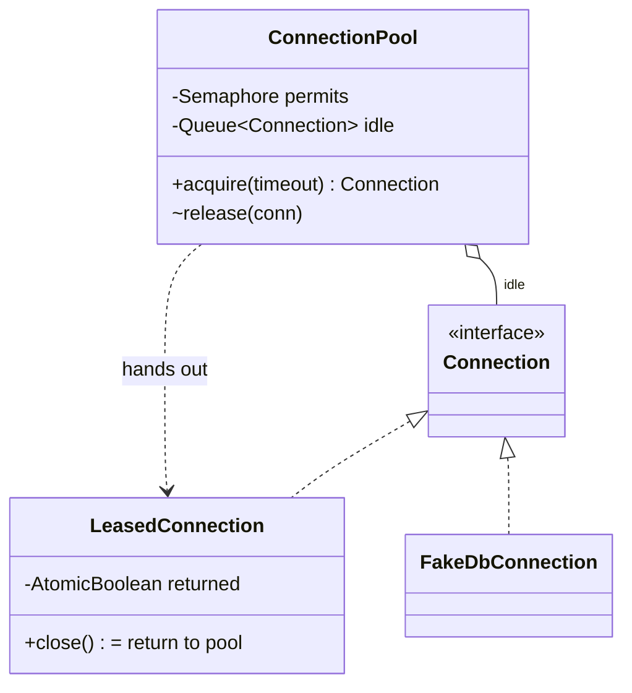

# Connection / Object Pool

> **One-liner:** A `Semaphore` bounds how many connections are OUT, an idle queue keeps the warm ones, acquisition blocks **with a timeout**, and release health-checks — recycle the good, destroy the sick, and the permit never leaks either way.

## Scope & clarifying questions

**In scope:** bounded pool with lazy creation; fair blocking acquire with timeout → `PoolExhaustedException`; leased wrapper whose `close()` returns instead of destroying; use-after-return fails loudly; double-close safe; health check on release; shutdown drains. **Out:** background validation/keepalive pings, min-idle warmup, per-connection max lifetime, statement caching.

Ask: max size, and what happens when exhausted — wait, timeout, or grow? Health check on acquire, release, or background? What does `close()` on a pooled connection mean to callers? Fairness under contention?

## Approach vs alternatives

Chosen — **`Semaphore(max, fair)` for the bound + `ConcurrentLinkedQueue` for idle + lazy factory creation**, with the caller-facing trick being the **`LeasedConnection` wrapper**: `close()` returns the delegate to the pool (so pooled connections are drop-in for try-with-resources), a CAS flag makes double-close safe and use-after-return an explicit error. Alternatives: **`BlockingQueue` of pre-created connections** — simpler, but eager creation wastes resources and `poll(timeout)` alone can't express "created-but-not-idle" without a second counter (the semaphore IS that counter); **synchronized + wait/notify** — the same semantics hand-rolled, more ways to get it wrong; **no wrapper (callers must call `pool.release`)** — leaks the moment someone forgets; making `close()` do the right thing is the API design point.



## Key code

```java
if (!permits.tryAcquire(timeout.toMillis(), MILLISECONDS))  // bounded wait, never forever
    throw new PoolExhaustedException(timeout);
Connection c = idle.poll();
if (c == null) c = factory.get();                           // lazy, bounded by the semaphore

void release(Connection c) {
    try {
        if (c.isHealthy()) idle.offer(c); else c.close();   // recycle or destroy
    } finally { permits.release(); }                        // the permit NEVER leaks
}
```

## Must-cover edge cases

- [x] Exhausted pool → timeout → `PoolExhaustedException` (fail fast, demo measures it)
- [x] Released connection is REUSED (same underlying id — pooling's whole point)
- [x] Sick connection destroyed at release; next acquire creates a fresh one
- [x] Use-after-return throws; double-close is a safe no-op (CAS guard)
- [x] Creation failure releases the permit (no leak)
- [x] 400 queries by 8 threads through a pool of 2 — created count stays ≤ 3

## Interview follow-ups

1. **Q: Why a semaphore AND a queue?** **A:** They answer different questions: the semaphore bounds *how many are out* (including ones being lazily created), the queue holds *which warm ones are in*. A queue alone can't bound lazily-created connections; a semaphore alone can't store them.
2. **Q: What's the classic leak, and where do you defend?** **A:** A permit acquired but never released — via an exception between acquire and lease, or a caller forgetting to return. Defenses: `finally { permits.release() }` on every exit of release, permit release on factory failure, and `close()`-returns semantics so try-with-resources does the right thing. Production adds leak detection: lease timestamps + a sweeper that logs abandoned leases.
3. **Q: Health check on acquire or release?** **A:** Release (built) catches breakage from the just-finished use cheaply. Acquire-time validation adds latency to every borrow; background ping validation is the production compromise (name `testWhileIdle`).
4. **Q: Why a fair semaphore?** **A:** Under saturation an unfair one lets barging threads starve waiters — request timeouts become wildly bimodal. Fair costs some throughput; for user-facing pools predictability wins.

Run [`Demo.java`](Demo.java) — lazy creation, fast-fail exhaustion, reuse of the same underlying connection, sick-connection replacement, use-after-return rejection, and the 8-thread stress with bounded creation.
