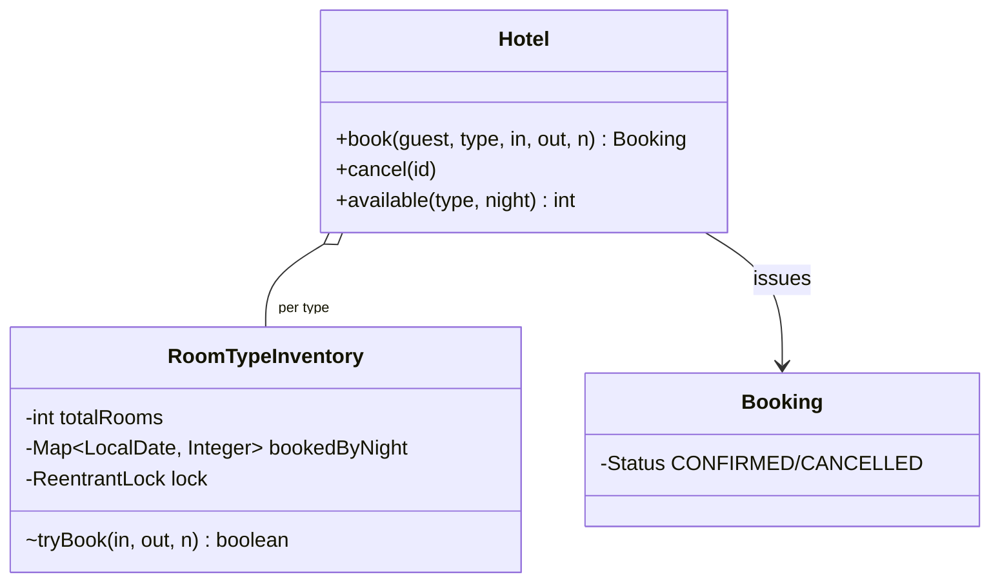

# Hotel Booking

> **One-liner:** Overlapping date ranges over FUNGIBLE inventory — a booked-count per (room type, night), all-or-nothing across the stay's nights. The design twin of IRCTC with the opposite modelling answer, and knowing WHY is the interview.

## Scope & clarifying questions

**In scope:** book N rooms of a type for [checkIn, checkOut) — every night must have capacity, atomically; overlapping stays share night counters; cancel releases exactly the stay's nights (once); per-night availability; concurrent bookings race safely. **Out:** specific room assignment (done at check-in against the type count — say it), rate plans/pricing, hold-then-pay (see p06 — same TTL pattern), overbooking policy.

Ask: does the guest book a room TYPE or a specific room? Is checkout day a occupied night ([in, out) half-open)? Overbooking allowed (hotels do ~10%)? Modify/extend stay?

## Approach vs alternatives

Chosen — **per-night integer counters per room type under one lock per type**: a stay checks all nights then decrements all nights, one critical section. This is correct *because rooms of a type are interchangeable* — any physical room can serve any night of the stay, so nights don't need to be covered by "one identity". **Contrast IRCTC** (the trap in reverse): a train seat must be ONE seat across all segments, so min-of-counters overestimates there — here counters are exact. Alternatives: **per-room calendars** (book a specific room like a meeting room) — needed only for room-specific attributes (view, connecting rooms); costs fragmentation: two 1-night bookings in different rooms can block a 2-night stay that counters would have served — that's why hotels assign rooms at check-in; **interval trees** — wrong shape, the count-per-bucket is the standard hotel/airline inventory model.



## Key code

```java
// all-or-nothing across nights, one critical section per room type
for (night = in; night.isBefore(out); night = night.plusDays(1))
    if (booked(night) + rooms > totalRooms) return false;   // validate ALL first
for (night = in; night.isBefore(out); night = night.plusDays(1))
    bookedByNight.merge(night, rooms, Integer::sum);         // then take ALL
```

## Must-cover edge cases

- [x] Overlapping ranges share night counters; the crunch night gates correctly
- [x] All-or-nothing: one full night rejects the whole stay, nothing mutated
- [x] Half-open [in, out): checkout day doesn't consume a night
- [x] Cancel releases exactly the stay's nights, exactly once (double-cancel throws)
- [x] Invalid range / unknown room type → specific exceptions
- [x] Two guests race the last room on a night → exactly one confirms

## Interview follow-ups

1. **Q: Why counters here but seat identity in train booking?** **A:** Fungibility. Any STANDARD room serves any night, so "2 booked on Oct 3" is complete information. A train passenger needs ONE physical seat across every segment — counters can't express that. Same-looking problem, opposite model; choosing by fungibility is the senior signal.
2. **Q: Guest wants room 204 specifically?** **A:** That room stops being fungible: give it its own calendar (meeting-room model) and keep counters for the rest. Mixing both is exactly what hotel PMSs do — assignment at check-in preserves counter flexibility until the last moment.
3. **Q: Overbooking?** **A:** Replace `totalRooms` with `totalRooms + overbookAllowance(type, night)` — a Strategy fed by no-show statistics, plus a walk-policy compensation path (a saga) when everyone shows up.
4. **Q: DB version?** **A:** `(room_type, night, booked_count)` rows; the stay's nights updated in one transaction with `WHERE booked + ? <= total` guards — the per-type lock becomes row locks; Serializable not required because each night's guard is a single atomic conditional update.

Run [`Demo.java`](Demo.java) — overlapping stays, the full-night all-or-nothing rejection, checkout-day boundary, cancel reopening the crunch night, and a two-guest race for the last room.
