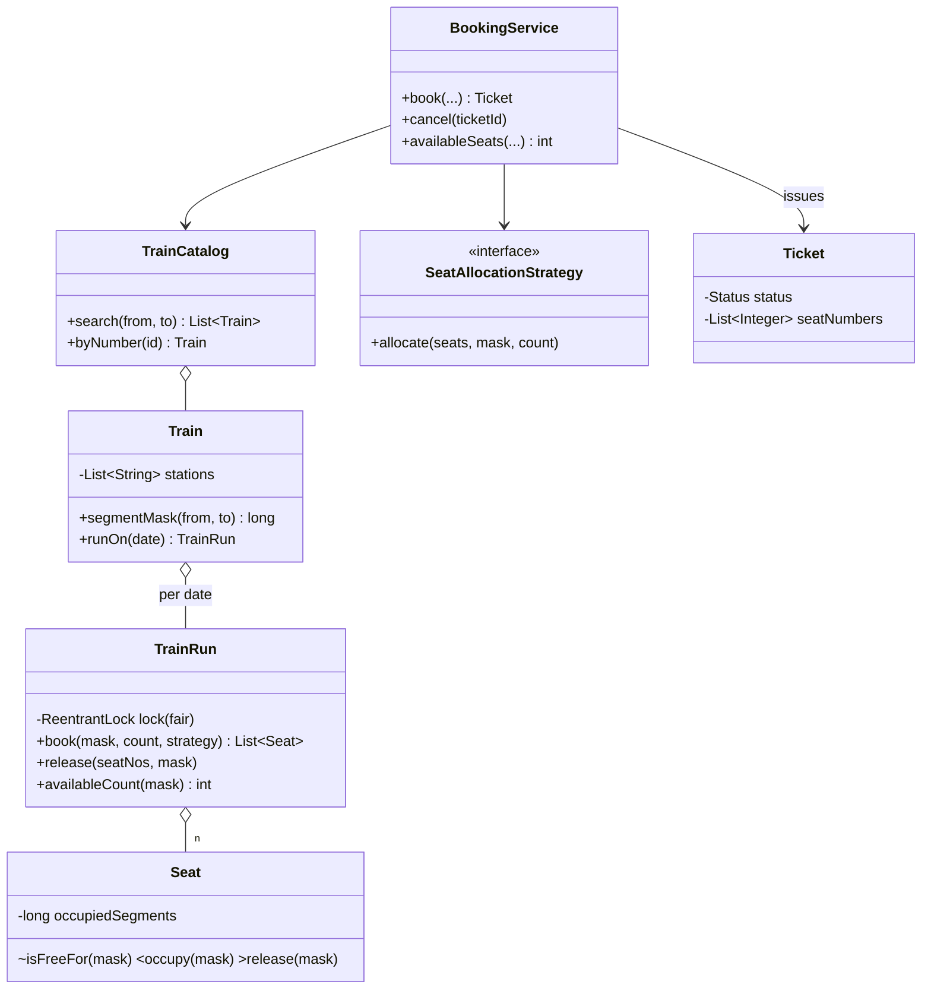

# IRCTC — Train Ticket Booking (segment-based seats)

> **One-liner:** Book train seats where the SAME physical seat is resold across non-overlapping parts of the route. The whole problem is one modelling insight: **inventory is not "seats" — it's "seat × segment"**. Get that, and everything else is Parking-Lot-grade.

## 0. The insight that makes this problem easy

A route with n stations has **n−1 segments** (segment k = the hop from station k to k+1). A journey from station *i* to station *j* occupies **segments i..j−1** — nothing else.

```
Delhi ──s0── Agra ──s1── Bhopal ──s2── Nagpur
```

A booking is painting segments of one seat's row; a seat is bookable for a journey iff its row is blank on **all** of that journey's segments:

| Seat | s0 (Delhi→Agra) | s1 (Agra→Bhopal) | s2 (Bhopal→Nagpur) |
|------|:---:|:---:|:---:|
| 1 | A | A | **B** ← same seat, resold |
| 2 | *free* | C | C |

- Available for **Delhi→Nagpur** (needs s0+s1+s2): seat 1 blocked, seat 2 blocked → **0**
- Available for **Delhi→Agra** (needs s0): seat 2 free → **1**
- A cancels → seat 1 frees s0,s1 only; B's s2 hold is untouched.

In code, each seat's row is a **long bitmask**; journey i→j is the mask `((1L<<j)-1) & ~((1L<<i)-1)`; "seat free for journey" is one AND — **O(1)**.

## 1. Requirements (as asked in the real interview)

**In scope:**
- Search trains by number, and by (source, destination, date)
- Available-seat count for (train, source, destination, date)
- Book tickets; concurrent booking requests handled **fairly**
- **Seat reuse across segments** (A books S1 st1→st2 ⇒ B can book S1 st3 onwards)
- Cancel a booked ticket

**Assumptions (state them back):** one run per train per day; reverse journey = different train id; single coach; no berth/coach preference; **confirmed-only, no waitlist**.

## 2. Clarifying questions to ask

- Can a booking span intermediate stations? *(THE question — it changes the entire inventory model)*
- Confirmed-only, or waitlist/RAC too? Single coach or many? Berth preferences?
- What does "fair" mean for concurrent requests — FIFO?
- Multiple seats per booking — all-or-nothing?
- Max stations per route? *(bounds the bitmask: ≤64 → a `long` works)*

## 3. Entities & relationships

"Catalog has Trains; a Train has an ordered route and one Run per date; a Run has Seats; a Seat's occupancy is a bitmask over the route's segments; a Ticket names its run, journey, and seat numbers."



## 4. Patterns used — and why (one sentence each)

| Pattern | Where | Why (the change it absorbs) |
|---------|-------|------------------------------|
| Strategy | `SeatAllocationStrategy` | Allocation will vary (lowest-first, window/berth preference, quota pools) |
| Repository | `TrainCatalog`, ticket map | In-memory `Map<Id, Entity>`, swappable for a DB |
| *deliberately none else* | — | No State (ticket has 2 statuses — an enum + guarded flip suffices), no Factory, no Observer yet (notifications would add one) |

**Approach vs alternatives:** chosen — **per-seat segment bitmask + fair `ReentrantLock` per train-run (pessimistic)**; availability/booking O(seats) with an O(1) check per seat. Alternatives an interviewer may raise: **per-segment free counters** with `min()` over the range — WRONG for confirmed booking: min-of-counts can be satisfied by *different* seats on different segments, but a passenger needs ONE seat across the whole journey (this trap is the point of the question); **interval list per seat** — correct, O(bookings-per-seat) overlap checks, fine but strictly worse than the O(1) bitmask for ≤64 segments (beyond 64: `BitSet`, same idea); **optimistic versioning** — valid at low contention, but tatkal-style bursts cause retry storms and it can't honor the explicit fairness requirement the way a fair (FIFO) lock does.

## 5. Concurrency

- **Shared state:** the seat-occupancy bitmasks of one `TrainRun`.
- **Lock & granularity:** one **fair** `ReentrantLock` per run (train+date). Two trains, or the same train on two dates, never contend. Fair = waiting bookers acquire FIFO — the requirement's "fair manner", literally.
- **Why not per-seat locks:** allocation is a *cross-seat* check-then-act — "find k seats free on these segments, then take them" must be atomic as a set; per-seat locks would need lock-ordering plus retry loops for zero practical gain on ≤72 seats/coach.
- **Trade-off (say it):** fair locks disable barging, so they're slower than unfair ones under heavy contention — correctness of the fairness requirement over raw throughput. Reads (`availableCount`) take the same lock: a non-volatile `long` may tear/stale-read against concurrent writes; a `ReadWriteLock` is the upgrade if availability queries dominate.
- **Never held across I/O:** payment would run *outside* the lock via hold-with-TTL + idempotent confirm (see Movie Booking p06) — here booking is instant-confirm, so the lock covers pure memory ops only.

## 6. Must-cover edge cases

- [x] Same seat, disjoint segments → both bookings succeed ([Demo](Demo.java): A and B share seat 1)
- [x] Overlapping segments → seat excluded; zero seats free across the full journey → `NoSeatsAvailableException` (all-or-nothing)
- [x] Destination before source / unknown station → `InvalidRouteException` before any inventory is touched
- [x] Cancel frees **exactly the ticket's segments** — the seat's other bookings survive
- [x] Double cancel → `IllegalStateException` (`synchronized markCancelled`)
- [x] Two users race for the last seat → fair lock serializes; exactly one confirms
- [x] Route bounds validated at construction (2..64 stations, ≥1 seat)

## 7. Key code snippets

The whole trick — journey → mask, seat check, in [Train](Train.java) / [Seat](Seat.java):

```java
long segmentMask(String from, String to) {          // bits i..j-1
    int i = stations.indexOf(from), j = stations.indexOf(to);
    if (i < 0 || j < 0 || i >= j) throw new InvalidRouteException(...);
    return ((1L << j) - 1) & ~((1L << i) - 1);
}

boolean isFreeFor(long mask) { return (occupiedSegments & mask) == 0; }  // O(1)
void occupy(long mask)       { occupiedSegments |= mask; }
void release(long mask)      { occupiedSegments &= ~mask; }
```

Atomic all-or-nothing booking under the fair per-run lock, in [TrainRun](TrainRun.java):

```java
lock.lock();                                   // fair: FIFO across waiting bookers
try {
    List<Seat> chosen = strategy.allocate(seats, mask, count);
    if (chosen.size() < count) throw new NoSeatsAvailableException(...);
    for (Seat s : chosen) s.occupy(mask);      // check+take under ONE lock: no race
} finally { lock.unlock(); }
```

## 8. Extension questions & answers

- **"Add waitlist/RAC."** On failure, enqueue (journey-mask, user, count) per run. On every cancel, scan the queue in order and confirm the first request(s) whose mask now fits — promotion is just `book()` retried under the same lock. Confirmed-only was an explicit assumption; name this design, don't build it unasked.
- **"Multiple coaches / berth preference."** Seat id becomes (coach, number); preference is a new `SeatAllocationStrategy` — the inventory model doesn't change at all.
- **"Pricing."** Fare = f(segments crossed, class) behind a `FareStrategy`; money in paise. Segment count falls out of `Long.bitCount(mask)`.
- **"Route longer than 64 stations."** Swap the `long` for a `BitSet` per seat — same AND/OR algebra, constructor already guards this.
- **"Make it distributed / DB-backed."** The seat×segment model maps to a `(run_id, seat_no, segment)` table with a uniqueness constraint: booking = transactional insert of all your segment rows (any conflict → rollback = all-or-nothing for free), or `SELECT ... FOR UPDATE` on the run. Add an idempotency key per booking request for retries; fairness moves to a queue in front of the writer.

## 9. Expected interview follow-ups

1. **Q: Why not keep a free-seat COUNT per segment and take `min()` over the journey?**
   **A:** min-of-counts overestimates: segment s0 might have seat 2 free and s1 have seat 1 free — min says 1, but no *single* seat covers both. Confirmed booking must allocate one seat across all segments, so you need per-seat rows, not per-segment tallies. (This is the trap that fails candidates.)
2. **Q: Where's the lock, and why is it fair?**
   **A:** One `ReentrantLock(true)` per train-run — the unit of contention. Fair = FIFO handoff, which is the requirement's "fair manner"; the cost is disabled barging (lower throughput), which I accept because fairness was explicit.
3. **Q: Complexity of availability and booking?**
   **A:** O(seats) per query/booking with an O(1) bitmask AND per seat; mask construction O(1). Coach ≈ 72 seats, so effectively constant; for whole-train scale, keep per-run seat lists partitioned by coach.
4. **Q: A books Delhi→Bhopal then cancels — what exactly is freed?**
   **A:** Only bits s0,s1 of seat 1 (`release(mask)` ANDs with the complement). B's Bhopal→Nagpur hold on the same seat lives on bit s2 and is untouched — cancellation is segment-scoped, not seat-scoped.
5. **Q: Two requests race for the last seat — walk me through it.**
   **A:** Both call `book()`; the fair lock admits them FIFO. First: allocate finds seat, occupies, confirms. Second: allocate under the same lock now sees the occupied mask, returns empty → `NoSeatsAvailableException`. No check-then-act window exists because check and take share one critical section — the Demo runs this race live.

Run [`Demo.java`](Demo.java) — seat reuse (A and B share seat 1), zero availability across the full route, both validation failures, segment-scoped cancel + double-cancel rejection, and the two-thread race where exactly one booking confirms.
