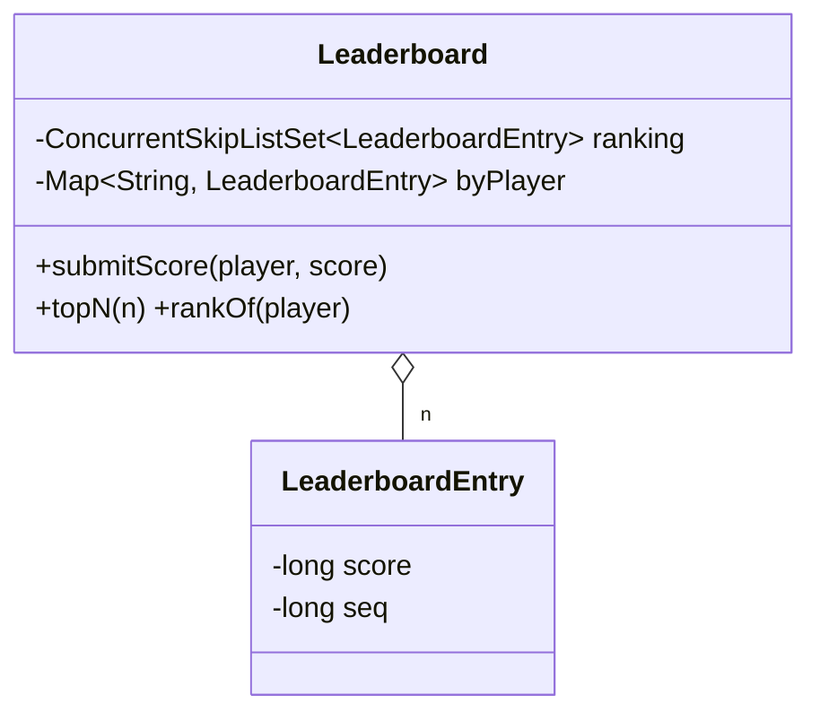

# Leaderboard

> **One-liner:** The in-memory Redis ZSET: a concurrent skip list for rank order + a hash map for O(1) player lookup, with a deterministic tie rule (first to reach the score ranks higher) and update-as-remove+insert.

## Scope & clarifying questions

**In scope:** submit/update scores (the heavy operation); topN; rank and score of a player; deterministic ties; concurrent updates keeping both structures consistent. **Out:** time-windowed boards (daily/weekly = one board per window), pagination around a player, percentile queries, persistence.

Ask: ties — same rank or deterministic order, and broken by what? Update rate vs read rate? Is rank-of-player a hot query *(drives the O(log n) rank discussion)*? Score only increases, or can it drop?

## Approach vs alternatives

Chosen — **`ConcurrentSkipListSet` ordered by (score desc, seq asc, id) + `ConcurrentHashMap` player→entry**. Skip list = O(log n) insert/remove with lock-free readers (why Redis uses one for ZSET); the map finds the old entry so an update is remove+insert. Writers serialize on one lock because the update touches two structures atomically; readers never block. Alternatives: **`TreeMap` + global RW lock** — same complexity, readers block writers; **a heap** — no removal of arbitrary entries, no iteration in rank order; **bucket-by-score array** — O(1) when scores are small dense integers (game levels!) — name it; **rank query**: walking the list is O(n) — an **order-statistic tree** (subtree sizes) or Redis `ZRANK` gives O(log n); the entry's `seq` tie-break also makes ranks stable and total.



## Key code

```java
Comparator<LeaderboardEntry> RANKING =
    comparingLong(LeaderboardEntry::score).reversed()  // high score first
        .thenComparingLong(LeaderboardEntry::seq)      // tie: earlier submission wins
        .thenComparing(LeaderboardEntry::player);      // total order — set semantics need it

// update = remove old + insert new, atomically w.r.t. other writers
LeaderboardEntry old = byPlayer.get(player);
if (old != null) ranking.remove(old);
ranking.add(new LeaderboardEntry(player, score, seq.incrementAndGet()));
```

## Must-cover edge cases

- [x] Ties broken deterministically — asha before bala at 100 (earlier submission)
- [x] Update re-ranks (bala 100→150 takes #1); a player appears exactly once
- [x] Comparator is a TOTAL order (set equality — without the id tie-break, two players with equal score+seq would silently merge)
- [x] Unknown player → exception, not rank 0
- [x] 2000 concurrent updates → map and skip list stay the same size

## Interview follow-ups

1. **Q: Why a skip list and not a balanced tree?** **A:** Same O(log n), but skip lists support lock-free concurrent readers naturally (CAS on forward pointers) — which is why `ConcurrentSkipListSet` exists and Redis ZSET uses one. A `TreeMap` needs a global lock around rebalancing.
2. **Q: Why does update need the map?** **A:** The set is ordered by score — you can't find "asha's current entry" in it without knowing her old score. The map remembers it; update = lookup, remove, insert. Forgetting this (inserting without removing) leaves ghost entries — the classic bug.
3. **Q: rank-of-player at a million players?** **A:** The O(n) walk dies. Order-statistic tree (each node stores subtree size → rank in O(log n)), or offload to Redis `ZRANK`. If scores are small dense ints, bucket counts + prefix sums beat everything.
4. **Q: Daily and all-time boards?** **A:** One board instance per window, double-write on submit; expire whole boards, never individual entries. Windowed decay (scores fade) is a different product — recompute jobs, not live structures.

Run [`Demo.java`](Demo.java) — deterministic tie ordering, live re-ranking on update, unknown-player rejection, and 2000 concurrent updates with both structures consistent.
