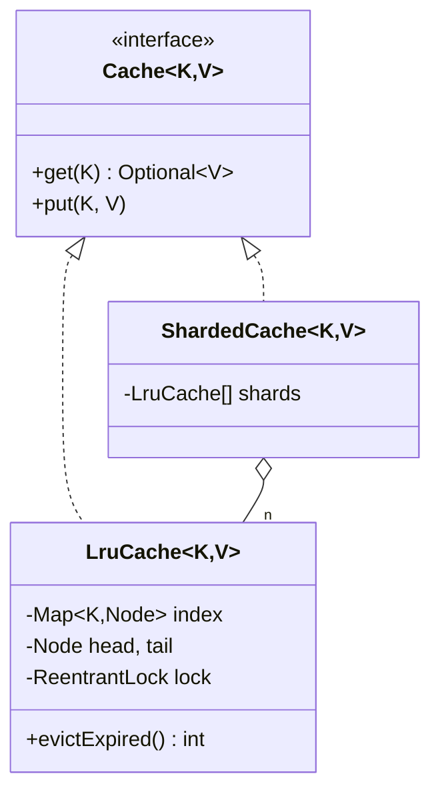

# LRU Cache (thread-safe, TTL)

> **One-liner:** THE known-optimal data structure question: HashMap + hand-rolled doubly-linked list = O(1) get/put/evict. The senior twists: a `get` is a WRITE (recency moves), so no ReadWriteLock — scale with sharding instead; TTL is lazy.

## Scope & clarifying questions

**In scope:** O(1) get/put, capacity eviction (LRU), per-entry TTL with lazy expiry + sweep, thread safety, lock striping via shards. **Out:** LFU (frequency buckets — see follow-up), weighted sizes, async loading (Caffeine-style), stats.

Ask: exact O(1) required? TTL per entry or global? `LinkedHashMap(accessOrder=true)` acceptable or hand-roll? Expected concurrency — single lock or striped? Eviction listener needed?

## Approach vs alternatives

Chosen — **HashMap<K, Node> + DLL with sentinel head/tail**: lookup O(1), recency move = unlink+link-front O(1), eviction = tail.prev O(1). Alternatives: **`LinkedHashMap(accessOrder=true)` + `removeEldestEntry`** — the honest 5-line answer; say it exists, then hand-roll because the interviewer wants the pointer surgery; **`ConcurrentHashMap` + timestamps** — O(n) eviction scan, rejected; **ReadWriteLock** — useless here because get mutates order (this is the trap in "make it thread-safe"); **sharding** (built) — N independent locks, ~N× less contention, trade: LRU order and capacity become per-shard approximations, which every production cache (Caffeine, memcached) accepts.



## Key code

```java
Optional<V> get(K key) {                       // a "read" that WRITES
    lock.lock();
    try {
        Node n = index.get(key);
        if (n == null) return Optional.empty();
        if (isExpired(n)) { unlink(n); index.remove(key); return Optional.empty(); } // lazy TTL
        moveToFront(n);                        // recency mutation → why one lock, not RW
        return Optional.of(n.value);
    } finally { lock.unlock(); }
}

if (index.size() > capacity) { Node evict = tail.prev; unlink(evict); index.remove(evict.key); }
```

## Must-cover edge cases

- [x] Eviction is LRU, and `get` refreshes recency (demo: touched `a` survives, `b` dies)
- [x] TTL: expired entries die lazily on access; `evictExpired()` sweep for hygiene
- [x] Sentinel head/tail — no null-checks in pointer surgery (the classic bug source)
- [x] Capacity 1 works; duplicate put updates value + recency + TTL
- [x] 40k concurrent ops across shards → size stays bounded, no corruption

## Interview follow-ups

1. **Q: Why not a ReadWriteLock?** **A:** LRU `get` moves the node to the front — every operation writes. RW locks only help when reads truly don't mutate; here they'd serialize anyway (and be slower). The scaling tool is striping, not read locks.
2. **Q: LFU instead?** **A:** O(1) LFU = frequency buckets: `Map<freq, DLL>` + min-freq pointer; each access moves the node up one bucket. Name the structure; note LFU's cold-start/aging problem (new entries evicted instantly) and the LFU-with-decay fix.
3. **Q: TTL — timer per entry?** **A:** Never: lazy expiry on touch + an optional sweep. Same answer as locker/rate-limiter — per-key timers don't scale.
4. **Q: What does sharding cost you?** **A:** Global LRU order: each shard evicts its own LRU, so a globally-hot shard may evict entries a global cache would keep. Capacity also partitions. Production caches accept the approximation for the concurrency win.

Run [`Demo.java`](Demo.java) — recency-aware eviction, lazy TTL + sweep, and an 8-thread shard hammer with bounded size.
