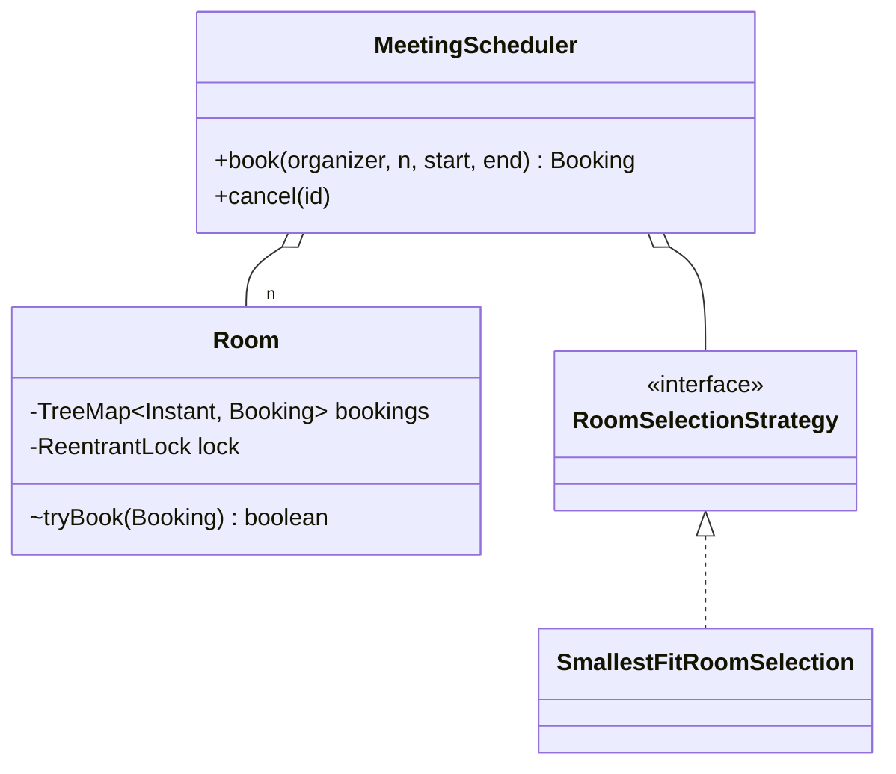

# Meeting Room Scheduler

> **One-liner:** Interval conflicts done optimally — a per-room `TreeMap<start, Booking>` makes the overlap check TWO neighbor lookups (floor + ceiling), O(log n), with check-and-insert atomic under a per-room lock.

## Scope & clarifying questions

**In scope:** book (organizer, attendees, [start, end)); smallest-sufficient-room allocation Strategy; conflict detection; back-to-back allowed (half-open intervals); cancel + rebook; concurrent bookings race safely. **Out:** recurring meetings (expand into instances or store rules + check both — name it), invitees/calendars, working-hours validation, room features (projector — a filter in the strategy).

Ask: is end exclusive (back-to-back ok)? Pick a room automatically or user-chosen? Recurring meetings? What granularity — minutes? Multiple offices/floors?

## Approach vs alternatives

Chosen — **`TreeMap` keyed by start + two-neighbor overlap test**: only the meeting just before (`floorEntry`) and just at/after (`ceilingEntry`) the new start can possibly conflict — everything else is provably disjoint. Alternatives: **list scan** — O(n) per booking, the naive answer; **interval tree** — the general structure for *stabbing* queries and overlapping-interval sets, overkill when bookings within a room are non-overlapping by invariant (say exactly that — it's why TreeMap suffices); **slot bitmap** (15-min granularity, like IRCTC segments) — O(slots) but simple, right when granularity is fixed and coarse.



## Key code

```java
// overlap = exactly two neighbor checks (bookings within a room are disjoint)
Map.Entry<Instant, Booking> before = bookings.floorEntry(b.start());
if (before != null && before.getValue().end().isAfter(b.start())) return false;
Map.Entry<Instant, Booking> after = bookings.ceilingEntry(b.start());
if (after != null && after.getKey().isBefore(b.end())) return false;
bookings.put(b.start(), b);   // same lock as the checks — atomic
```

## Must-cover edge cases

- [x] Overlap rejected; **back-to-back accepted** (half-open [start, end))
- [x] Smallest sufficient room chosen (3p → 4-seater, not the hall)
- [x] Nobody fits / invalid range → specific exceptions
- [x] Cancel frees the slot; rebooking works
- [x] Two organizers race one slot → exactly one wins (per-room lock)

## Interview follow-ups

1. **Q: Why is checking just two neighbors enough?** **A:** Within a room, existing bookings are pairwise disjoint (the invariant the lock maintains). So the only candidates that can overlap [s, e) are the latest booking starting ≤ s and the earliest starting ≥ s. Everything earlier ends before that floor entry; everything later starts after the ceiling. O(log n), no scan.
2. **Q: When would you need a real interval tree?** **A:** When stored intervals may overlap each other (one person's calendar across rooms, equipment shared across meetings) — then "find all overlapping" needs augmented trees. Here the non-overlap invariant makes TreeMap strictly better.
3. **Q: Recurring meetings?** **A:** Two designs: expand into N instances (simple, storage-heavy, edits touch N rows) vs store the rule + check new bookings against both instances and rules (compact, complex conflict math). Products mostly expand within a horizon — say the trade.
4. **Q: Find the first free slot of length L?** **A:** Walk consecutive TreeMap entries and return the first gap ≥ L — O(n) worst case; keep a free-gap structure if this query dominates.

Run [`Demo.java`](Demo.java) — smallest-fit allocation, overlap rejection, back-to-back boundary, cancel/rebook, and a two-thread race for one slot.
