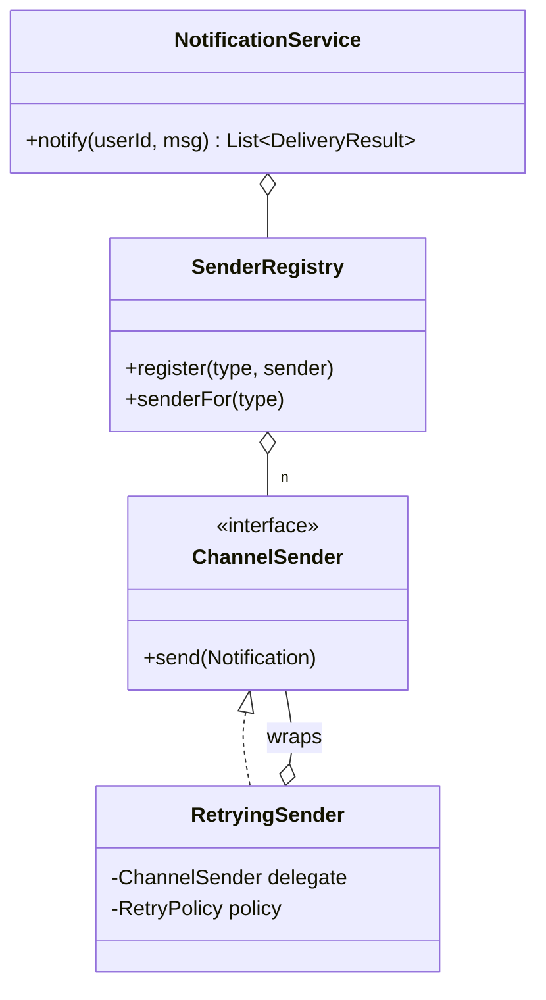

# Notification Service

> **One-liner:** The pattern-composition problem — Factory registry for channels, Decorator for retry-with-backoff, parallel fan-out futures with per-channel timeouts, and failures as *results*, never as broken siblings.

## Scope & clarifying questions

**In scope:** user channel preferences; parallel fan-out to email/SMS/push; retry with exponential backoff (injected Sleeper — testable without sleeping); per-channel timeout; failing/dead channel isolated in the result list. **Out:** templates/localization, digest batching, delivery receipts/webhooks, rate limiting per provider (compose the p08 limiter), dedupe keys.

Ask: which channels, and do they fan out in parallel? Retry policy per channel? What does the caller get back — per-channel status? Is a notification lost if all channels fail (dead-letter)? Ordering guarantees?

## Approach vs alternatives

Chosen — **registry Factory + Decorator-wrapped senders + `CompletableFuture` fan-out on an injected executor**. Each channel: `supplyAsync(dispatch).completeOnTimeout(failed, 2s)` — a slow provider can't hold the others hostage. Alternatives: **sequential sends** — simple, but latency = sum of providers and one hang blocks all; **fire-and-forget queue per channel** (the p07 logging shape) — the production upgrade for throughput + durable retries, costs synchronous results; name it. Backoff sleeps through an injected `Sleeper` for the same reason clocks are injected — the demo records `[100ms, 200ms]` instead of actually waiting.



## Key code

```java
// fan-out: parallel, per-channel timeout, failure becomes a RESULT
channels.stream().map(ch -> CompletableFuture
        .supplyAsync(() -> dispatch(ch, notification), executor)
        .completeOnTimeout(DeliveryResult.failed(ch, "timed out"), 2, SECONDS))
    .map(CompletableFuture::join) ...

// decorator retry with injected backoff
catch (Exception e) {
    if (attempt == policy.maxAttempts()) throw new Exception("gave up after " + attempt);
    sleeper.sleep(policy.delayBeforeAttempt(attempt + 1));   // 100ms, 200ms, 400ms…
}
```

## Must-cover edge cases

- [x] Flaky channel healed by retry (2 failures → delivered on 3rd; backoff delays recorded)
- [x] Dead channel exhausts retries → FAILED result; email/SMS unaffected (isolation)
- [x] Per-channel timeout (`completeOnTimeout`) — a hung provider can't block the fan-out
- [x] Unknown channel → registry throws, captured as a failed result
- [x] User with no preferences → empty result, not an error

## Interview follow-ups

1. **Q: Why is `Sleeper` injected?** **A:** Same reason as `Clock`: `Thread.sleep` inline makes retry untestable (a 3-retry test takes 700ms of wall time). Inject the side effect; the demo proves backoff `[100ms, 200ms]` without sleeping.
2. **Q: Why jitter on top of exponential backoff?** **A:** Without it, all clients that failed together retry together — synchronized stampedes on the recovering provider. `delay * random(0.5..1.5)` decorrelates them.
3. **Q: All channels fail — is the notification lost?** **A:** In this build, the caller sees all-FAILED and decides. Production: park in a dead-letter store and re-drive — plus a circuit breaker per provider so a dead one stops burning retries.
4. **Q: At-least-once retries mean possible duplicates — how do users not get 3 SMSes?** **A:** Idempotency key per (notification, channel) checked at the provider boundary — the same answer as payments; retries must be safe to replay.

Run [`Demo.java`](Demo.java) — parallel fan-out with one healed channel, one dead channel isolated, recorded backoff, and the no-preferences case.
