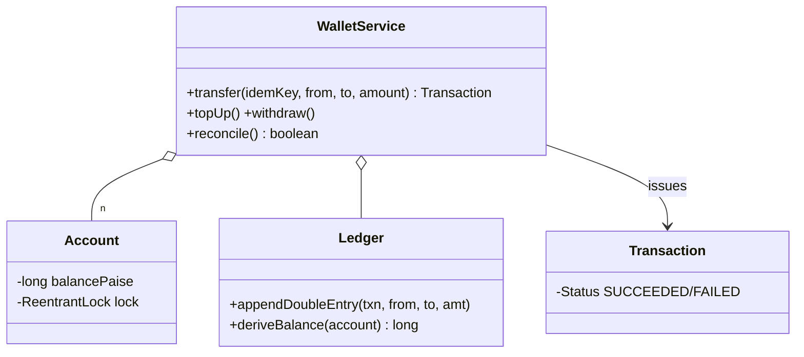

# Payment Gateway / Wallet

> **One-liner:** A wallet is a **double-entry ledger** with balances as cached derivations — plus the two non-negotiables: idempotent transfers (retry ≠ double spend) and **ID-ordered locking** so A→B and B→A can't deadlock.

## Scope & clarifying questions

**In scope:** accounts + a treasury (money's border crossing); transfer/top-up/withdraw as double-entry transactions; idempotency keys; insufficient-balance and self-transfer rejection; reconciliation (system sums to zero, ledger replay == live balances); deadlock-free concurrent opposing transfers. **Out:** external PSP integration (the p06 saga — reference it), refunds/reversals (compensating transactions, never deletes), KYC/limits, multi-currency.

Ask: is a retry with the same key expected to return the original result? Can balances go negative (overdraft)? Are failed attempts recorded? What proves the books are right — reconciliation cadence?

## Approach vs alternatives

Chosen — **double-entry**: every transaction writes two legs summing to zero; account balance is a cached fold of its legs, and `reconcile()` re-derives to catch drift. This is non-negotiable bookkeeping, not a style choice: single-sided "balance += x" has no audit trail and no invariant to check. **Idempotency** = `Map<key, Transaction>`, checked before AND re-checked inside the locks (double-checked, correctly — inside a lock, not DCL-on-a-field). **Deadlock**: two-account operations lock in account-ID order — the canonical fix for circular wait; the demo fires 200 opposing transfers that would hang a naive implementation in seconds. Alternatives: **serialize everything on one lock** — correct, kills throughput, unnecessary; **optimistic CAS per account** — works for single-account ops, but transfer is a two-account invariant (debit iff credit) which CAS can't span — exactly the roadmap's "multi-variable invariant → use a lock".



## Key code

```java
// canonical lock order: A→B and B→A acquire in the SAME order → no circular wait
Account first  = fromId.compareTo(toId) < 0 ? from : to;
Account second = first == from ? to : from;
first.lock().lock();
second.lock().lock();
try {
    if (byIdempotencyKey.containsKey(key)) return replayed;  // re-check INSIDE the locks
    if (!from.canDebit(amount)) throw new InsufficientBalanceException(...);
    from.apply(-amount);
    to.apply(+amount);
    ledger.appendDoubleEntry(txnId, fromId, toId, amount);   // both legs, atomically
    byIdempotencyKey.put(key, txn);
} finally { second.lock().unlock(); first.lock().unlock(); }
```

## Must-cover edge cases

- [x] Idempotent replay: same Transaction returned, balances move once
- [x] Insufficient balance / self-transfer / non-positive amount → specific exceptions, nothing mutated
- [x] 200 opposing concurrent transfers complete — the deadlock demo that fails without lock ordering
- [x] Treasury models money entering/leaving: the whole system always sums to zero
- [x] Reconciliation: ledger replay equals every live balance

## Interview follow-ups

1. **Q: Why double-entry instead of just updating balances?** **A:** Two invariants for free: every transaction internally sums to zero (can't lose money in a crash between debit and credit if legs are atomic), and the whole system sums to zero. Balance becomes a *derived* number you can re-check — that's what reconciliation means. Single-sided updates give you neither.
2. **Q: Walk me through the deadlock and its fix.** **A:** T1 locks alice then wants bob; T2 locks bob then wants alice — circular wait, both stuck forever. Fix: a global acquisition order (account ID); both threads lock alice first, so one simply waits. Same answer as p05's move and p06's seats — one rule, everywhere.
3. **Q: Client retries a transfer after a timeout — how do you not double-charge?** **A:** The idempotency key. First check is a fast path; the authoritative re-check happens inside the locks so two concurrent retries can't both commit. Store the result, return it forever.
4. **Q: How do refunds work?** **A:** A new compensating transaction (B→A) referencing the original — the ledger is append-only; you never edit or delete a posted entry. That's also the saga's compensation leg when an external PSP capture fails.

Run [`Demo.java`](Demo.java) — idempotent replay, both rejection paths, the 200-transfer deadlock gauntlet, and a clean reconcile.
