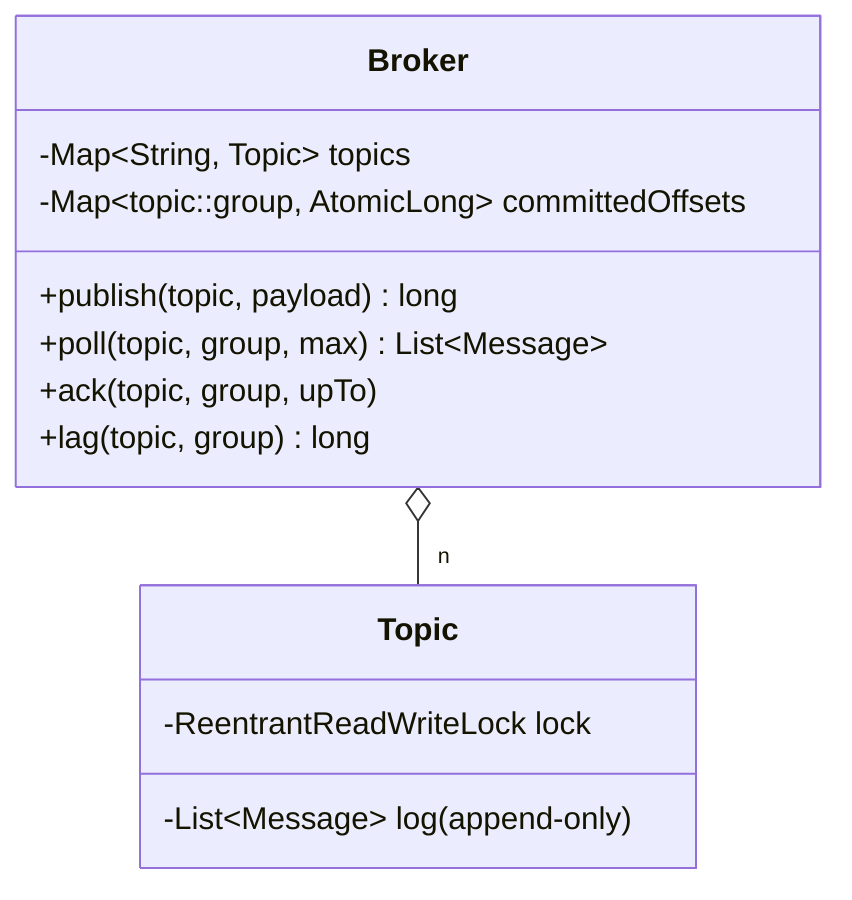

# Pub-Sub / Message Queue (Kafka-lite)

> **One-liner:** One decision generates the whole design: **delivery doesn't remove messages — consumers move OFFSETS over an append-only log.** Groups fan out, members of a group share an offset, and poll-then-ack gives at-least-once.

## Scope & clarifying questions

**In scope:** topics as append-only logs; publish returns the offset; consumer groups with committed offsets (`poll` reads, `ack` advances — monotonic); redelivery when un-acked (at-least-once); lag; concurrent publishers with contiguous offsets. **Out:** partitions (parallelism within a group — name it), visibility timeouts / per-message in-flight tracking (SQS model), retention/compaction, persistence.

Ask: queue (one consumer eats it) or pub-sub (everyone sees it)? *(groups give you both — the answer to say)*; delivery guarantee — at-most / at-least / exactly-once? Ordering scope? What happens to a message a consumer keeps failing on?

## Approach vs alternatives

Chosen — **log + offsets (Kafka model)**: fan-out to N groups costs nothing (each is just another counter), replay is free (reset the offset), acks are a single monotonic CAS. Alternatives: **per-consumer delivery queues** (RabbitMQ-style push) — the broker copies/tracks per consumer; simpler mental model, but fan-out multiplies storage and replay is gone; **in-flight set + visibility timeout** (SQS) — per-message redelivery instead of batch re-poll, needed when consumers in one group must not re-receive each other's un-acked work — name it as the upgrade; here, one offset per group is the honest interview scope. `ReadWriteLock` on the log: many pollers, one appender class of contention.



## Key code

```java
// poll reads from the committed offset — and does NOT advance it
List<Message> poll(topic, group, max) { return t.read(offsetFor(topic, group).get(), max); }

// ack is a MONOTONIC commit: stale/duplicate acks can never move the offset backwards
long next = upToOffset + 1;
while (true) {
    long current = committed.get();
    if (next <= current || committed.compareAndSet(current, next)) return;
}
```

## Must-cover edge cases

- [x] Two groups each receive ALL messages (fan-out); members of a group share one offset
- [x] Un-acked poll → same messages redelivered (at-least-once, shown live)
- [x] Crash-after-partial-processing resumes exactly after the last ack
- [x] Stale ack cannot regress the offset (monotonic CAS)
- [x] Unknown topic → explicit exception
- [x] 4 concurrent publishers → 400 contiguous, unique offsets

## Interview follow-ups

1. **Q: Queue vs pub-sub — which is this?** **A:** Both, and that's the point of consumer groups: every *group* gets every message (pub-sub); consumers *within* a group share the offset so each message is processed once per group (queue). One mechanism, both semantics.
2. **Q: Why does at-least-once fall out of poll-then-ack?** **A:** The offset only moves on ack. Crash after processing but before acking → the next poll redelivers. The alternative orderings are worse: advance-on-poll is at-MOST-once (crash = message lost). Consequence to say aloud: consumers must be idempotent.
3. **Q: How would exactly-once work?** **A:** It doesn't, as a transport guarantee — you get it end-to-end: idempotent consumers (dedupe on message id) or atomically committing the offset WITH the processing result in the same store (Kafka's transactional consumer trick).
4. **Q: One group needs parallel consumers — how?** **A:** Partitions: split the topic log by key hash; each partition has its own offset per group and is owned by one consumer at a time. Ordering shrinks from topic-wide to per-partition — the fundamental trade.

Run [`Demo.java`](Demo.java) — group fan-out, redelivery without ack, resume-after-crash, monotonic ack, unknown-topic rejection, and contiguous offsets under concurrent publishing.
