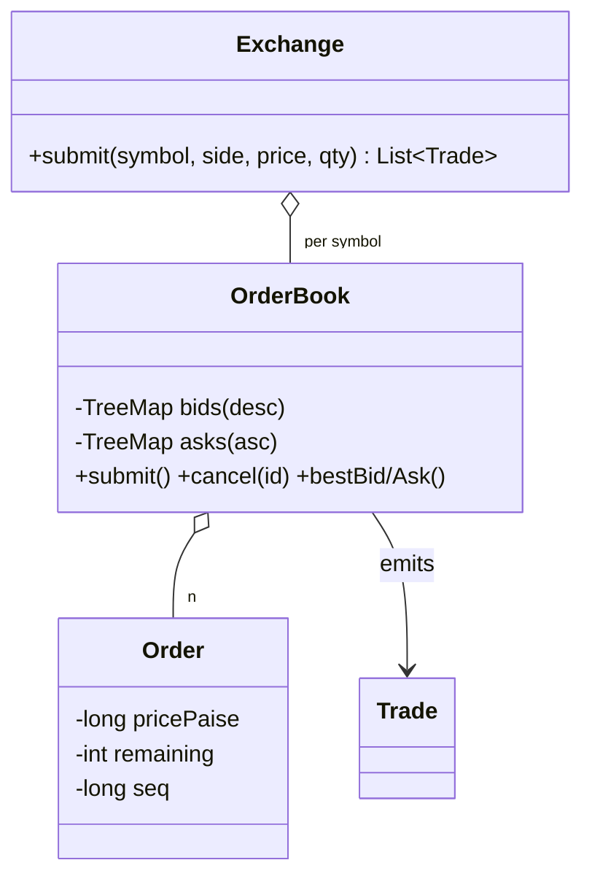

# Stock Exchange / Order Matching

> **One-liner:** THE order book: `TreeMap` price levels + FIFO queue per level = price-time priority; executions price at the RESTING order's limit; partial fills are the normal case; matching per symbol is single-threaded by design.

## Scope & clarifying questions

**In scope:** limit orders; matching on arrival with price-time priority; partial fills across levels; remainder rests; cancel; best bid/ask; per-symbol serialized matching; concurrent submits across threads stay consistent. **Out:** market orders (a limit at ∞/0 — say it), stop orders, self-trade prevention, fees, settlement/clearing, market-data feeds.

Ask: limit only, or market/IOC/FOK? Which price executes when limits overlap? *(the resting order's — price improvement)* Priority within a price level? Expected throughput — does per-symbol serialization suffice?

## Approach vs alternatives

Chosen — **two `TreeMap<price, Deque<Order>>`** (bids descending, asks ascending): best level is `firstEntry()` O(log L), FIFO deque gives time priority, cancel is a level lookup + removal. Alternatives: **heaps (PriorityQueue)** — O(log n) best, but no O(log n) cancel and same-price time priority needs (price, seq) tuples — TreeMap-of-queues dominates once cancels exist (they always do); **sorted list per side** — O(n) inserts; **array-indexed price ladder** (price → slot) — O(1) everything, the real HFT answer when tick size and price bands are fixed — name it as the upgrade. **Concurrency:** matching is *deliberately* single-threaded per symbol (synchronized book) — a matching engine's correctness depends on total ordering of arrivals; real exchanges shard by symbol onto actor threads. Parallelizing inside one book is the wrong answer; say why.



## Key code

```java
while (!order.isFilled() && !opposite.isEmpty() && crosses(order, opposite.firstKey())) {
    Order resting = opposite.firstEntry().getValue().peekFirst(); // price THEN time
    int qty = Math.min(order.remaining(), resting.remaining());   // partial fills natural
    long px = resting.pricePaise();                               // RESTING price executes
    order.fill(qty); resting.fill(qty);
    if (resting.isFilled()) level.pollFirst();
    if (level.isEmpty()) opposite.pollFirstEntry();
}
if (!order.isFilled()) ownSide.computeIfAbsent(price, p -> new ArrayDeque<>()).addLast(order);
```

## Must-cover edge cases

- [x] Price priority across levels AND time priority within a level (ORD-1 fills before ORD-3)
- [x] Execution at the resting order's price — a 102 buy fills at 101 (improvement, shown)
- [x] Partial fills; unfilled remainder rests and becomes the new best bid
- [x] Cancel removes a resting order (and its empty level); bogus cancel returns false
- [x] Zero/negative price or qty rejected at construction
- [x] 100 buys vs 100 sells from two threads → exactly 100 shares traded, book flat

## Interview follow-ups

1. **Q: Both orders have limit prices — which price trades?** **A:** The resting order's. It was there first quoting a price; the aggressor accepts it. That's "price improvement" for the aggressor (my 102 buy filled at 101) and it's how every real exchange works. Splitting the difference is the classic wrong guess.
2. **Q: Why is single-threaded matching per symbol the RIGHT answer, not a concession?** **A:** Matching correctness is defined by arrival order — parallel matching inside one book would need locks so coarse it serializes anyway, plus nondeterminism regulators won't accept. One actor thread per symbol, symbols sharded across cores: that's LMAX/NSE architecture. Concurrency lives *between* books, not within one.
3. **Q: TreeMap vs heap for the book?** **A:** Heap gives cheap best but no cheap cancel and no natural FIFO-within-price. TreeMap of deques gives O(log L) best/insert, O(1) time priority, and findable cancels. With fixed tick sizes, an array ladder beats both — O(1) everything.
4. **Q: Market orders and IOC?** **A:** Market = limit at +∞/0 through the same loop, but never rests (reject or cancel the remainder). IOC = match then discard remainder; FOK = pre-check total available then all-or-nothing. All are policies wrapped around the same match loop.

Run [`Demo.java`](Demo.java) — price-time priority with price improvement, partial fill and resting remainder, cancels, and the two-thread 100×100 cross ending with a flat book.
