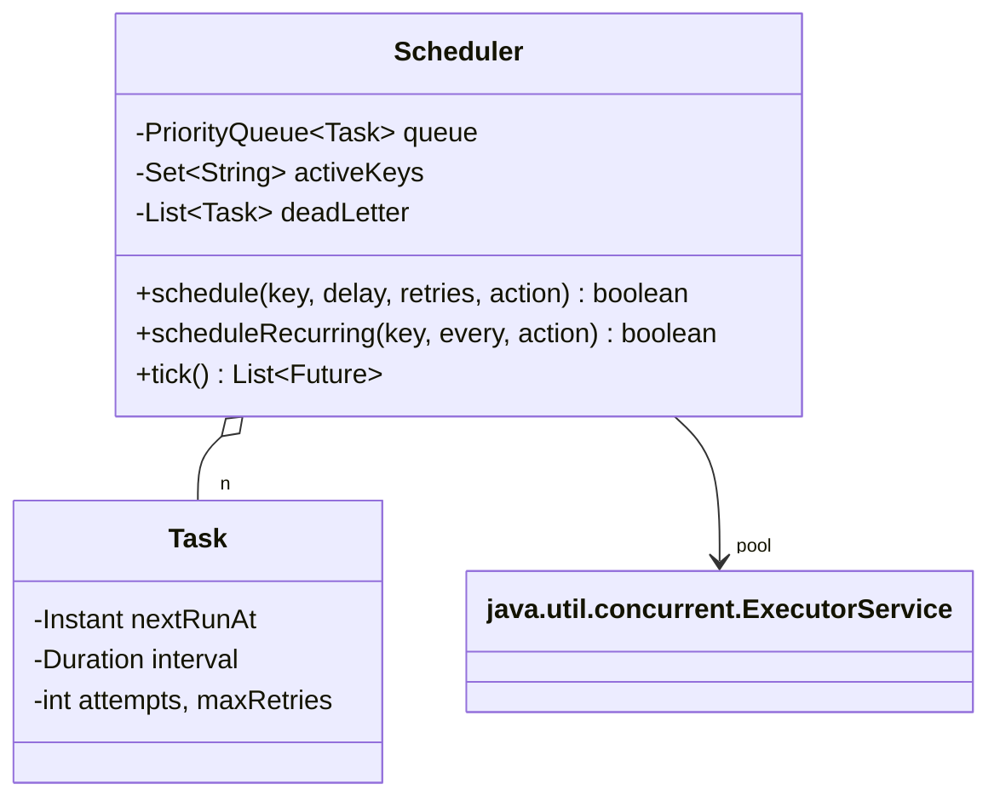

# Task Scheduler / Cron

> **One-liner:** A priority queue ordered by next-run-time, a polling step that hands due tasks to a worker pool, exponential-backoff retries into a dead-letter list, and idempotent submission — the consensus scheduler shape, driven by an injected clock.

## Scope & clarifying questions

**In scope:** one-shot delayed tasks; fixed-rate recurring tasks; retries with exponential backoff; dead-letter after exhaustion; duplicate submission (same key) is a no-op; execution on a worker pool, never under the scheduler lock. **Out:** cron expressions (a `nextRunAfter(Instant)` strategy — name it), persistence/crash recovery, distributed leader election, task priorities beyond time.

Ask: relative delays or cron syntax? Fixed-rate or fixed-delay recurrence (drift semantics)? What happens after max retries? Can the same job be submitted twice? Does a slow task block the scheduler?

## Approach vs alternatives

Chosen — **`PriorityQueue<Task>` by (nextRunAt, seq) under one lock + `tick()` draining due tasks to an `ExecutorService`**. `tick()` is the polling thread's loop body made deterministic; production is the same loop parked on a condition (`await(headDue - now)`) or a `DelayQueue`, woken when the head changes. Alternatives: **`ScheduledThreadPoolExecutor`** — the honest JDK answer, say it exists, then build the internals because that's the question; **timer thread per task** — O(tasks) threads, rejected; **busy polling** — burns a core, rejected (the loop must *wait*, not spin). `PriorityQueue` is not thread-safe and even a blocking variant can't atomically "check head due + wait" — hence one lock around queue touches, execution strictly outside it.



## Key code

```java
// the polling step: drain due under the lock, execute OUTSIDE it
lock.lock();
try {
    while (!queue.isEmpty() && !queue.peek().nextRunAt.isAfter(clock.instant()))
        due.add(queue.poll());
} finally { lock.unlock(); }
due.forEach(t -> workers.submit(() -> run(t)));

// failure → backoff → requeue; exhausted → dead letter, never silently dropped
task.nextRunAt = clock.instant().plus(retryBaseDelay.multipliedBy(1L << (task.attempts - 1)));
```

## Must-cover edge cases

- [x] Duplicate submission with the same key → rejected (idempotent, demo prints `false`)
- [x] Retries: 60s → 120s backoff, then dead-letter (visible in the demo trace)
- [x] Recurring task re-arms after each run; failures of one task never affect others
- [x] User code runs on the pool, never under the scheduler lock
- [x] Deterministic time — stepping clock + tick, zero sleeps

## Interview follow-ups

1. **Q: How does the real polling thread wait without burning CPU?** **A:** `Condition.awaitNanos(headDue - now)` under the queue lock, signalled whenever a new head is inserted — or just `DelayQueue`, which encapsulates exactly that. Busy-polling and per-task timers are the two named wrong answers.
2. **Q: Fixed-rate vs fixed-delay recurrence?** **A:** Fixed-rate schedules from the *planned* time (can bunch up after a stall); fixed-delay from *completion* (drifts). This build re-arms from completion time — state the choice; cron semantics are fixed-rate.
3. **Q: Worker crashes mid-task — is the task lost?** **A:** In-memory, yes — which is why production schedulers persist the task before acking submission and use a visibility timeout: dequeued tasks sit in an in-flight set and reappear if not acked (SQS semantics). That also forces task idempotency, since redelivery means possible double execution.
4. **Q: One task throws forever — what protects the system?** **A:** Bounded retries with exponential backoff, then dead-letter with the task intact for inspection/replay. Unbounded retry is a self-inflicted DoS.

Run [`Demo.java`](Demo.java) — duplicate submission rejected, a one-shot task, a heartbeat re-arming across ticks, and a flaky task walking 60s→120s backoff into the dead-letter list.
