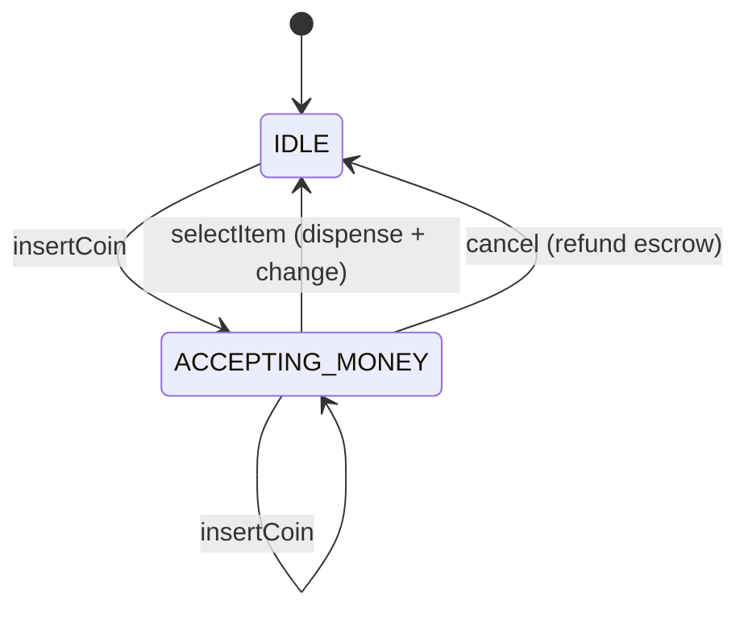

# Vending Machine

> **One-liner:** THE canonical State problem. Each state blocks illegal operations by default, and the purchase is atomic: item + exact change, or the sale is refused with a full refund — inserted coins live in escrow until commit.

## Scope & clarifying questions

**In scope:** insert coins → select → dispense + change; cancel with refund; out-of-stock, insufficient funds, and cannot-make-change all refused cleanly; one transaction at a time. **Out:** card payments, display hardware, restock workflows, multi-tray dispensing.

Ask: coin denominations? What happens when exact change is impossible — short-change, refuse, or hold? Cancel allowed mid-transaction? One customer at a time?

## Approach vs alternatives

Chosen — **GoF State classes** (`IdleState`, `AcceptingMoneyState`) whose default methods throw, plus **coin escrow**: inserted coins join the till only when the sale commits, so every refusal path can refund exactly. Change planning is **greedy largest-first over till + escrow** — exact for canonical coin systems (₹1/2/5/10); for arbitrary denominations greedy fails and DP (coin change) is the named fix. Alternatives: an enum + switch state machine (fine, but this problem is *the* State showcase — use the classes); accepting coins into the till immediately (breaks refunds — the classic bug).



## Key code

```java
// validate EVERYTHING before mutating ANYTHING
if (stock == 0) throw new OutOfStockException(code);
if (inserted < price) throw new InsufficientFundsException(price, inserted);
Map<Coin,Integer> change = planChange(inserted - price, tillPlusEscrow);  // pure planning
if (change == null) throw new CannotMakeChangeException(...);             // refuse, don't short-change
// only now: escrow -> till, change out, stock--, state -> IDLE
```

## Must-cover edge cases

- [x] Select before inserting money → blocked by the state itself
- [x] Insufficient funds → coins stay in escrow (top up or cancel)
- [x] Cannot make change → sale refused, cancel refunds everything inserted
- [x] Out of stock → refused before money is taken
- [x] Atomic commit: till/stock/state mutate only after all checks pass

## Interview follow-ups

1. **Q: Why escrow instead of adding coins to the till on insert?** **A:** Refunds. Once coins mix into the till, "give back exactly what this user inserted" needs change-making — which might be impossible. Escrow keeps refund trivially exact; the till only grows on committed sales.
2. **Q: Greedy change — when does it break?** **A:** Non-canonical coin systems (e.g., {1,3,4}: greedy gives 6=4+1+1, optimal 3+3; with limited stock greedy can miss feasible combos). Canonical currency → greedy is exact; otherwise bounded-knapsack DP.
3. **Q: Where does State earn its keep here vs an if-else?** **A:** Illegal operations become unrepresentable per state (select-while-idle throws in the state, not in a scattered guard), and adding a `DispensingState` or `MaintenanceState` is a new class, not another flag.
4. **Q: Concurrency?** **A:** A physical machine serves one customer — `synchronized` methods model that honestly. A fleet of machines = independent instances; no shared state to engineer.

Run [`Demo.java`](Demo.java) — happy purchase with change, all three refusal paths, and cancel refunds.
