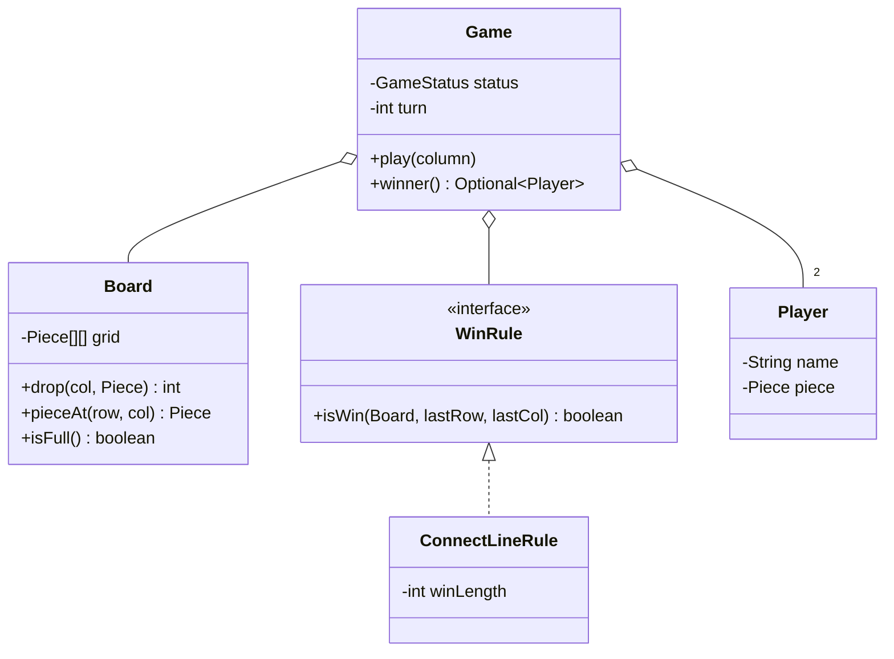

# Connect Four

> **One-liner:** The warm-up problem — it's really testing whether you separate state (Board), coordination (Game), and rules (WinRule), and whether you handle the non-happy paths. No patterns forced.

## 1. Requirements

**In scope (agree these first):**
- Two players alternate dropping pieces into columns; piece falls to the lowest empty cell
- Win = N in a line (horizontal / vertical / diagonal); draw = full board, no win
- Invalid moves (bad column, full column) rejected explicitly; no moves after game over
- Board size and win length configurable

**Out of scope (say it aloud):**
- AI opponent, UI/rendering beyond debug print, persistence, timers/clocks, online play — "I'll design so these bolt on"

## 2. Clarifying questions to ask

- Standard 6x7 with connect-4, or configurable? *(configurable costs nothing — do it)*
- Exactly 2 players? Could it become N players?
- What happens on an invalid move — error, or lose the turn?
- Draw handling needed? Undo/replay? AI later?
- Single machine, single game at a time? *(drives the concurrency answer)*

## 3. Entities & relationships

Nouns → classes: Board, Game, Player, Piece, WinRule. "Game **has a** Board, **has a** WinRule, **has 2** Players; Board **has** cells holding zero or one Piece."



## 4. Patterns used — and why (one sentence each)

| Pattern | Where | Why (the change it absorbs) |
|---------|-------|------------------------------|
| Strategy | `WinRule` | Winning rules vary (Tic-Tac-Toe, Gomoku) — Game never changes |
| *deliberately none else* | — | Factory for 2 players, Singleton Game, Observer for one console = pattern stuffing; plain constructors win |

## 5. Concurrency

- **Shared state:** none by design — one Game per match, and a single game is inherently turn-sequential.
- **Say it explicitly:** "This is single-threaded by nature; concurrency enters only if it goes online."
- **If networked:** the server owns a Game per match-id; guard each with its own lock (`synchronized play`) or one actor thread per game — never a global lock across games. Retried move requests carry a move-id so a double-submit isn't a double move (idempotency).

## 6. Must-cover edge cases

- [x] Out-of-bounds column → `InvalidMoveException` ([Board.drop](Board.java))
- [x] Full column → `InvalidMoveException`; validation happens **before** mutation, so the turn survives a rejected move
- [x] Move after game over → `GameOverException`
- [x] Draw detection via placed-piece count, not a grid scan
- [x] Win check only around the last placed piece — O(winLength), not O(rows·cols)
- [x] Configurable board size and win length; both validated at construction

## 7. Key code snippets

The O(k) win check — count outward in both directions from the last move:

```java
for (int[] d : DIRECTIONS) {                       // — | / \
    int line = 1 + countSame(board, piece, row, col,  d[0],  d[1])
                 + countSame(board, piece, row, col, -d[0], -d[1]);
    if (line >= winLength) return true;
}
```

Exception-safe drop — validate, then mutate:

```java
public int drop(int col, Piece piece) {
    if (col < 0 || col >= cols) throw new InvalidMoveException("column " + col + " is out of bounds");
    for (int row = 0; row < rows; row++)
        if (grid[row][col] == null) { grid[row][col] = piece; piecesPlaced++; return row; }
    throw new InvalidMoveException("column " + col + " is full");
}
```

## 8. Extension questions & answers

- **"Make it Tic-Tac-Toe."** Gravity is the only Connect-Four-specific bit. Add `place(row, col)` beside `drop` (or a `PlacementRule` for how moves land); `WinRule`, `Game`, win/draw logic all unchanged — that's why rules live behind an interface.
- **"Connect 5 / Gomoku / bigger board."** Pure config: `new Board(15, 15)`, `new ConnectLineRule(5)`. Zero code changes.
- **"Add undo."** Command pattern — each move stores its `(row, col)`; undo clears the cell, restores turn and status. See [Command](../../patterns/behavioral/command/).
- **"Add an AI player."** A `MoveStrategy` interface (`chooseColumn(Board)`) — human strategy reads input, bot strategy computes; Game just asks the current player's strategy. Strategy again.
- **"N players?"** Turn is already `players[turn]` round-robin — extend the array, validate distinct pieces.

## 9. Expected interview follow-ups

1. **Q: Why check the win only around the last move?**
   **A:** Only lines through the newest piece can newly win — everything else was already checked after earlier moves. That invariant turns an O(rows·cols) scan per move into O(winLength). At this scale both pass; *stating the invariant* is what scores.
2. **Q: Why is `WinRule` given (row, col) instead of scanning the board?**
   **A:** Same invariant, pushed into the contract — the rule gets told where change happened. It also keeps Board dumb (pure state) and the rule stateless/shareable.
3. **Q: How would you test this?**
   **A:** Rule tests: each direction, edges, exactly-k vs k-1. Board tests: bounds, full column, exception safety. Game tests: alternation, draw, move-after-end. Everything is deterministic — no clocks, no randomness, which is why the classes stay pure.
4. **Q: Where's the riskiest bug?**
   **A:** Off-by-one in the direction scan (forgetting to count the placed piece itself, or double-counting it) — that's why the `1 +` in the win check is explicit and the demo plays an exactly-3 line.
5. **Q: What if two move requests for the same game arrive together?**
   **A:** Point at Section 5 — per-game lock or actor thread, idempotent move-ids for retries; also validate the move came from `currentPlayer`.

Run [`Demo.java`](Demo.java) — a config-sized win, plus all three rejections (out of bounds, full column, game over) and a draw.
