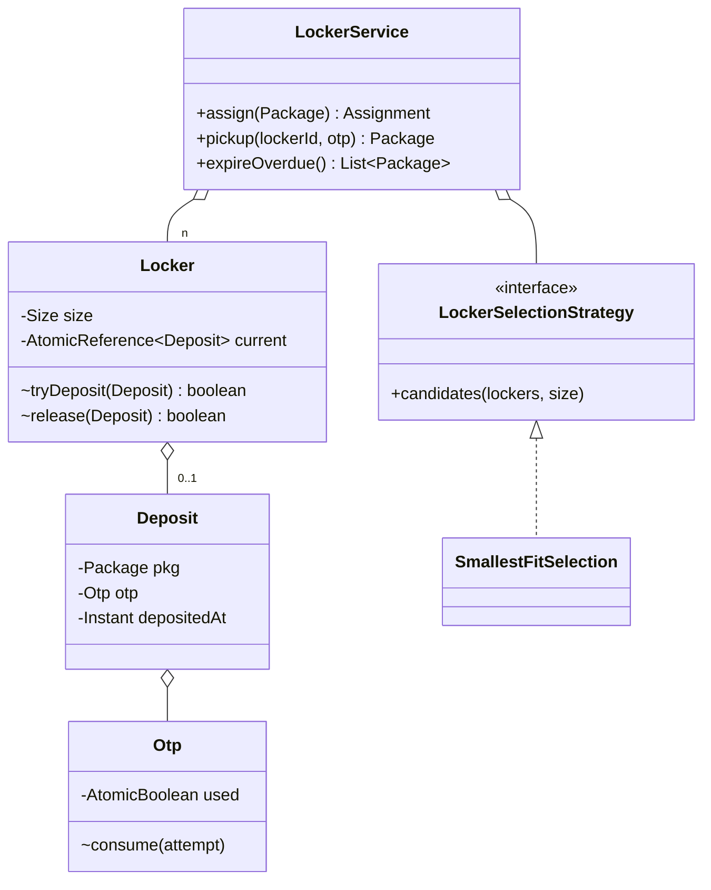

# Amazon Locker

> **One-liner:** Assign packages to size-compatible lockers and release them via single-use OTP — really testing allocation Strategy, per-locker concurrency (never lock the location), and TTL expiry with an injected clock.

## 1. Requirements

**In scope:** courier deposits package → system picks a locker (smallest fit) and issues an OTP; customer picks up with the OTP (single-use, validated); unclaimed packages expire after a TTL and return to the courier; freed lockers return to the pool atomically.

**Out of scope (say it):** multiple locations, reservations before delivery, refrigerated lockers, notifications, real hardware door control.

## 2. Clarifying questions to ask

- Locker and package sizes — fixed set? Can a small package take a large locker? *(yes, but prefer smallest fit)*
- OTP: single-use? Does it expire with the package TTL? What happens after expiry?
- How long until an unclaimed package is returned? Who sweeps?
- Concurrent couriers at one location — expected? *(drives per-locker CAS)*
- One package per locker?

## 3. Entities & relationships



## 4. Patterns used — and why (one sentence each)

| Pattern | Where | Why |
|---------|-------|-----|
| Strategy | `LockerSelectionStrategy` | Selection varies: smallest-fit today, nearest-to-entrance tomorrow |
| *deliberately none else* | — | No Factory (one Package class), no Observer (no subscribers yet), no State (a locker is free/occupied — an AtomicReference, not a state machine) |

**Approach vs alternatives:** chosen — **per-locker `AtomicReference` CAS + strategy-ordered candidate walk**: assignment is lock-free, losers of a race just try the next candidate; O(lockers) worst case. Alternatives: a **location-wide lock** — trivially correct but serializes every courier (the roadmap's explicit anti-goal); **free-list queues per size** (`ConcurrentLinkedQueue<Locker>` per Size) — O(1) pop and the right answer at huge scale, but loses strategy pluggability (ordering baked into the queue) and needs careful re-enqueue on release; CAS-walk keeps the strategy seam and is plenty for one location.

## 5. Concurrency

- **Shared state:** each locker's occupancy; each OTP's used flag.
- **Lock & granularity:** none held — `Locker.tryDeposit` is a CAS on `AtomicReference`, `Otp.consume` is a CAS on `AtomicBoolean`, `release` is a CAS back to null. Two couriers contend only on the *same* locker; the strategy's free-filter is just a snapshot — **the CAS is the real gate** (no check-then-act).
- **Trade-off:** under heavy contention every courier walks the same candidate order → retries; fix with striped free-lists per size. Say it, don't build it.
- **Expiry sweep** is idempotent and race-safe: `release(expectedDeposit)` only frees if the locker still holds that exact deposit — a concurrent pickup can't be clobbered.

## 6. Must-cover edge cases

- [x] Package too large / all compatible lockers full → `NoLockerAvailableException`
- [x] OTP: wrong code, **reuse of a consumed code**, pickup from empty locker → `InvalidOtpException`
- [x] Expired deposit: pickup refused (courier return), `expireOverdue()` sweep frees lockers
- [x] Locker returns to pool atomically and is immediately reassignable
- [x] Two couriers race one locker → exactly one wins (Demo runs it live)
- [x] Clock injected — expiry tested by advancing time, not sleeping

## 7. Key code snippets

The whole concurrency story — claim and free are CAS, never a location lock:

```java
boolean tryDeposit(Deposit d) { return size.fits(d.pkg().size()) && current.compareAndSet(null, d); }
boolean release(Deposit expected) { return current.compareAndSet(expected, null); }

for (Locker locker : selection.candidates(lockers, pkg.size())) {   // best-first walk
    if (locker.tryDeposit(deposit)) return new Assignment(locker.id(), otp.code());
}   // lost every race / nothing fits:
throw new NoLockerAvailableException(...);
```

Single-use OTP — validation and consumption are one atomic step:

```java
void consume(String attempt) {
    if (!code.equals(attempt)) throw new InvalidOtpException("wrong code");
    if (!used.compareAndSet(false, true)) throw new InvalidOtpException("code already used");
}
```

## 8. Extension questions & answers

- **"Multiple locations."** `LockerLocation` owns its lockers + service; a router picks the location (new Strategy: nearest to customer). Per-locker CAS already means locations never contend.
- **"Reserve a locker before the courier arrives."** A reservation is a `Deposit` variant with its own (shorter) TTL — same CAS slot, same sweep; confirm-on-arrival swaps reservation → real deposit.
- **"OTP by SMS/email."** Observer on assignment events + the Factory-built notification channels — both already in `src/patterns`.
- **"Persist it."** Lockers table with `version` column — the CAS becomes an optimistic `UPDATE ... WHERE version = ?`; the sweep becomes a scheduled job on `deposited_at < now - ttl`.

## 9. Expected interview follow-ups

1. **Q: Two couriers get assigned the same locker — walk me through why not.**
   **A:** Assignment isn't "find free then write" as two steps; the write IS the check (`compareAndSet(null, deposit)`). The loser's CAS fails and he tries the next candidate. The strategy's free-filter is an optimization, not a correctness gate.
2. **Q: Why not lock the whole location?**
   **A:** Correct but serializes all couriers at a 200-locker site for no reason — contention is per-locker by nature. Coarse lock is the first thing the interviewer expects you to reject aloud.
3. **Q: How does expiry run — a timer per package?**
   **A:** No per-key timers. Deposits carry `depositedAt`; a single scheduled sweep frees overdue lockers, plus pickup lazily rejects expired deposits. Clock is injected so all of it is testable.
4. **Q: OTP replay — customer's code leaks and is used twice?**
   **A:** `consume` flips an `AtomicBoolean` — validation and burn are one atomic step, so a replay loses the CAS and gets rejected even under concurrency.
5. **Q: What if the sweep and a pickup race on the same expired deposit?**
   **A:** Both call `release(expectedDeposit)` — CAS with the expected value — so exactly one frees it; the pickup path already rejected the customer at the expiry check.

Run [`Demo.java`](Demo.java) — smallest-fit assignment, wrong/used OTP rejections, locker recycling, exhausted-capacity rejection, a 4-day clock jump driving the expiry sweep, and a two-courier race won exactly once.
