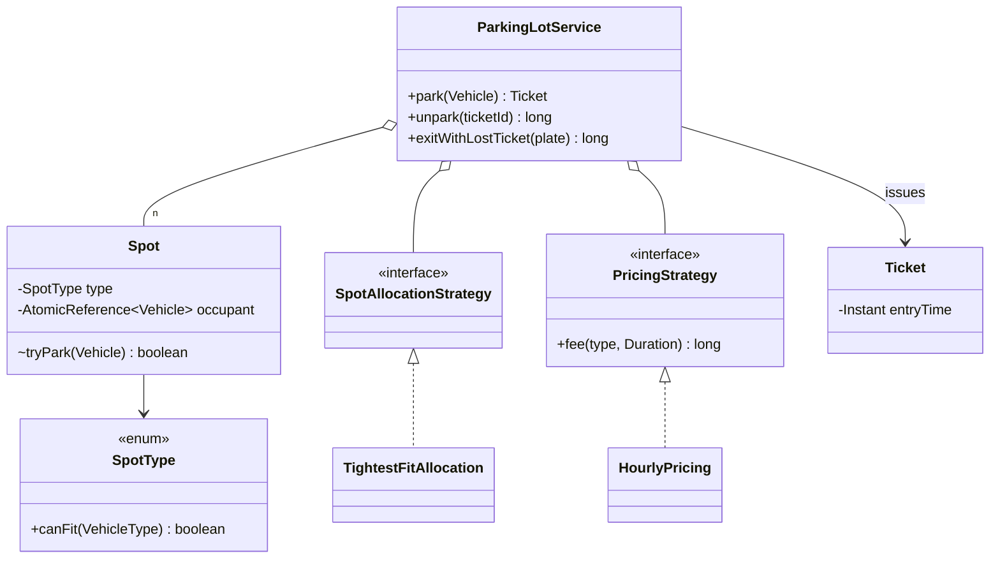

# Parking Lot

> **One-liner:** THE template problem — Strategy (allocation + pricing), a compatibility matrix instead of if-else, money done right, and per-spot concurrency for parallel entry gates. Master this shape; half the other problems are it wearing a costume.

## 1. Requirements

**In scope:** park/unpark by vehicle type (bike/car/truck); spot compatibility (small vehicles fit bigger spots); ticket at entry, time-based fee at exit (round-up per started hour, paise); lot-full clean failure; lost-ticket penalty; parallel entry gates.

**Out of scope (say it):** floors/gates as entities (add a `floorId` on Spot when asked), reservations, EV charging, monthly passes, payments processing.

## 2. Clarifying questions to ask

- Vehicle and spot types? Can a bike take a large spot? *(compatibility matrix)*
- Pricing: per vehicle type? Rounding rule for partial hours? Lost-ticket policy?
- Multiple entry/exit gates running concurrently? *(drives per-spot CAS)*
- Nearest-spot or any-spot allocation? Floors?
- What happens when the lot is full — fail or waitlist?

## 3. Entities & relationships



## 4. Patterns used — and why (one sentence each)

| Pattern | Where | Why |
|---------|-------|-----|
| Strategy ×2 | `SpotAllocationStrategy`, `PricingStrategy` | Both rules WILL change (nearest-gate, EV surcharge, day caps) |
| Repository | `Map<ticketId, Ticket>` | Active tickets, swappable for a DB |
| Static factory | `Vehicle.of(type, plate)` | A Factory *class* is unearned: subtypes have no distinct behaviour — say this aloud |

**Approach vs alternatives:** chosen — **per-spot `AtomicReference` CAS + strategy-ordered candidate walk** (same shape as Amazon Locker; O(spots) worst case, zero global locking). Alternatives: **lot/floor-level `synchronized` allocate** — correct, simple, but serializes every gate (reject it aloud); **free-queues per spot type** (`ConcurrentLinkedQueue`) — O(1) allocation, right at 10k-spot scale, but hardcodes ordering (kills the allocation Strategy) and complicates "tightest fit across types"; **`ReentrantLock` per spot with `tryLock(timeout)`** — equivalent granularity, useful when parking involves multi-step mutation; occupancy here is a single reference, so CAS is tighter.

## 5. Concurrency

- **Shared state:** each spot's occupant; the active-ticket map.
- **Lock & granularity:** none — `tryPark` is `compareAndSet(null, vehicle)`; the free-filter in the strategy is only a snapshot, the CAS is the gate. Ticket issue/exit use `ConcurrentHashMap` put/remove — `remove(ticketId)` atomically claims the exit, so a double-exit on the same ticket is impossible.
- **Trade-off:** losers re-walk candidates under contention; striped free-lists fix it at scale (say, don't build).
- **Never held across I/O:** fee computation and payment happen after the ticket is claimed, outside any spot state.

## 6. Must-cover edge cases

- [x] Lot full → `LotFullException`, clean failure
- [x] Lost ticket → locate by plate, flat penalty, spot still freed
- [x] Used/unknown ticket at exit → `InvalidTicketException` (double-exit impossible: map `remove` is the claim)
- [x] Round-UP per started hour; money in paise, never double
- [x] Compatibility matrix on the enum (`SpotType.canFit`), zero if-else at call sites
- [x] Two gates race the last spot → exactly one parks (Demo runs it)
- [x] Clock injected — 2h30m fee tested by advancing time

## 7. Key code snippets

The matrix, not if-else:

```java
public enum SpotType {
    SMALL(EnumSet.of(BIKE)), MEDIUM(EnumSet.of(BIKE, CAR)), LARGE(EnumSet.allOf(VehicleType.class));
    public boolean canFit(VehicleType v) { return fits.contains(v); }
}
```

Gate-safe parking — CAS walk + atomic exit claim:

```java
for (Spot spot : allocation.candidates(spots, vehicle.type()))
    if (spot.tryPark(vehicle)) return issueTicket(spot, vehicle);   // CAS won
throw new LotFullException(vehicle.type());

Ticket ticket = activeTickets.remove(ticketId);       // atomic: second exit gets null
if (ticket == null) throw new InvalidTicketException(...);
```

## 8. Extension questions & answers

- **"EV charging spots."** New `SpotType.EV_MEDIUM` row in the matrix + an EV-priority `SpotAllocationStrategy`; pricing adds a surcharge Strategy. Zero existing edits.
- **"Monthly pass holders."** A `PricingStrategy` returning 0 for pass plates + (optionally) reserved spots via allocation strategy. New classes only.
- **"Multiple floors / nearest-to-gate."** `floorId`/coordinates on Spot; allocation strategy sorts by distance — the seam already exists.
- **"10,000 spots — O(spots) walk too slow?"** Free-list `ConcurrentLinkedQueue` per (floor, type): O(1) pop at the cost of pluggable ordering; or striped index. Name the trade.
- **"Persist it."** Spots row with `version` (optimistic CAS → `UPDATE WHERE version=?`), tickets table; fee computed from DB timestamps.

## 9. Expected interview follow-ups

1. **Q: Two entry gates assign the same spot — prevent it.**
   **A:** Occupancy is an `AtomicReference`; `tryPark` is `compareAndSet(null, vehicle)` — check and write are one atomic step. The loser tries the next candidate. Naive `if (spot.isFree()) spot.park()` is the classic check-then-act race — name it.
2. **Q: Why is the fee never a `double`?**
   **A:** Binary floating point can't represent paise exactly; errors compound across thousands of tickets. `long` minor units + an explicit round-up rule is deterministic and auditable.
3. **Q: Lost ticket — how do you even find the car?**
   **A:** Active tickets are indexed; scan/secondary-index by plate, charge a *policy* penalty (flat max-day rate), free the spot. The point is having a policy, not improvising.
4. **Q: Where would State fit here?**
   **A:** It wouldn't — a spot is free/occupied, one atomic reference. Forcing State onto two states is pattern stuffing; the booking problems (p06) earn it with real lifecycles.
5. **Q: What changes with 4 floors and 6 gates?**
   **A:** Nothing in correctness — CAS is already gate-count-agnostic. Allocation strategy gains floor/distance awareness; free-count displays become per-floor Observers.

Run [`Demo.java`](Demo.java) — matrix allocation, lot-full and double-exit rejections, 2h30m round-up fee, lost-ticket penalty, and a two-gate race for the last spot.
