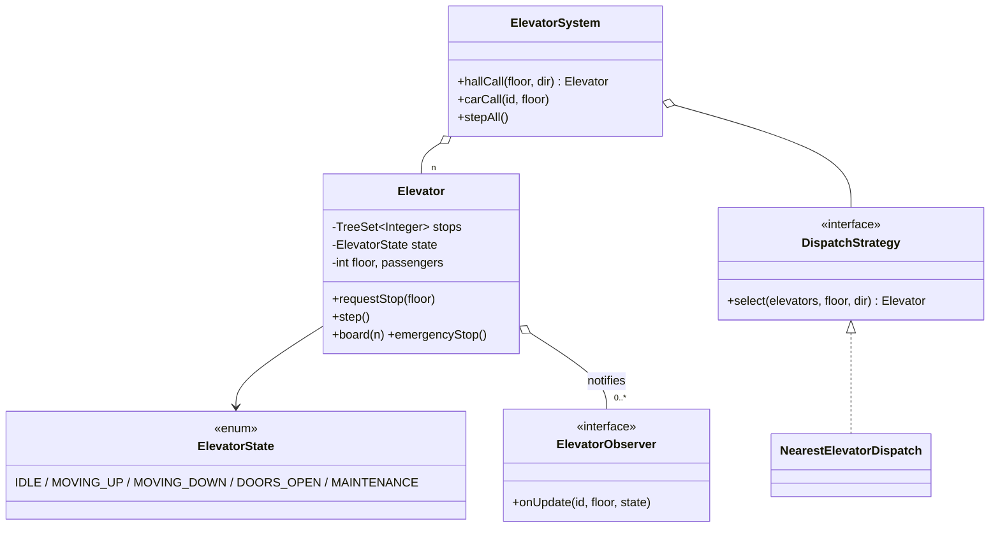

# Elevator

> **One-liner:** N cars, a dispatch Strategy, and per-car LOOK scheduling on a validated state machine — the problem where you say the high-signal sentence: *"I'll use LOOK: keep going while there's work ahead, reverse only when there's none — it bounds worst-case wait and never thrashes direction."*

## 1. Requirements

**In scope:** N elevators; hall calls (floor + direction) dispatched by strategy; car calls; LOOK scheduling (finish all same-direction stops before reversing); duplicate requests deduped; capacity limit at boarding; emergency stop from any state; bounded pending requests.

**Out of scope (say it):** door sensors/timers, real threads (tick-based here — see §5), floors as entities, destination-dispatch panels.

## 2. Clarifying questions to ask

- How many elevators/floors? Hall panels give direction or destination?
- Scheduling: is FCFS acceptable or do you want SCAN/LOOK? *(say LOOK + why)*
- Weight or passenger-count capacity? What happens on overload?
- Emergency stop semantics — dump requests? Who reactivates?
- Simulation (tick) or real-time threads?

## 3. Entities & relationships



## 4. Patterns used — and why (one sentence each)

| Pattern | Where | Why |
|---------|-------|-----|
| State | `ElevatorState` enum machine in `step()` | Behaviour differs per lifecycle stage; enum form because per-state logic is a few lines each (the [State README's](../../patterns/behavioral/state/) "lightweight alternative" — say the choice aloud) |
| Strategy | `DispatchStrategy` | Nearest today; directional-nearest, cost-function, VIP-priority tomorrow |
| Observer | `ElevatorObserver` | Display panels/monitoring subscribe; cars never know who watches |

**Approach vs alternatives:** chosen — **LOOK via two-sided `TreeSet` queries** (`ceiling`/`floor`): keep direction while stops exist ahead, reverse otherwise; O(log n) per operation and no starvation of far floors. Alternatives: **FCFS queue** — trivially fair but thrashes direction (elevator ping-pongs); **SSTF (nearest next)** — minimizes next hop but starves far floors; **SCAN** — LOOK but riding to the physical ends even with no work; LOOK dominates it. For dispatch, nearest-car is the baseline; a cost function (distance + direction match + load) is the named upgrade.

## 5. Concurrency

- **Shared state:** each car's stop set, state, and passenger count.
- **Model:** tick-based here, which is the honest interview scope — and the threaded version is *the actor model*: one thread per car draining a **bounded** `BlockingQueue` of requests, so all car state stays single-writer and needs no locks. Say that sentence; it's the roadmap's point.
- **Bounded, never unbounded:** pending stops cap at 8 → `RequestQueueFullException` (backpressure). Rejection policy is a stated decision, not an accident.
- **Requests while doors are closing:** in the threaded build they land in the queue and are picked up at the next decide step — same as our `requestStop` during `DOORS_OPEN`.
- **Observers** sit on a `CopyOnWriteArrayList` — display updates never block or corrupt the car loop.

## 6. Must-cover edge cases

- [x] Duplicate request for the same floor → `TreeSet` dedupes (Demo shows pending count unchanged)
- [x] Overload → `CapacityExceededException` at boarding; doors stay open
- [x] Direction change only after finishing all work ahead (LOOK — Demo trace: 4, 6, then reverse to 0)
- [x] Emergency stop from any state → stops cleared, `MAINTENANCE`, dispatch skips it, direct calls rejected
- [x] N elevators with pluggable dispatch — nearest car wins, ties deterministic
- [x] Bounded pending queue → 9th stop rejected

## 7. Key code snippets

LOOK in four lines — the sorted set does the algorithm:

```java
if (stops.isEmpty())                                    state = IDLE;
else if (direction == UP   && stops.ceiling(floor) != null) state = MOVING_UP;   // work ahead → continue
else if (direction == DOWN && stops.floor(floor)   != null) state = MOVING_DOWN;
else reverse();                                         // nothing ahead → NOW reverse
```

Dispatch as a strategy — swap without touching cars:

```java
elevators.stream()
    .filter(e -> e.state() != MAINTENANCE)
    .min(comparingInt((Elevator e) -> Math.abs(e.floor() - floor)).thenComparing(Elevator::id));
```

## 8. Extension questions & answers

- **"VIP floor priority."** New `DispatchStrategy` (VIP calls beat distance) or a priority tier in the stop set — strategy seam already exists.
- **"Destination dispatch (enter floor at the panel)."** Hall call carries the destination → dispatch can group riders by direction; the car's LOOK loop is unchanged.
- **"Real threads."** One actor thread per car + bounded `BlockingQueue<Request>`; `ElevatorSystem` only enqueues. Single-writer per car = no locks on car state. Graceful shutdown: stop accepting, drain, park at lobby.
- **"Energy optimization."** Cost-function dispatch (distance, direction match, load, idle-parking floors) — a strategy, measured against wait-time SLOs.

## 9. Expected interview follow-ups

1. **Q: Why LOOK over first-come-first-served?**
   **A:** FCFS services requests in arrival order, so the car ping-pongs (3→9→2→8...), unbounded travel per request. LOOK batches by direction: everything on the way gets served in one sweep — bounded worst case (~2 building heights), no direction thrash. SSTF is the other tempting-but-wrong answer: it starves far floors.
2. **Q: Two people press the same floor button — two stops?**
   **A:** Stops are a `TreeSet` — dedup is a set property, not an if-check. The demo shows pending count unchanged on a duplicate press.
3. **Q: Where's the concurrency if this went multithreaded?**
   **A:** Actor per car: one thread owns all car state and drains a bounded queue; `hallCall` threads only enqueue. Single-writer means no locks, no races; the bounded queue gives backpressure. The alternative — shared mutable car state + locks — is strictly worse; say why you chose confinement.
4. **Q: Overload — where's the check and what's the UX?**
   **A:** At `board()`, not at request time (you can't know load in advance). Reject the boarding, keep doors open, let riders step off. Weight sensors map to the same check with kilograms instead of head-count.
5. **Q: Emergency stop while moving between floors?**
   **A:** Allowed from ANY state — that's the point of putting it outside the normal transition table: clear stops, `MAINTENANCE`, notify observers; dispatch filters it out and direct requests are rejected until service reactivates it.

Run [`Demo.java`](Demo.java) — the LOOK trace (4, 6, then reverse to 0), duplicate dedup, overload rejection, nearest-car dispatch, emergency stop rerouting calls, and bounded-queue backpressure.
