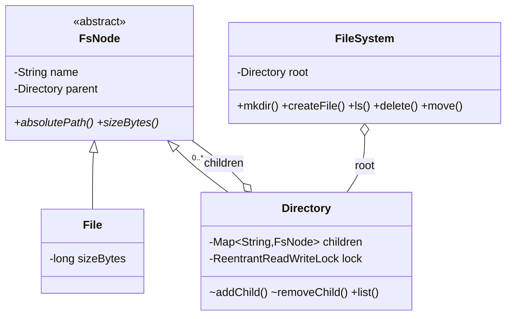

# In-Memory File System

> **One-liner:** Composite tree + path handling + per-directory ReadWriteLocks — really testing whether you normalize paths in ONE place, prevent move-cycles, and know that reads shouldn't block reads.

## 1. Requirements

**In scope:** mkdir/createFile/ls/delete/move+rename; absolute path resolution handling `.`, `..`, repeated and trailing slashes; recursive size; duplicate names impossible; delete non-empty directory refused; move cannot create a cycle; concurrent create in one directory safe.

**Out of scope (say it):** file content/IO, permissions (add-on: an owner/mode field checked in one `checkAccess` choke point), symlinks, quotas, watching.

## 2. Clarifying questions to ask

- Absolute paths only, or relative + working directory?
- What do `..` above root and trailing slashes do? *(normalize, don't error)*
- Delete of a non-empty directory — refuse or recursive flag?
- Expected concurrency — listings while creating? *(drives ReadWriteLock)*
- Are file sizes fixed at creation or do writes grow them?

## 3. Entities & relationships



## 4. Patterns used — and why (one sentence each)

| Pattern | Where | Why |
|---------|-------|-----|
| Composite | `FsNode` / `File` / `Directory` | Size, traversal, deletion checks — one code path for leaf and subtree |
| *named, not built* | Visitor | For an open-ended operation family (search, checksum, du-report) — say it when the interviewer adds a third operation |

**Approach vs alternatives:** chosen — **object tree with parent pointers + per-directory `ReentrantReadWriteLock`**; paths normalize through one resolver (deque of segments, `..` pops). Alternatives: a **flat `HashMap<String path, Node>`** — O(1) exact lookup but move/rename becomes O(subtree) key rewriting and listing needs prefix scans (it's how blob stores work — name it, reject it for a hierarchical FS); **single global lock** — correct, kills read concurrency between unrelated directories; **`ConcurrentHashMap` children without dir locks** — fixes create/create races but not compound invariants like move's remove+add atomicity.

## 5. Concurrency

- **Shared state:** each directory's children map.
- **Lock & granularity:** one `ReadWriteLock` per directory — `ls`/`size` take read (parallel readers), create/delete/move take write; contention scopes to a single directory, never the tree.
- **Move is the hard case:** two write locks (source parent, destination) acquired in **canonical path order** — two opposite-direction moves between the same directories cannot deadlock (this is the roadmap's "lock ordering" must-know). Write-lock reentrancy makes the nested child ops safe, and a name conflict at the destination **rolls back** — a failed move leaves the tree untouched.
- **Trade-off:** recursive `size` holds read locks down the subtree; for huge trees keep cached sizes updated on write (eventual) or snapshot.

## 6. Must-cover edge cases

- [x] Path parsing: `.`, `..` (clamped at root), `//`, trailing slash — one normalizer ([FileSystem.resolve](FileSystem.java))
- [x] Duplicate names → `NameConflictException` via `putIfAbsent` (unrepresentable, not checked-then-added)
- [x] Delete non-empty directory → `DirectoryNotEmptyException`; root undeletable
- [x] Move/rename across directories, atomic with rollback on conflict
- [x] Cycle prevention: destination's ancestor chain must not contain the moved node
- [x] Concurrent same-name create → exactly one wins (Demo races it)

## 7. Key code snippets

Path normalization in one place — a deque, not string hacking:

```java
Deque<String> parts = new ArrayDeque<>();
for (String part : path.split("/")) {
    if (part.isEmpty() || part.equals(".")) continue;  // '//', trailing '/', '.'
    if (part.equals("..")) parts.pollLast();            // above root stays at root
    else parts.addLast(part);
}
// then walk root → parts, failing with PathNotFoundException
```

Cycle prevention — walk UP from the destination:

```java
for (FsNode ancestor = destination; ancestor != null; ancestor = ancestor.parent())
    if (ancestor == node) throw new IllegalMoveException("cannot move into own subtree");
```

## 8. Extension questions & answers

- **"Permissions."** Owner/mode fields on `FsNode` + a single `checkAccess(user, node, op)` choke point called by every public method — an add-on precisely because access control was kept out of the node classes.
- **"Symlinks."** A `Symlink extends FsNode` holding a target path, resolved (with a hop limit against link loops) inside `resolve` — one more case in the one place paths are interpreted.
- **"Quotas."** Per-directory `maxBytes`; create/move check `sizeBytes()` up the ancestor chain — or maintain cached rolling sizes to avoid O(subtree) on every write.
- **"Search by name/glob."** Recursive traversal now; the Visitor pattern once operations multiply.

## 9. Expected interview follow-ups

1. **Q: Two threads create the same filename simultaneously?**
   **A:** `putIfAbsent` under the directory's write lock — the check and insert are one step, so exactly one wins and the loser gets `NameConflictException`. Never `if (!exists) put` — that's check-then-act.
2. **Q: Why ReadWriteLock instead of synchronized?**
   **A:** Listings dominate mutations in a file system; RW locks let unlimited concurrent readers per directory and only serialize writers. `synchronized` would make two parallel `ls` of the same big directory queue up.
3. **Q: How can move deadlock, and how do you prevent it?**
   **A:** Move A→B locks (parentA, B) while a concurrent move B→A locks (parentB, A) — opposite order, circular wait. Prevention: always acquire the two write locks in a canonical order (path string comparison here) — global lock ordering, the standard answer.
4. **Q: What exactly makes moving /a into /a/b illegal, and where do you check?**
   **A:** It orphans the subtree into itself — a cycle; `size`/`ls` would recurse forever. Check before locking: walk the destination's parent chain; if the moved node appears, reject.
5. **Q: Why not one big `Map<path, node>`?**
   **A:** Exact lookups get O(1), but rename/move of a directory must rewrite every descendant key, `ls` becomes a prefix scan, and there's no natural place for per-directory locks. That design is an object store (S3), not a file system — knowing which one you're building is the answer.

Run [`Demo.java`](Demo.java) — normalized weird paths, duplicate/non-empty/not-found rejections, cross-directory move + rename, cycle rejection, and a same-name create race with exactly one winner.
