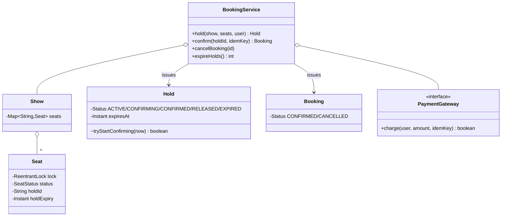

# Movie Ticket Booking (BookMyShow)

> **One-liner:** THE concurrency centrepiece — every transactional idea from the roadmap lands here in code: 2PL over multiple seats, reserve-with-TTL, payment outside locks, idempotent confirm, and saga compensation. If you can narrate this problem, you can narrate §3 of the roadmap.

## 1. Requirements

**In scope:** hold N seats all-or-nothing with a TTL; confirm with payment (idempotent — retries/double-clicks charge once); payment failure releases holds; holds lapse and are reclaimed; cancellation with refund; two users racing one seat.

**Out of scope (say it):** theatres/screens/cities catalog, seat tiers & pricing strategies (flat price here — name `PricingStrategy` as the seam), payment webhooks, waitlists.

## 2. Clarifying questions to ask

- Hold-then-pay with a TTL, or instant booking? How long is the hold window?
- Partial availability: want 3, only 2 free — book 2 or fail? *(all-or-nothing)*
- What happens on payment failure / timeout mid-payment?
- Same user double-clicks pay — two charges? *(idempotency key)*
- Cancellation/refund rules?

## 3. Entities & relationships



## 4. Patterns used — and why (one sentence each)

| Pattern | Where | Why |
|---------|-------|-----|
| State ×2 | `SeatStatus` (AVAILABLE→HELD→BOOKED), `Hold.Status` (ACTIVE→CONFIRMING→…) | Both have real lifecycles with illegal transitions to reject |
| Observer | `BookingObserver` | Email/SMS on confirm, notified outside all locks |
| DIP | `PaymentGateway` injected | Service never knows the PSP; tests script failures |
| *named seams* | `PricingStrategy` (tier/time pricing) | Say it; flat price keeps the demo focused |

**Approach vs alternatives:** chosen — **pessimistic per-seat locks acquired in seat-ID order (2PL discipline)** for the hold, then **payment with zero locks held**, then book-or-release. Alternatives to argue: **optimistic versioning** (version per seat, validate-and-bump at commit, retry on conflict) — better at low contention, but popular-show bursts cause retry storms exactly when it matters, and the roadmap wants you to argue both — do so; **synchronized on the show** — serializes unrelated seats (reject aloud); **DB/Redis** — `SELECT FOR UPDATE` on sorted seat rows or `SETNX` with TTL is this same design distributed (name it for the follow-up).

## 5. Concurrency — the whole point

- **2PL over multiple seats:** sort seat IDs, lock all (growing), validate all, mutate all, unlock all (shrinking). Never lock-mutate-release one seat at a time — that books you half a group. Sorted order ⇒ no circular wait ⇒ no deadlock.
- **Never hold a lock across I/O:** `confirm` claims the hold via an atomic `tryStartConfirming` (CONFIRMING blocks rival confirms and the sweeper), *then* charges with no locks held, *then* relocks seats to book. The TTL is what protects the seats during user think-time — not a held lock.
- **Idempotency:** `Map<idempotencyKey, Booking>` — a replayed confirm returns the stored booking; the demo proves exactly one charge for a double-click.
- **Saga:** hold → charge → confirm; on decline the compensating action releases the seats (`isHeldBy` check ensures we never clobber a newer hold on the same seat).
- **Expiry:** lazy (a new hold reclaims lapsed seats in-line) + a sweep for hygiene — no timer per hold.

## 6. Must-cover edge cases

- [x] Partial availability → all-or-nothing rejection naming blockers
- [x] Payment failure → holds released (saga), seats immediately re-bookable
- [x] Double-click / payment retry → same booking, ONE charge (idempotency key)
- [x] Hold expiry → lazy reclaim by next hold + sweep; expired confirm rejected
- [x] Two users race one seat → exactly one hold succeeds
- [x] Cancellation → seats freed, refund issued, double-cancel throws

## 7. Key code snippets

The 2PL hold — the snippet to write from memory:

```java
List<Seat> seats = seatIds.stream().sorted().map(show::seat).toList(); // global order
seats.forEach(s -> s.lock().lock());                                   // growing phase
try {
    List<String> blocked = seats.stream().filter(s -> !s.canHold(now)).map(Seat::id).toList();
    if (!blocked.isEmpty()) throw new SeatsUnavailableException(blocked); // nothing mutated
    seats.forEach(s -> s.hold(holdId, now.plus(ttl)));                  // mutate ALL
} finally {
    seats.forEach(s -> s.lock().unlock());                              // shrinking phase
}
```

Confirm = claim → pay (no locks) → book or compensate:

```java
if (!hold.tryStartConfirming(now)) throw new HoldInvalidException(...); // atomic window claim
boolean paid = gateway.charge(user, amount, idemKey);                   // I/O, ZERO locks held
if (!paid) { releaseSeats(hold); throw new PaymentFailedException(...); } // saga compensation
lockSorted(seats, Seat::book);                                          // then commit
```

## 8. Extension questions & answers

- **"Multiple screens/shows per theatre."** Seats belong to a Show already — the catalog above it (Theatre→Screen→Show) is pure aggregation; locks stay per-seat-per-show.
- **"Group booking with adjacency preference."** A seat-selection Strategy that proposes adjacent blocks; the hold path is unchanged — all-or-nothing already handles "3 adjacent or nothing".
- **"Argue optimistic vs pessimistic."** Pessimistic (here): no wasted payment work, but locks are held briefly per operation. Optimistic: version per seat, `confirm` validates versions; wins when contention is rare, loses under tatkal-style rushes. Rule: contention high or conflict cost high → pessimistic.
- **"Distributed?"** Locks don't cross machines: DB `SELECT ... FOR UPDATE` over sorted seat rows, or Redis `SET seat holder NX PX ttl` per seat = the same hold-with-TTL; idempotency keys become a table; the saga becomes explicit compensation steps.

## 9. Expected interview follow-ups

1. **Q: Why must payment happen with no locks held?**
   **A:** Payment is slow, remote I/O — holding seat locks across it would freeze those seats for every other customer for seconds (or forever on a hung PSP). The hold-with-TTL *is* the reservation during payment; locks only guard the microsecond state flips.
2. **Q: User pays, response is lost, client retries — double booking?**
   **A:** The retry carries the same idempotency key; the service returns the stored booking without re-charging. The demo double-click shows one charge. Store request-id → result: that's the whole trick.
3. **Q: Why sort seat IDs before locking?**
   **A:** Two group bookings overlapping on {A3, A4} locking in different orders = circular wait = deadlock. A global acquisition order (sorted IDs) breaks it — the classic 2PL + lock-ordering answer.
4. **Q: Hold expires while the user is on the payment page — what happens?**
   **A:** `tryStartConfirming` checks expiry atomically with the claim — a lapsed hold can't enter payment. If it expired earlier, another user may already hold those seats (lazy reclaim); the first user gets a clean "hold expired" and must re-hold.
5. **Q: The sweep and a payment-failure release race on the same seat?**
   **A:** Both release under the seat's lock with an `isHeldBy(holdId)` guard — a seat is only freed by the hold that owns it, so a newer hold can never be clobbered.

Run [`Demo.java`](Demo.java) — all-or-nothing rejection, idempotent double-click (one charge), payment-failure saga, lazy TTL reclaim + sweep, a two-user race for one seat, and cancel + refund.
