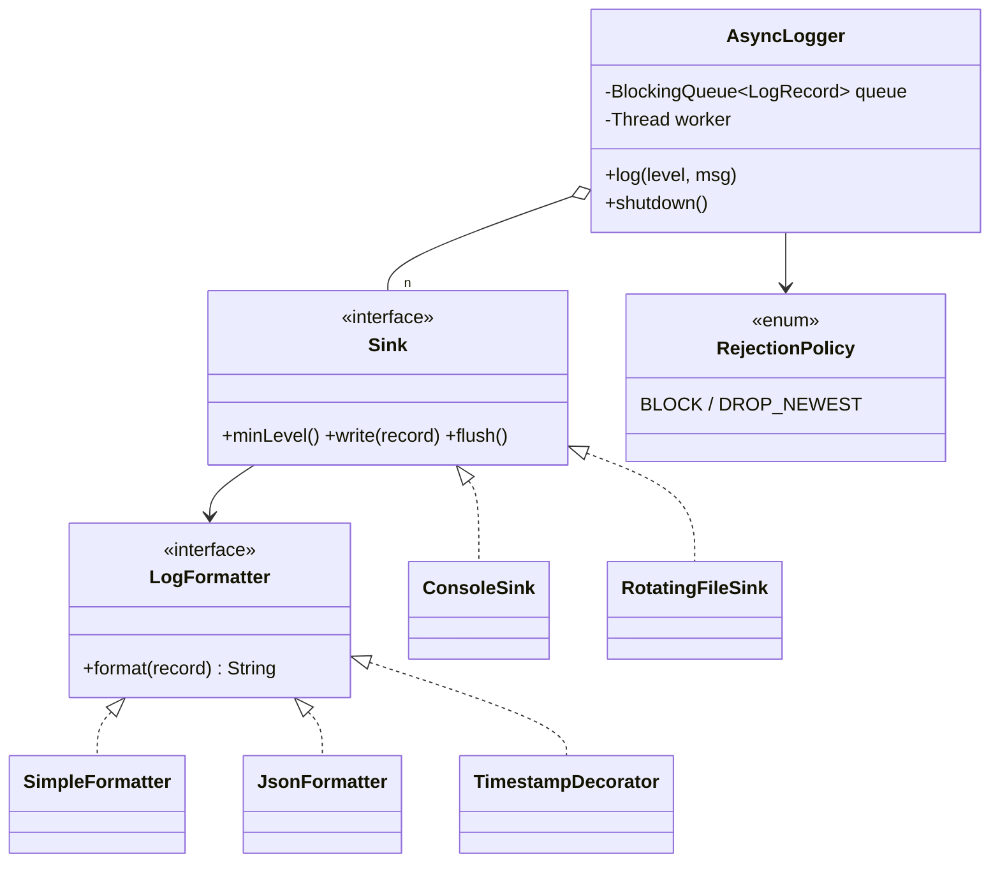

# Logging Service

> **One-liner:** Producer-consumer done right — callers enqueue into a **bounded** queue, one worker drains to per-level sinks, a failing sink can't hurt the others, and shutdown drains-then-flushes. The async plumbing IS the interview.

## 1. Requirements

**In scope:** log(level, msg) non-blocking for callers; per-sink min level + formatter; console + size-rotated file sinks; a failing sink isolated; bounded queue with a stated rejection policy (block / drop+count); graceful shutdown that flushes everything accepted.

**Out of scope (say it):** log4j-style config files, per-module levels (a `Map<module, LogLevel>` checked in `log` — name it), network appenders, MDC context (a `ThreadLocal` — name it).

## 2. Clarifying questions to ask

- Can `log()` ever block the caller? What's acceptable on overload — block, drop, or spill to disk?
- Delivery guarantee: must a message accepted before shutdown reach every sink?
- Rotation: by size, time, or both? What about a sink that starts failing?
- One global logger or injected instances? *("no hard Singleton" is the expected answer)*
- Ordering across threads: total order needed, or per-thread enough?

## 3. Entities & relationships



## 4. Patterns used — and why (one sentence each)

| Pattern | Where | Why |
|---------|-------|-----|
| Strategy | `LogFormatter` (simple/JSON) | Format varies per sink |
| Decorator | `TimestampDecorator`, `ThreadNameDecorator` | Fields compose freely around any formatter |
| Chain of Responsibility (broadcast form) | sink list + per-sink `minLevel` | Every interested sink handles — the list-based modern CoR (see [the pattern README](../../patterns/behavioral/chainofresponsibility/)) |
| Builder | logger/sink config | Already built as the [Builder pattern's](../../patterns/creational/builder/) `LoggerConfig` example |
| *deliberately no Singleton* | — | "Thread-safe global access without a hard Singleton": one instance at startup, injected — say it |

**Approach vs alternatives:** chosen — **bounded `ArrayBlockingQueue` + single worker thread**; sinks are thread-confined (zero locks — the strongest concurrency answer is no sharing). Alternatives: **synchronous logging** — simplest, but every caller pays sink latency and one slow sink stalls the app; **worker pool per sink** — isolates slow sinks at the cost of cross-sink ordering (name it as the upgrade when one sink is a slow remote); **unbounded queue** — the classic failure: hides overload until OOM. Bounded + explicit `RejectionPolicy` is the senior answer.

## 5. Concurrency

- **Shared state:** just the queue — producers `offer/put`, the worker `take`s. Records are immutable; sinks are single-threaded by confinement.
- **Rejection policy is a decision:** BLOCK = backpressure (audit logs), DROP_NEWEST + counter = shed load honestly (metrics/debug logs). The demo overflows a capacity-2 queue deterministically (gate latch, not sleeps) and reports `dropped=2`.
- **Graceful shutdown:** flip `accepting` (reject new), enqueue a sentinel, worker drains everything before it, join, flush sinks. Everything accepted pre-shutdown is delivered — say the sequence aloud.
- **Failing sink:** try/catch per sink in the dispatch loop — isolation, plus the real-world upgrade: a circuit breaker + retry decorator around the flaky sink.

## 6. Must-cover edge cases

- [x] Per-sink level filtering (console INFO+ skips DEBUG; file DEBUG+ keeps it)
- [x] File rotation by size (200B cap → `app.log.N` events in the demo)
- [x] Failing sink isolated — error still reaches console/file
- [x] Full queue → policy applied, drops **counted**, never silent
- [x] Shutdown drains + flushes; logging after shutdown rejected explicitly
- [x] No static/global state — the "no hard Singleton" requirement

## 7. Key code snippets

The worker loop — isolation + per-sink filter in one place:

```java
LogRecord record = queue.take();
for (Sink sink : sinks) {
    if (!record.level().atLeast(sink.minLevel())) continue;   // per-sink filtering
    try { sink.write(record); }
    catch (RuntimeException e) { /* one sink down ≠ logging down */ }
}
```

Graceful shutdown — the sentence interviewers wait for:

```java
accepting = false;              // 1. stop accepting
queue.put(SHUTDOWN_SENTINEL);   // 2. drain: worker processes all earlier records first
worker.join();                  // 3. wait for the drain
sinks.forEach(Sink::flush);     // 4. flush
```

## 8. Extension questions & answers

- **"Structured JSON logs."** Already a formatter — swap per sink; that's why format is a Strategy.
- **"Per-module log levels."** `Map<String module, LogLevel>` consulted in `log(module, level, msg)` — filtering stays at the entry point, cheapest possible.
- **"One sink is a slow remote endpoint."** Give it its own queue + worker (pool-per-sink) so it can't starve the file sink; wrap with retry + circuit-breaker decorators — all named seams.
- **"Trace/request IDs."** `ThreadLocal` context captured into the record at the call site — the record is immutable, so it crosses to the worker safely.

## 9. Expected interview follow-ups

1. **Q: Why is the queue bounded — what breaks if it isn't?**
   **A:** An unbounded queue converts overload into an OOM hours later — it hides the problem. Bounded forces the real decision at admission: block (backpressure) or drop-and-count. Saying "unbounded" here is a known fail.
2. **Q: Slow file system — do callers feel it?**
   **A:** No; callers only touch the queue. The worker absorbs sink latency; if it falls behind, the queue fills and the policy engages. That's the whole reason for async.
3. **Q: Why do sinks need no locks?**
   **A:** Thread confinement — only the single worker ever calls `write`. The strongest concurrency answer is not a cleverer lock; it's no sharing.
4. **Q: How do you guarantee nothing accepted is lost at shutdown?**
   **A:** Sentinel through the same FIFO queue: everything enqueued before it is processed first, then flush, then exit. Records offered after `accepting=false` are rejected explicitly.
5. **Q: Two threads log concurrently — is ordering preserved?**
   **A:** Per-thread order yes (FIFO queue); global cross-thread order is whatever the enqueue interleaving was — there is no meaningful "true" global order without timestamps. Say that; don't invent a lock to fake one.

Run [`Demo.java`](Demo.java) — per-sink filtering, decorator-composed formats, two file rotations, an isolated failing sink, drain-then-flush shutdown, post-shutdown rejection, and a deterministic full-queue drop count.
