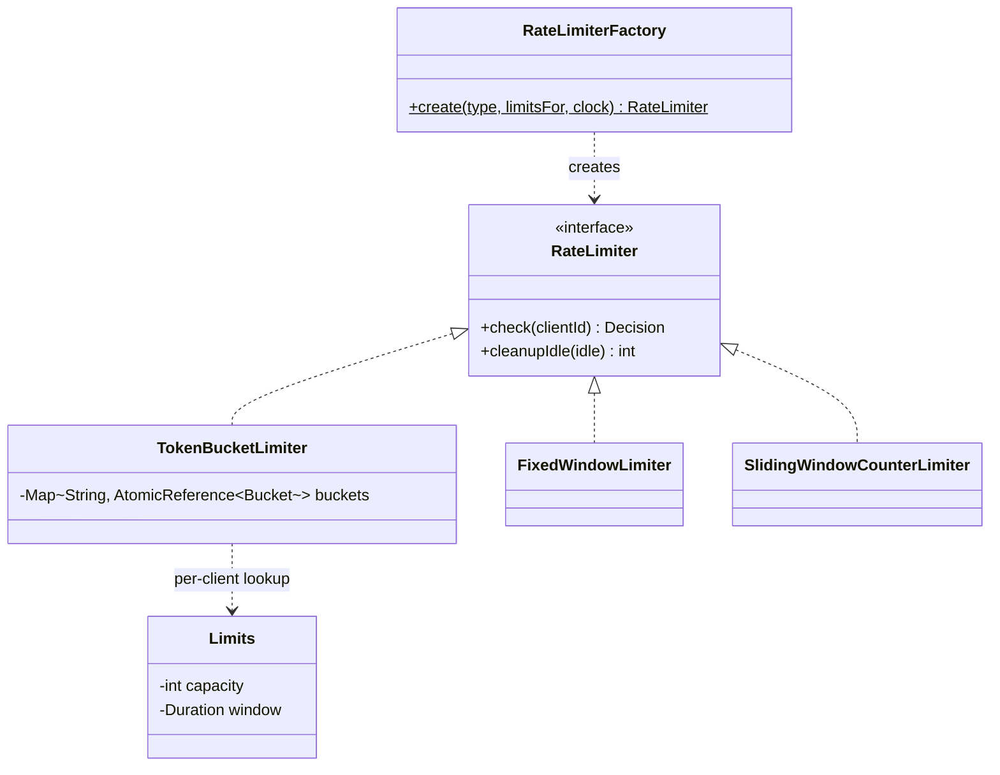

# Rate Limiter

> **One-liner:** Three limiting algorithms behind one Strategy interface, chosen by a Factory, with per-client state in a concurrent map and the check-and-decrement done as a **CAS loop** — the roadmap's "strong interview answer", in code.

## 1. Requirements

**In scope:** `check(clientId)` → allow/deny + retry-after; token bucket, fixed window, sliding window counter; per-tier limits (a lookup, not a new limiter); lazy refill (no timer per key); idle-client state cleanup; correct under concurrent calls.

**Out of scope (say it):** distributed enforcement (describe: shared store + atomic ops — §8), leaky bucket & sliding window **log** (name them: log = exact but O(requests) memory), middleware wiring.

## 2. Clarifying questions to ask

- Burst allowed up to capacity, or strictly smoothed? *(token bucket vs leaky bucket)*
- Per-client, per-IP, per-API-key? Different tiers?
- What does the caller get on deny — boolean or retry-after for a 429?
- Accuracy vs memory: is 2× boundary burst acceptable? *(fixed vs sliding)*
- Single node or distributed?

## 3. Entities & relationships



## 4. Patterns used — and why (one sentence each)

| Pattern | Where | Why |
|---------|-------|-----|
| Strategy | `RateLimiter` implementations | The algorithm is the thing that varies — this problem IS the Strategy+Factory pairing |
| Factory | `RateLimiterFactory.create(type, …)` | Config names the algorithm; the switch lives in exactly one place |
| *tiering ≠ pattern* | `Function<String, Limits>` | Per-tier limits are a lookup the limiter consults — no TieredLimiter class needed |

**Approach vs alternatives (know all five):**

| Algorithm | Memory/client | Accuracy | Verdict |
|-----------|--------------|----------|---------|
| **Token bucket** (built) | O(1) | burst to capacity + sustained rate | the default answer — bursts are usually desired |
| **Fixed window** (built) | O(1) | **2× burst at boundaries** — shown live in the demo | simplest; know its flaw |
| **Sliding window counter** (built) | O(1) | weighted estimate, smooths the boundary | best accuracy/memory trade |
| Sliding window log | O(requests) | exact | name it; reject the memory cost |
| Leaky bucket | O(1)+queue | constant outflow, no bursts | for smoothing producers, not API quotas |

State is `AtomicReference<ImmutableState>` + CAS loop — not `synchronized` — because the critical section is a single reference swap under high contention: exactly where lock-free wins (roadmap §3.3).

## 5. Concurrency

- **Shared state:** one small immutable state object per client in a `ConcurrentHashMap`.
- **The CAS loop:** read → compute (lazy refill from injected clock) → `compareAndSet`; a lost race recomputes and retries. Check-and-decrement is atomic with zero locks — 20 threads racing a capacity-5 bucket admit **exactly 5** (demo proves it).
- **Lazy refill, no timers:** tokens are computed from `elapsed × capacity / window` at access time — idle keys cost nothing; milli-token integer math avoids floating point.
- **Lock striping** is the named fallback if one client's CAS contention ever mattered; `computeIfAbsent` already gives per-key creation safety.
- **Cleanup:** `removeIf(lastRefill < cutoff)` sweep — idle state is evicted, bounded memory.

## 6. Must-cover edge cases

- [x] Burst vs sustained: bucket starts full (burst), refills at rate (sustained)
- [x] Deny carries **retry-after** (computed from token deficit / window remainder)
- [x] Boundary burst: fixed window admits 6 in 150ms at cap 3/s — demonstrated, then smoothed by sliding counter
- [x] Per-tier limits (free=3/s, pro=5/s) through one limiter
- [x] Clock injected — refill tested by advancing time
- [x] Exactly-capacity admission under 20-thread race
- [x] Idle client state cleanup

## 7. Key code snippets

The token bucket CAS loop — the roadmap's "strong interview answer":

```java
while (true) {
    Bucket cur = ref.get();
    long refilled = Math.min(capMilli, cur.milliTokens + (now - cur.lastRefillMs) * capMilli / windowMs);
    if (refilled < 1000)                                  // < 1 token
        return Decision.deny(ceil((1000 - refilled) * windowMs / capMilli));
    if (ref.compareAndSet(cur, new Bucket(refilled - 1000, now)))
        return Decision.allow();
    // lost the race → recompute and retry
}
```

## 8. Extension questions & answers

- **"Make it distributed."** Describe, don't code: state moves to a shared store with atomic ops — Redis `INCR`+`EXPIRE` (fixed window) or a Lua-scripted token bucket (atomicity across read-compute-write); accept small over-admission with local caches + async sync if latency matters. Clocks: use the store's clock, never node clocks.
- **"Different limits per endpoint AND per client."** Key becomes `client:endpoint`; `Limits` lookup composes both — the map doesn't care what the key means.
- **"What about request cost (weight)?"** `check(client, cost)` consumes `cost × 1000` milli-tokens — one-line change; that's why tokens aren't booleans.
- **"429 response contract."** `Decision.retryAfterMillis` maps to the `Retry-After` header; clients back off with jitter — say jitter, it's the difference between backoff and a synchronized stampede.

## 9. Expected interview follow-ups

1. **Q: Why a CAS loop instead of `synchronized`?**
   **A:** The critical section is one reference swap on one variable under high contention — the textbook lock-free case. No blocking, no convoy; a lost CAS costs one recompute. If the state grew to multi-variable invariants, I'd go back to a lock.
2. **Q: Where does fixed window break, exactly?**
   **A:** Cap 3/s: 3 requests at t=0.9s and 3 at t=1.05s are all admitted — 6 in 150ms, 2× the cap, because counters reset at the boundary. The demo prints it. Sliding counter weights the previous window's count by its remaining overlap to smooth exactly this.
3. **Q: Why not a refill timer per client?**
   **A:** A timer per key is O(clients) scheduled work, mostly for idle keys. Lazy refill computes tokens from elapsed time at access — idle clients cost zero and accuracy is identical.
4. **Q: How do you test refill without sleeping?**
   **A:** The clock is injected — the demo advances a stepping clock 400ms and asserts exactly one token returned. Never `Thread.sleep` in tests; never `System.currentTimeMillis()` inline.
5. **Q: Sliding window counter vs log?**
   **A:** Log stores every timestamp — exact, O(requests) memory per client, expensive eviction. Counter keeps two ints and weights the previous window — O(1) with a bounded estimation error. At API-gateway scale the counter wins; say when exactness is worth the log (billing).

Run [`Demo.java`](Demo.java) — bucket burst + lazy refill + retry-after, tiered limits, the fixed-window boundary burst and its sliding-window fix, exactly-5-of-20 under race, and idle-state eviction.
