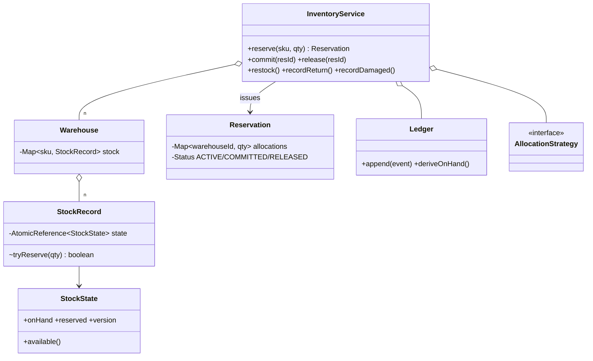

# Inventory Management

> **One-liner:** Reserved vs committed as two separate numbers, optimistic (versioned CAS) mutations that make oversell impossible, and an append-only ledger from which current stock is *derivable* — transactions + event sourcing in one problem.

## 1. Requirements

**In scope:** restock; reserve across multiple warehouses (all-or-nothing, greedy split); commit (ship) / release; returns and damage as distinct movement types; low-stock alerts; every change through an append-only ledger with replay-equals-live audit; concurrent reserves never oversell.

**Out of scope (say it):** batch/expiry tracking (a `Batch` list per record with FEFO picking — doubles the model for one concept; descope it aloud and describe), backorders, transfers (a RESERVE+COMMIT in one warehouse + RESTOCK in another under a saga), purchasing.

## 2. Clarifying questions to ask

- Is "available" on-hand minus reserved? When does stock actually decrement — reserve or ship?
- Multi-warehouse: can one order split? Split policy (fewest shipments, nearest)?
- Oversell tolerance: strictly never, or reconcile later?
- Are returns/damage adjustments or first-class movements? *(movements — audit)*
- Who consumes low-stock alerts? Threshold per SKU?

## 3. Entities & relationships



## 4. Patterns used — and why (one sentence each)

| Pattern | Where | Why |
|---------|-------|-----|
| Repository | `Warehouse` (`Map<sku, StockRecord>`), reservations map | Swappable for tables 1:1 |
| Strategy | `AllocationStrategy` | Split policy varies (fewest shipments vs nearest vs cheapest) |
| Observer | `LowStockObserver` | Replenishment subscribes; inventory never knows who listens |
| Command / event sourcing | `Ledger` of `StockEvent`s | Every change is an immutable event; state is derived, audit and replay are free |

**Approach vs alternatives:** chosen — **optimistic versioned CAS per (warehouse, sku)**: `StockState(onHand, reserved, version)` swapped atomically; the availability check and the write are one step, so oversell can't happen and there are no locks to hold. Alternatives: **pessimistic lock per record** — equivalent correctness, but reserve is a single-reference update, the textbook optimistic case (low conflict, tiny critical section); **one number ("stock")** — the classic modelling error: you can't distinguish promised-but-unshipped from gone, refunds and expiry sweeps become guesswork (reject it aloud); **ledger-only (fold on read)** — pure event sourcing; reads become O(events) without snapshots — name snapshots as the fix.

## 5. Concurrency

- **Shared state:** one `AtomicReference<StockState>` per (warehouse, sku).
- **Oversell prevention:** `tryReserve` = read → `available < qty ? fail` → CAS with version+1; a lost race retries against fresh state. The demo hammers 5 units with 8 threads — exactly 5 win.
- **Multi-warehouse reserve is a mini-saga:** legs CAS one by one; if a later leg loses its race, earlier legs are compensated (RELEASE events) and the whole reservation fails cleanly — all-or-nothing without global locks.
- **Reservation consume-once:** `synchronized transition` from ACTIVE — a double commit/release throws.
- **Ledger:** appends under its own tiny lock; replay never blocks stock operations.

## 6. Must-cover edge cases

- [x] Reserved vs committed: two numbers moving independently (visible at every demo step)
- [x] Oversell → `InsufficientStockException` naming requested vs available
- [x] Multi-warehouse split (12 = 10+2, greedy) with rollback if a leg races out
- [x] Returns (RETURN) and damage (DAMAGED) as movements — and damage may never eat *reserved* stock
- [x] Double commit rejected; low-stock alerts on threshold
- [x] Audit: `deriveOnHand(ledger) == live onHand` for every warehouse

## 7. Key code snippets

Optimistic reserve — the whole oversell story:

```java
boolean tryReserve(int qty) {
    while (true) {
        StockState s = state.get();
        if (s.available() < qty) return false;                        // check…
        if (state.compareAndSet(s,                                    // …and take: ONE atomic step
                new StockState(s.onHand, s.reserved + qty, s.version + 1))) return true;
    }
}
```

Multi-warehouse legs with compensation:

```java
for (leg : plan) {
    if (record(leg).tryReserve(qty)) done.add(leg);
    else { done.forEach(this::releaseLeg); throw new InsufficientStockException("lost race"); }
}
```

## 8. Extension questions & answers

- **"Backorders."** A queue of unmet demand per SKU; RESTOCK events trigger a matcher that converts queue entries into reservations — Observer on the ledger.
- **"Warehouse transfers."** TRANSFER_OUT + TRANSFER_IN events under a saga (out succeeds, in fails → compensating TRANSFER_IN back); never mutate two warehouses in one unprotected step.
- **"Batch/expiry."** `StockRecord` holds `List<Batch(qty, expiry)>`; picking becomes FEFO (first-expired-first-out) — an `AllocationStrategy` inside the record; expiry sweep emits DAMAGED-like EXPIRED events.
- **"What isolation level if this were a DB?"** Reserve = `UPDATE stock SET reserved = reserved + ? WHERE sku=? AND on_hand - reserved >= ?` — a single guarded statement is atomic even at Read Committed; the version column is the app-level guard for read-modify-write flows. Serializable only if multi-row invariants appear.

## 9. Expected interview follow-ups

1. **Q: Why two numbers instead of decrementing stock at reserve time?**
   **A:** Reserve is a promise, ship is the fact. One number can't express "promised but still on the shelf" — cancellations would need to *add* stock back (indistinguishable from restock in the audit), and physical counts would never match. Two numbers + derived available keeps every state honest.
2. **Q: Optimistic vs pessimistic here — argue it.**
   **A:** Contention per (warehouse, sku) is low and the update is one reference — optimistic CAS wins: no locks held, conflicts just retry. Under flash-sale contention on one SKU, retries storm — then a pessimistic per-record lock (or striping) is the right flip. Name the crossover, don't dogmatize.
3. **Q: How do you *prove* current stock is right?**
   **A:** Fold the ledger: RESTOCK+RETURN add, COMMIT+DAMAGED subtract; the result must equal live on-hand (the demo asserts it). Any drift means a write bypassed the ledger — that's the audit value of event sourcing.
4. **Q: Two warehouses, the second leg fails mid-reserve — what state am I left in?**
   **A:** None: earlier legs are compensated with RELEASE events before the exception propagates. The ledger shows RESERVE followed by RELEASE — a visible, auditable aborted attempt, which is exactly what a saga leaves behind.
5. **Q: Why can't damage consume reserved stock?**
   **A:** Reserved units are promised to a customer; writing them off silently breaks a commitment the system already made. `tryRemoveAvailable` guards `available >= qty` atomically — the write-off waits for a human decision (release the reservation first) instead of lying.

Run [`Demo.java`](Demo.java) — greedy 10+2 split, oversell rejection, commit moving both numbers, return/damage movements with the reserved-stock guard, ledger replay equal to live state, and the 8-threads-5-units race won exactly 5 times.
