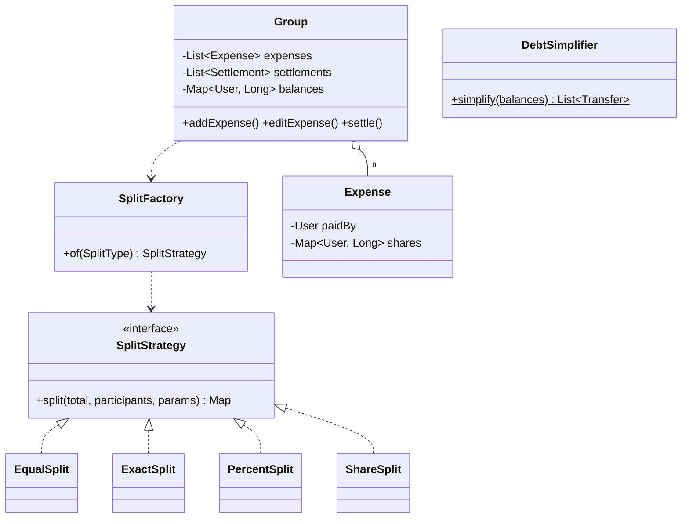

# Splitwise

> **One-liner:** Money correctness under a microscope — long paise everywhere, splits validated *before* balances move, a deterministic answer to "who gets the extra paisa in ₹100÷3", and settlement as a min-cash-flow greedy.

## 1. Requirements

**In scope:** groups with members; expenses split EQUAL / EXACT / PERCENT / SHARE; splits must sum to the total (validated first); balances derived and always summing to zero; simplified settle-up (min transfers); partial settlements; expense edit/delete with deterministic recomputation; concurrent adds to one group safe.

**Out of scope (say it):** users across multiple groups with cross-group netting, one-off (non-group) expenses (a 2-member implicit group), currencies/FX, activity feed, reminders.

## 2. Clarifying questions to ask

- Split types needed? How are percentages given — floats? *(demand basis points or paise)*
- ₹100 ÷ 3: who absorbs the extra paisa? *(any deterministic documented rule wins)*
- Can expenses be edited/deleted after settlements happened?
- Simplify debts: is fewest-transfers required, or is a good greedy enough?
- Partial settle-ups allowed?

## 3. Entities & relationships



## 4. Patterns used — and why (one sentence each)

| Pattern | Where | Why |
|---------|-------|-----|
| Strategy | 4 `SplitStrategy` impls | The split rule is the thing that varies |
| Factory | `SplitFactory.of(type)` — enum registry | Pick the strategy from data; stateless strategies shared |
| *deliberately none else* | — | No Observer (no listeners yet), no Command (settlements list is enough history here) |

**Approach vs alternatives:** chosen — **balances derived by deterministic recomputation** over immutable expenses + recorded settlements, with **largest-remainder rounding** for proportional splits. Alternatives: **incremental balance mutation on every event** — faster, but edit/delete must compute perfect inverse deltas and any bug corrupts balances forever; recomputation is O(events) and self-healing (say the trade: switch to incremental + periodic recompute-audit at scale). For rounding: floating point (never), or naive floor-and-dump-remainder-on-one-user — largest-remainder distributes error fairly and deterministically. For settlement: greedy max-creditor×max-debtor gives ≤ n−1 transfers; true minimum transfer count is NP-hard (subset-sum matching) — knowing that is the senior answer.

## 5. Concurrency

- **Shared state:** a group's expenses, settlements, balances.
- **Lock & granularity:** one monitor per `Group` (synchronized methods) — two users adding to the same group serialize; different groups never contend. This is the roadmap's exact prescription ("per-group lock").
- **Why not finer:** every write touches the shared balances map and must see a consistent expense list — a group is a natural consistency boundary, and group write rates are human-scale. Say why coarse-here is right, not lazy.
- **Invariant check:** `sum(balances) == 0` after every operation — the demo asserts it after a concurrent race.

## 6. Must-cover edge cases

- [x] Splits must sum to total → `SplitValidationException` **before** any mutation
- [x] ₹100 ÷ 3 → 33.34/33.33/33.33 — first `total % n` participants get the paisa (documented rule)
- [x] Percentages as basis points (must sum to 10000) — no doubles near money
- [x] Largest-remainder distribution for percent/share splits
- [x] Edit/delete → full deterministic recomputation; settlements recorded so they survive
- [x] Partial settle-up; min-cash-flow simplification
- [x] Concurrent adds to one group → balances still sum to zero

## 7. Key code snippets

The rounding rules — the question everyone gets wrong with doubles:

```java
// EQUAL: first (total % n) participants absorb the extra paisa
long base = total / n, extras = total % n;
share(i) = base + (i < extras ? 1 : 0);

// PERCENT/SHARE: largest-remainder — floor all, hand leftover paise to biggest remainders
shares.put(u, total * weight / weightSum);
remainders.put(u, total * weight % weightSum);
// sort by remainder desc, +1 paisa to the first (total - distributed)
```

Min-cash-flow greedy:

```java
while (!creditors.isEmpty() && !debtors.isEmpty()) {
    Entry c = creditors.poll(), d = debtors.poll();
    long amt = Math.min(c.amount, d.amount);
    transfers.add(new Transfer(d.user, c.user, amt));
    if ((c.amount -= amt) > 0) creditors.add(c);
    if ((d.amount -= amt) > 0) debtors.add(d);
}
```

## 8. Extension questions & answers

- **"One-off expenses between two people (no group)."** An implicit 2-member group — same code path, no new model.
- **"Multi-currency."** `Money(amount, currency)` value object; balances per currency; FX conversion only at display with a dated rate — never merge currencies in storage.
- **"Recurring expenses."** A template + scheduler emitting normal expenses — nothing in the split model changes.
- **"Notify users on new expense."** Observer on group events — the seam is the end of `addExpense`.
- **"Millions of users?"** Balances become materialized per-pair rows updated transactionally; recomputation becomes an offline audit job — same derive-vs-store trade, bigger scale.

## 9. Expected interview follow-ups

1. **Q: ₹100 across 3 people — walk me through the paisa.**
   **A:** 10000/3 = 3333 rem 1 — deterministic rule: first participant gets 3334. Any rule works if it's documented, deterministic, and the shares sum exactly. The one failing answer is `100.0/3` in doubles.
2. **Q: Why recompute balances on edit instead of applying a delta?**
   **A:** The inverse-delta of an edit (payer changed? participants changed? type changed?) is easy to get subtly wrong, and one bad delta corrupts balances silently forever. Recompute from immutable events is O(events), obviously correct, and self-healing. At scale: incremental + periodic recompute audit.
3. **Q: Is the greedy settlement optimal?**
   **A:** It guarantees ≤ n−1 transfers, which is what products ship. The true minimum transfer count is NP-hard (it's subset-sum: finding sub-groups that net to zero) — stating that distinction is the point of the question.
4. **Q: A settlement happened, then the expense is edited — what keeps money consistent?**
   **A:** Settlements are recorded events, folded into every recomputation after expenses. The edit changes what's owed; the payment that happened stays counted. Never mutate a settlement retroactively.
5. **Q: Where's the lock and why so coarse?**
   **A:** Per group. Every write must see a consistent (expenses, settlements, balances) triple — that's one invariant boundary, human write rates, zero cross-group contention. Fine-grained locks here would buy nothing and risk torn recomputations.

Run [`Demo.java`](Demo.java) — the ₹100÷3 paisa, a rejected invalid exact split (balances untouched), percent + share splits, min-cash-flow plan, partial settle-up surviving an edit's recomputation, and a concurrent-add race with the zero-sum invariant held.
