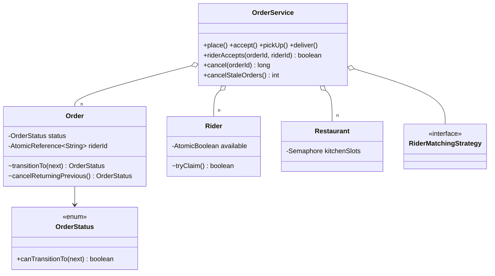
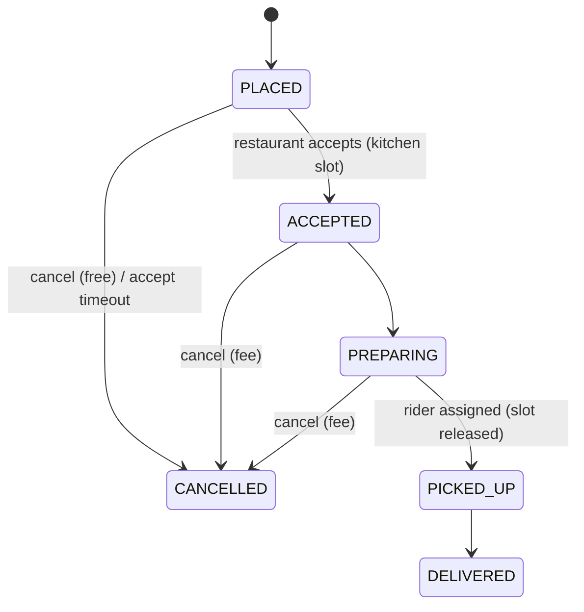

# Food Delivery (Swiggy-lite)

> **One-liner:** An event-driven lifecycle where every allowed transition lives in ONE map, rider assignment is a CAS (the "two riders accept" race), kitchen capacity is a semaphore, and cancellation rules depend on the exact state you were in — atomically.

## 1. Requirements

**In scope:** place → accept → prepare → pick up → deliver, with cancel branches; transitions validated from one table; nearest-rider matching + distance-based fee (both Strategies); two riders accepting one order resolved by CAS; restaurant concurrent-order cap (semaphore); per-state cancellation rules + refunds; rider unassign/reassign; accept-timeout auto-cancel.

**Out of scope (say it):** menus/carts/items, payments (prepaid assumed; refund printed), live GPS tracking, surge pricing, scheduled orders, multi-restaurant carts.

## 2. Clarifying questions to ask

- Exact lifecycle states and who triggers each? Any state skippable?
- Cancellation policy per state? Refund rules?
- How are riders matched — system-pushed or rider-pool broadcast (race)?
- Restaurant throughput limit — reject or queue when full?
- What if the restaurant never accepts? *(timeout)*

## 3. Entities & relationships





## 4. Patterns used — and why (one sentence each)

| Pattern | Where | Why |
|---------|-------|-----|
| State (transition-table form) | `OrderStatus.ALLOWED` map | "Allowed transitions in one place" — the roadmap's literal ask; behaviour-per-state is small, so the [State README's](../../patterns/behavioral/state/) enum form is the honest pick |
| Strategy ×2 | `RiderMatchingStrategy`, `DeliveryFeeStrategy` | Matching and fees are the rules product changes weekly |
| Observer | `OrderObserver` | Customer, restaurant, rider each react differently to one event; failures isolated |
| *Factory noted* | notification channels | Built already in [patterns/creational/factory](../../patterns/creational/factory/) — reference it, don't re-stuff |

**Approach vs alternatives:** chosen — **CAS on the order's rider slot** (`AtomicReference.compareAndSet(null, riderId)`) plus a CAS claim on the rider's availability, with clean back-out when only one of the two succeeds. Alternatives: **lock per order** for assignment — correct but heavier than a single-reference race needs (the roadmap explicitly names CAS here); **dispatcher-assigns-only** (no rider race) — simpler, but real marketplaces broadcast to a pool, so the race is the actual requirement; **status enum without a table** — scattered `if` checks that rot; the single ALLOWED map is the maintainable form.

## 5. Concurrency

- **Two riders, one order:** both call `riderAccepts` → claim self (`AtomicBoolean` CAS), then race the order's `AtomicReference` CAS; the loser releases their claim. Two atomic slots + back-out = no lock, no deadlock, no half-assigned states.
- **Kitchen capacity:** `Semaphore.tryAcquire` at accept (fail fast → `RestaurantAtCapacityException`), released at pickup or cancel — and a failed transition releases the slot it took (no leaks).
- **Cancellation atomicity:** fee depends on the previous state, so `cancelReturningPrevious()` validates + flips + returns previous under one monitor — no stale-read fee decisions.
- **Timeout sweep** uses the injected clock; PLACED orders older than the window auto-cancel with full refund. No timer per order.

## 6. Must-cover edge cases

- [x] Illegal transitions rejected explicitly (deliver before pickup → exception)
- [x] Two riders accept simultaneously → exactly one WON (demo races it)
- [x] Rider unassignment → automatic rematch, excluding the rider who bailed
- [x] Cancellation rules per state: PLACED free / ACCEPTED+PREPARING charged / PICKED_UP+DELIVERED refused
- [x] Refunds computed in paise, fee withheld and printed
- [x] Kitchen at capacity → clean rejection; slots released on pickup AND on cancel
- [x] Accept-timeout sweep auto-cancels stale PLACED orders

## 7. Key code snippets

The transition table — one place, zero scattered ifs:

```java
private static final Map<OrderStatus, Set<OrderStatus>> ALLOWED = Map.of(
    PLACED, Set.of(ACCEPTED, CANCELLED),
    ACCEPTED, Set.of(PREPARING, CANCELLED),
    PREPARING, Set.of(PICKED_UP, CANCELLED),
    PICKED_UP, Set.of(DELIVERED), DELIVERED, Set.of(), CANCELLED, Set.of());
```

The double-CAS rider acceptance with back-out:

```java
if (!rider.tryClaim()) return false;              // claim yourself first
if (order.assignRider(riderId)) return true;      // then race for the order
rider.release();                                  // lost → free yourself again
return false;
```

## 8. Extension questions & answers

- **"Scheduled orders."** A `scheduledFor` instant + the sweep pattern in reverse: a dispatcher promotes due orders to PLACED — no lifecycle changes.
- **"Multi-restaurant carts."** One cart fans out into N orders under a saga: any restaurant rejecting compensates the others (cancel + refund) or partial-fulfils per policy.
- **"Surge pricing."** A `DeliveryFeeStrategy` reading demand/supply — the seam exists; that's the point of the strategy.
- **"Rider batching (two orders per trip)."** Matching strategy returns (rider, batch) pairs; order-side CAS is unchanged — assignment is still first-writer-wins per order.
- **"Track the rider live."** Rider location becomes a stream; customers subscribe via the same Observer seam, throttled.

## 9. Expected interview follow-ups

1. **Q: Two riders tap "accept" at the same instant — walk me through it.**
   **A:** Each claims their own availability CAS, then races `order.riderId.compareAndSet(null, me)`. Exactly one wins; the loser rolls back their claim. No locks — two single-variable CAS slots with a back-out path, which is precisely when lock-free is the right tool.
2. **Q: Why does the fee decision live inside the same lock as the cancel?**
   **A:** Fee depends on the previous state. Read-status-then-cancel is check-then-act: an accept could slip between and turn a "free" cancel into one that should've charged. `cancelReturningPrevious()` makes the rule and the transition one atomic step.
3. **Q: Why a semaphore for the kitchen and not a counter?**
   **A:** A semaphore IS the counter with atomic acquire/release semantics and a fail-fast `tryAcquire` — no check-then-act on a raw int. Bounded resource access is its exact use case; blocking acquire is deliberately avoided in a user-facing call.
4. **Q: What happens to the slot if accept fails halfway?**
   **A:** The transition is attempted after the acquire; on failure the catch releases the slot before rethrowing. Resource acquire/release must be exception-symmetric — leaked permits are the classic semaphore bug.
5. **Q: Restaurant never responds — where's the timeout?**
   **A:** No per-order timers: orders carry `placedAt`, an injected clock, and a sweep cancels PLACED orders past the window with a full refund. Same lazy-expiry idea as locker/booking TTLs.

Run [`Demo.java`](Demo.java) — full lifecycle with per-persona notifications, an illegal transition rejected, the two-rider CAS race, cancel-and-rematch, capacity rejection, all three cancellation rules, and the stale-order sweep.
