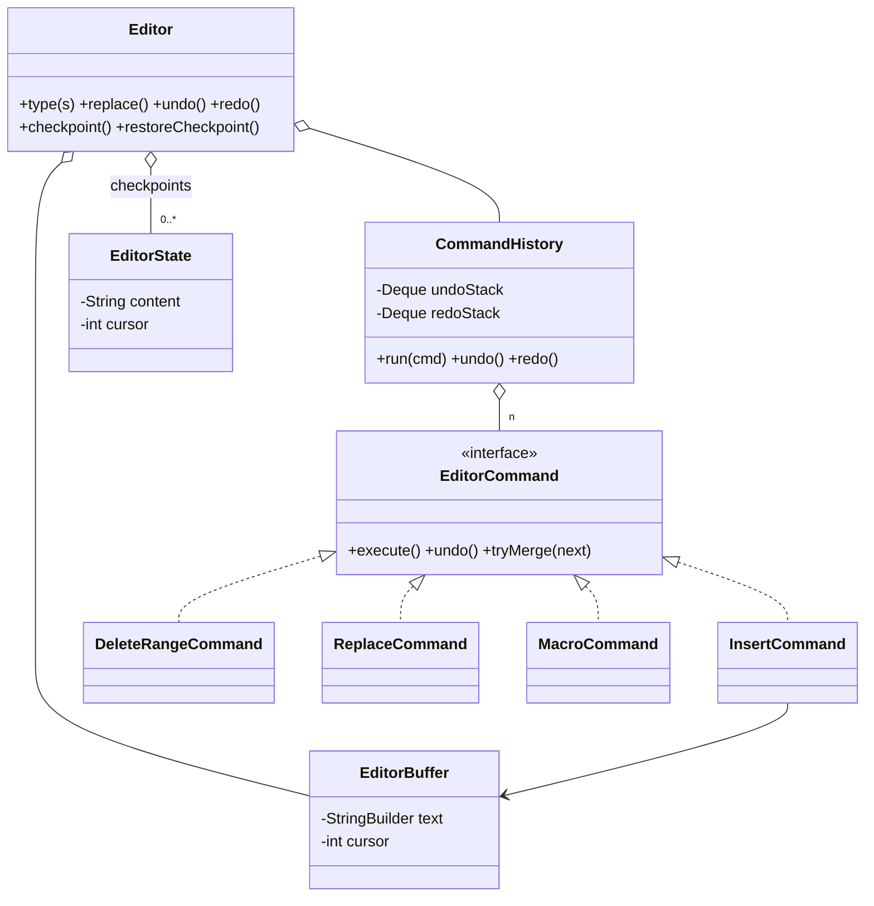

# Text Editor (Undo/Redo)

> **One-liner:** Command + Memento working together — per-keystroke commands that MERGE into word-sized undo units, cursor as part of state, macros as one history entry, and checkpoints that know they must clear the command stacks.

## 1. Requirements

**In scope:** insert/delete/replace as undoable commands; two stacks with redo cleared on new edits; consecutive keystrokes grouped into one undo unit (space closes a group); cursor restored by undo; macros (composite) undone atomically; Memento checkpoints of content+cursor.

**Out of scope (say it):** rendering/UI, selections, find/replace-all (a macro of replaces), files, syntax; large-document buffer structures — named in §8, implemented simply (`StringBuilder`).

## 2. Clarifying questions to ask

- Undo granularity — per keystroke or per word/group? What breaks a group?
- Is cursor position part of undo state? *(yes — undo that loses your cursor feels broken)*
- After undo + new edit, what happens to redo? *(cleared — linear history)*
- Macros/multi-edits: one undo step or many?
- Document size — do we care about editing a 100MB file? *(name piece table)*

## 3. Entities & relationships



## 4. Patterns used — and why (one sentence each)

| Pattern | Where | Why |
|---------|-------|-----|
| Command | insert/delete/replace with execute/undo | Edits need history — reversible actions as objects |
| Composite | `MacroCommand` | N edits, one history entry, undo in reverse order |
| Memento | `EditorState` checkpoints | Restore-by-state where inverse ops don't help (jump far back cheaply) |
| Facade | `Editor` | One entry point over buffer + history + checkpoints |

**Approach vs alternatives:** chosen — **command-based undo with merge-on-push grouping**, plus Memento only for checkpoints. Alternatives: **snapshot-per-edit (pure Memento)** — trivially correct, O(document) memory per keystroke: unacceptable, which is why commands store deltas; **event-sourced replay** (rebuild from scratch on undo) — O(history) per undo; **grouping via timers** (group keystrokes within 500ms) — how real editors do it, nondeterministic in tests; the merge rule (contiguous + space closes group) is deterministic and testable. Buffer: `StringBuilder` is O(n) per mid-document edit — **piece table** (immutable original + append-only adds + a table of spans, O(log n) edits, undo-friendly since old spans persist) or **gap buffer** (O(1) at a moving cursor) are the named upgrades.

## 5. Concurrency

- **Single-threaded by design** — say it: an editor's document has one writer (the user). No locks belong here; adding them would be pattern-stuffing's concurrency cousin.
- **What breaks with collaboration:** two users' index-based commands invalidate each other (my insert at 5 shifts your delete at 9). Locks/turn-taking kill liveness. The real fixes are **OT** (transform incoming ops against concurrent ones — Google Docs) or **CRDTs** (commutative ops on stable IDs — Figma, Yjs). Name them, sketch the failure, don't implement.

## 6. Must-cover edge cases

- [x] Redo cleared on any new edit (linear history — demo shows the rejection)
- [x] Keystroke grouping: 8 keystrokes → 2 undo units; space closes a group
- [x] Cursor is part of state — every undo restores it (visible in every demo line)
- [x] Macro undone atomically (both quotes vanish in one undo)
- [x] Checkpoint restore clears command stacks (stale commands would corrupt the new world)
- [x] Undo/redo on empty stacks → explicit exceptions
- [x] Delete/replace capture removed text at execute time

## 7. Key code snippets

Merge-on-push — grouping without timers:

```java
public void run(EditorCommand command) {
    command.execute();
    if (undoStack.isEmpty() || !undoStack.peek().tryMerge(command))
        undoStack.push(command);          // not mergeable → its own undo unit
    redoStack.clear();                    // new edit kills the redo branch
}

// InsertCommand.tryMerge: contiguous keystroke joins the unit; space closes it
boolean contiguous = incoming.position == position + text.length();
boolean groupOpen  = text.charAt(text.length() - 1) != ' ';
if (contiguous && groupOpen) { text.append(incoming.text); return true; }
```

Why checkpoint restore clears history:

```java
buffer.load(state.content(), state.cursor());
history.clear();   // undo entries reference positions in a document that no longer exists
```

## 8. Extension questions & answers

- **"100MB document — what breaks?"** `StringBuilder` insert is O(n) memmove per edit. **Piece table**: original text immutable + append-only add buffer + a span table; edits are span splices (O(log n) with a tree), and undo gets cheaper because old spans are never destroyed. **Gap buffer**: O(1) at a stationary cursor. Name both, pick piece table for undo-heavy editors.
- **"Collaborative editing."** Say what breaks (concurrent index-based ops invalidate each other), then name OT (server transforms ops) vs CRDT (commutative ops, IDs instead of indices; merges without a central server). Don't implement.
- **"Selection-aware commands."** Selection = (anchor, cursor) added to command pre/post state — same capture-and-restore shape as the cursor.
- **"Persistence / crash recovery."** Write-ahead log of commands (they're already serializable actions) + periodic snapshots — Command and Memento again, on disk.

## 9. Expected interview follow-ups

1. **Q: Why does a new edit clear the redo stack?**
   **A:** After undo + new typing, history has branched; the old redo chain targets positions in a document that no longer exists — replaying it would corrupt text. Linear undo keeps one truth; branching = a version tree (name it, don't build it).
2. **Q: How do you group keystrokes without a timer?**
   **A:** Merge-on-push: the history asks the top command to absorb the incoming one; inserts merge when contiguous, and a space closes the group. Deterministic, testable, and it lives in one place instead of leaking "grouping mode" state everywhere.
3. **Q: Command vs Memento — you used both. Why?**
   **A:** Commands are cheap deltas for step-wise undo; snapshots are O(document) but restore *anywhere* in one jump. Editors mix them: commands for keystrokes, snapshots at checkpoints — bounded replay from the nearest checkpoint.
4. **Q: Why does undo restore the cursor too?**
   **A:** The user's mental state includes where they were typing — undo that leaves the cursor stranded feels broken. So pre-state (cursor) is captured at command construction and restored in `undo`; "what belongs in the state" is the actual design question.
5. **Q: What's subtle about undoing a macro?**
   **A:** Children must undo in REVERSE order — each undo assumes the positions produced by the later commands still exist. Forward-order undo corrupts offsets; that one line (`for i = n-1 … 0`) is the whole trick.

Run [`Demo.java`](Demo.java) — word-grouped undo of 8 keystrokes, replace round-trip, the dead redo branch, a one-undo macro, and a checkpoint restore that clears history.
