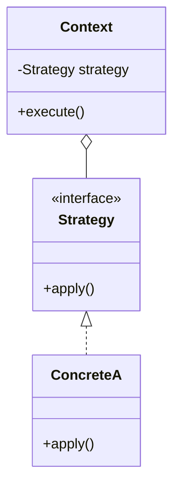

# <Pattern Name>

> **Solves:** <the problem this pattern solves, in one sentence>

## When to use / when NOT

- **Use when:** <the kind of change this pattern absorbs — "pricing will vary", "lifecycle stages differ">
- **Don't use when:** <the pattern-stuffing red flag — "the rule will never vary; a plain method is simpler">
- **One-sentence justification to say aloud:** "<X> will vary, so I'm putting it behind <interface>; if it wouldn't, <simpler thing> is enough."

## Structure



<!-- Replace with this pattern's actual diagram. Keep it to 3–5 boxes — the shape, not the ceremony. -->

## Key code — the 20% that matters

```java
// ~15 lines max: the essence you must be able to write from memory.
// Full runnable version lives in this folder; Demo.java runs it.
```

## Where it appears in the 12 problems

- **<Problem>** — <one line on the role it plays there>

## Expected interview questions

1. **Q:** <question interviewers actually ask about this pattern>
   **A:** <2–3 sentence answer, trade-off included>
2. **Q:** When would you NOT use this?
   **A:** <the honest simpler alternative>
3. **Q:** <thread-safety / variant question if relevant>
   **A:** <answer>

## Write-from-memory checklist (target: 3 minutes)

- [ ] <interface + method signature>
- [ ] <2 concrete implementations>
- [ ] <context/client wiring — constructor injection>
- [ ] <demo call showing the swap>
