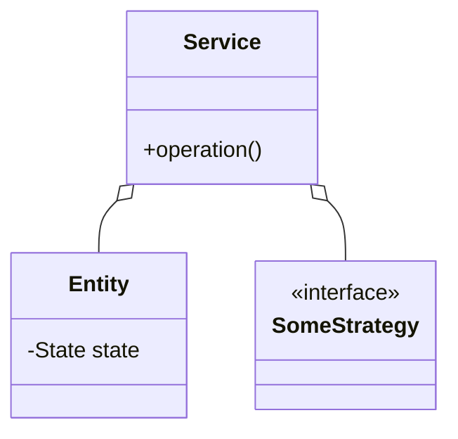

# <Problem Name>

> **One-liner:** <what you're building and the 1–2 concepts this problem is really testing>

## 1. Requirements

**In scope (3–5, agree these with the interviewer first):**
- <feature>

**Out of scope (say these aloud):**
- <e.g., auth, persistence, payments — "I'll design for it but not code it">

## 2. Clarifying questions to ask

- <5–8 questions you'd ask in the first 7 minutes — sizes, concurrency, failure behaviour, extensions>

## 3. Entities & relationships

<Nouns → classes, verbs → methods. Say relationships aloud: "X has many Y".>



## 4. Patterns used — and why (one sentence each)

| Pattern | Where | Why (the change it absorbs) |
|---------|-------|------------------------------|
| <Strategy> | <PricingStrategy> | <"pricing rules will vary"> |

## 5. Concurrency

- **Shared state:** <what two threads fight over>
- **Lock & granularity:** <lock per spot / per group / CAS — and why not coarser or finer>
- **Trade-off:** <what this choice costs>
- **If it doesn't scale:** <striping / optimistic versions / queue — the next tool you'd reach for>

## 6. Must-cover edge cases

- [ ] <from the roadmap's must-cover list — you're not done until each is in code>

## 7. Key code snippets (the tricky 2–3 parts only)

```java
// e.g., the critical section, the validation, the rounding rule
```

## 8. Extension questions & answers

- **"Now add <X>"** → <the one new class / swapped strategy that handles it>
- **"Make it distributed"** → <what breaks, the named fix — don't code it>

## 9. Expected interview follow-ups

1. **Q:** <the follow-up interviewers actually ask>
   **A:** <2–3 sentence answer with the trade-off>
2. **Q:** "What if two users do this at the same time?"
   **A:** <point at the exact lock/CAS in section 5>
